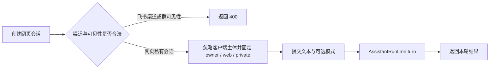

# 服务端应用如何装配并承接请求

buildApp 是 omem 服务端的组合根：按配置创建 Fastify、存储、检索、知识、记忆、助手及可选后台运行时，注册面向网页与集成方的 API，并统一执行访问保护、错误映射、后台恢复和资源关闭。

来源：gpt-5.6-sol 分析，gpt-5.6-sol 独立复核；模型解释仍可被原始证据纠正。

## 它解决什么问题

`buildApp(config, dependencies)` 把分散的领域能力装成一个可运行、也可被测试注入依赖的 Fastify 应用。它先阻止“无令牌却监听非本机地址”的配置，再创建 Store、运行记录、记忆和反馈服务；随后选择 ACP 配置，组装知识仓库、统一检索及助手运行时。这里负责**接线与 HTTP 边界**，具体检索、记忆或对话算法仍由相应服务实现。参考 [应用入口与基础服务 ↗](../../../apps/server/src/app.ts#L54 "支持 buildApp 的参数形式、非本机监听保护，以及 Store、Runs、MemoryService、FeedbackService 的创建。")、[检索与助手装配 ↗](../../../apps/server/src/app.ts#L93 "支持 ACP 模型、知识仓库、检索服务、知识路由和 AssistantRuntime 共享依赖的装配关系。")

## 一次网页提问怎样流过入口

以网页提问为例，客户端先提交 `chatId` 创建会话。网页入口会明确拒绝 `channel=lark_p2p/lark_group` 或 `visibility=group`，这些请求触发错误后由统一错误处理返回 400；客户端传入的 `principalId` 若能通过 schema 校验则不会因此报错，而是被忽略，服务端始终以 `principalId: "owner"`、`channel: "web"`、`visibility: "private"` 打开会话。参考 [网页会话与提问入口 ↗](../../../apps/server/src/app.ts#L793 "支持网页入口分别处理渠道、可见性和主体字段：拒绝飞书渠道与群可见性，忽略客户端主体并固定 owner/web/private，以及后续调用 assistant.turn。")、[API 访问与错误处理 ↗](../../../apps/server/src/app.ts#L171 "支持 token 或本机来源保护，以及冲突、重复活跃操作和普通入口错误的统一 HTTP 状态映射；也说明会话入口抛出的伪造渠道错误最终返回 400。")

随后客户端向该会话提交 `text`，可选 `requestId`、`assist/research` 模式和检索用途；入口完成严格校验，把请求映射给 `assistant.turn`，等待后返回结果。参考 [网页会话与提问入口 ↗](../../../apps/server/src/app.ts#L793 "支持网页入口分别处理渠道、可见性和主体字段：拒绝飞书渠道与群可见性，忽略客户端主体并固定 owner/web/private，以及后续调用 assistant.turn。")

## 它与材料和检索模块如何协作

同一入口还把不同来源统一送入 Store：直接捕获、文件、Git、飞书链接和 Traex hook 都先经过各自适配器与 `captureSchema`，输入事件则先聚合、再把就绪批次写入。参考 [多来源捕获入口 ↗](../../../apps/server/src/app.ts#L247 "支持直接捕获、文件、Git、飞书、Traex 和聚合输入最终进入 Store 的流程。")

搜索接口把查询限制为 300 字、结果上限固定为 30，并校验用途、代码意图、材料角色和有效时间；若检索实现提供统一 `search` 就直接调用，否则兼容旧的 source 搜索，再用 Store 补齐标题、版本和章节。参考 [统一搜索请求 ↗](../../../apps/server/src/app.ts#L313 "支持搜索条件校验、查询约束、统一检索优先与旧接口兼容投影。")

## 安全边界与生命周期

所有 `/api/` 请求共享一层保护：有令牌时用定时安全比较校验 Bearer token；无令牌时只接受本机 Host，并拒绝非本机 Origin。冲突映射为 409、重复活跃操作为 429、输入及其他入口错误为 400。参考 [API 访问与错误处理 ↗](../../../apps/server/src/app.ts#L171 "支持 token 或本机来源保护，以及冲突、重复活跃操作和普通入口错误的统一 HTTP 状态映射；也说明会话入口抛出的伪造渠道错误最终返回 400。")

学习与飞书是可选运行时：启用学习却找不到指定 profile 会立即失败；飞书初始化失败会先关闭 Store。应用装好后后台恢复未完成对话、周期刷新提醒和输入批次，并启动可选运行时；关闭时依次停止助手、定时器、学习、飞书、运行任务、检索和存储。扩展新业务通常在此注册路由，但领域行为应继续放在对应服务中。参考 [可选运行时装配 ↗](../../../apps/server/src/app.ts#L121 "支持学习 profile 的配置约束、飞书运行时依赖装配及初始化失败时关闭 Store。")、[后台启动与资源关闭 ↗](../../../apps/server/src/app.ts#L872 "支持未完成会话恢复、周期任务、可选运行时启动，以及 onClose 中的完整清理顺序。")
