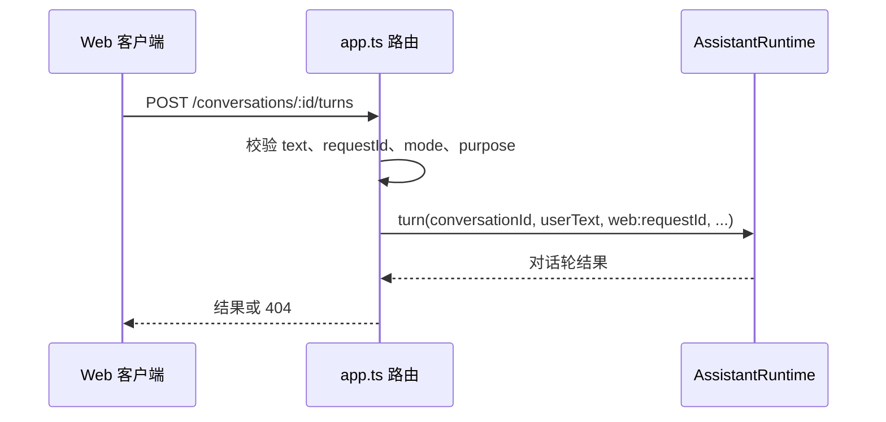

# 服务端应用装配与 HTTP 请求入口

buildApp 是 omem 服务端的组合根：它依据配置创建存储、检索、知识、助理、学习与飞书能力，统一注册 HTTP 边界，并负责启动恢复、后台任务和有序关闭。路由主要承担校验、权限约束和委派，具体业务由各服务实现。

来源：gpt-5.6-sol 分析，gpt-5.6-sol 独立复核；模型解释仍可被原始证据纠正。

## 把基础能力装成一个可用服务

`buildApp` 解决的是“怎样把分散的领域能力变成一个可运行 Web 服务”。它先限制非本机监听必须配置令牌，再创建 Fastify、SQLite 存储、运行记录、记忆与反馈服务。助理配置只取配置列表中首个 `transport === "acp"` 的 profile；若没有则为 `null`，CLI、认证或 transport 是否真的可运行由 ACP 适配器与运行时处理。参考 [服务端基础装配与助理配置 ↗](../../../apps/server/src/app.ts#L54 "支持非本机监听的令牌要求、基础服务创建，以及只选择首个 ACP profile、实际不可运行时由适配器和运行时处理的结论。")

随后，同一套检索能力被交给知识路由和 `AssistantRuntime`；开发仓库模式只是在这里替换知识仓库与检索适配。这样 HTTP 层负责装配，知识生成、检索和对话仍由各自模块实现。参考 [知识检索与助理装配 ↗](../../../apps/server/src/app.ts#L93 "说明知识路由和 AssistantRuntime 共用检索能力，并展示开发模式下仓库与检索适配的选择。")

材料输入也体现这一边界：直接捕获、文件、Git、飞书和 TraeX 入口先转换并校验请求，最终都委派给 `store.capture`；聚合输入则先入队，再刷新已就绪批次。参考 [材料输入汇聚 ↗](../../../apps/server/src/app.ts#L247 "支持多种连接器经校验和转换后统一调用 store.capture，以及聚合输入的入队与刷新流程。")

## 代表性调用：从网页提问到对话结果

网页先 `POST /api/assistant/conversations` 创建会话。Web 请求若声明飞书频道或群可见性会被拒绝；`principalId` 虽可随请求传入，但不会决定会话主体，服务端始终以 `owner`、`web` 和私有可见性打开会话。参考 [网页会话身份边界 ↗](../../../apps/server/src/app.ts#L793 "支持 Web 会话对飞书频道和群可见性的拒绝规则，并表明请求 principalId 不参与打开会话，主体固定为 owner。")

一次提问的输入包括会话 ID、文本，以及可选请求 ID、助理/研究模式和检索用途。路由把请求 ID 加上 `web:` 前缀后调用运行时；结果缺少会话时返回 404，否则原样返回。参考 [助理提问路由 ↗](../../../apps/server/src/app.ts#L819 "支持代表性调用的字段校验、请求 ID 转换、AssistantRuntime.turn 委派及返回行为。") 用户还可读取历史、取消指定轮次；重试失败使用 409 表示当前状态冲突。参考 [对话历史与轮次控制 ↗](../../../apps/server/src/app.ts#L843 "说明历史读取、取消和重试端点如何区分会话不存在、轮次不存在与重试冲突。")

## 安全边界、可选能力与生命周期

所有 `/api/` 请求共享一层入口保护：配置令牌时使用 Bearer token 并做定时安全比较；未配置时只接受本机 Host，并拒绝非本机 Origin。Zod 输入错误统一为 400，重基、陈旧或冲突错误映射为 409，重复活动映射为 429。参考 [API 访问与错误映射 ↗](../../../apps/server/src/app.ts#L171 "支持 Bearer token、本机 Host 与 Origin 约束，以及输入、冲突和活动状态的统一 HTTP 错误映射。")

学习管线仅在启用且能找到指定 profile 时构造，否则配置错误会在启动期暴露；飞书能力既可注入，也可按配置创建，初始化失败会先关闭存储，未配置时相关路由通过 `requireLark` 明确失败。参考 [可选学习与飞书能力 ↗](../../../apps/server/src/app.ts#L121 "说明学习 profile 的启动校验、飞书服务的注入或构造、失败清理和未配置保护。")

启动完成后，未结束的助理轮次在后台恢复，提醒和输入聚合由定时器驱动，学习与飞书运行时按需启动。关闭时先停止助理并等待恢复任务，再清理定时器和各服务，最后关闭数据库；因此新增长期资源应同时接入这里的启动与 `onClose` 清理。参考 [后台恢复与有序关闭 ↗](../../../apps/server/src/app.ts#L872 "支持静态页面注册、未完成轮次恢复、周期任务启动，以及 onClose 中的资源清理顺序。")
