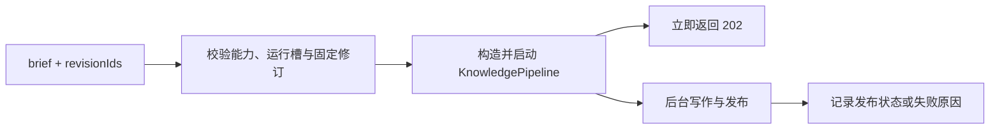

# 知识库 HTTP 接口：阅读、检索与异步整理

这层 Fastify 路由把知识仓储、固定版本证据、检索服务与 Agent 生成管线接到同一组 HTTP 接口。它服务文章和原文阅读、知识搜索、问题处理，并以单任务后台执行方式启动页面整理或材料分析。

来源：gpt-5.6-sol 分析，gpt-5.6-sol 独立复核；模型解释仍可被原始证据纠正。

## 一处协调知识阅读与行动

`registerKnowledgeRoutes` 是知识库的 HTTP 协调层：调用者提供存储、路由前缀和工作区，也可以替换仓储与检索实现；未提供时，使用基于传入 `Store` 的默认仓储和关键词检索。文章元数据包含当前状态、版本、生成与复核模型，以及文章所列问题的数量 `questionCount`；它并不表示尚未回答的问题数。参考 [路由依赖与文章元数据 ↗](../../../apps/server/src/knowledge/api.ts#L20 "支持路由依赖可注入、默认仓储与关键词检索，以及 questionCount 直接取文章 questions 长度的说明。")

读取文章时，接口会按文章记录的依赖摘要解析引用。依赖缺失或固定历史版本不可用时，引用仍可返回，但被标为不可操作并给出人读原因；文章引用与原始材料引用分别解析。参考 [固定版本引用解析 ↗](../../../apps/server/src/knowledge/api.ts#L28 "支持引用按依赖摘要解析文章或材料历史版本，并在依据不可用时返回不可操作原因。")

## 代表性调用：从选材到后台发布

以整理一篇新页面为例，客户端提交 `brief` 和若干 `revisionIds`。接口先确认 Agent 已配置且没有其他整理任务，再校验阅读目标、材料数量和固定修订是否仍存在；随后把修订映射为材料键，构造 `KnowledgePipeline` 并启动后台写作。参考 [页面整理与运行状态 ↗](../../../apps/server/src/knowledge/api.ts#L147 "支持页面请求校验、管线构造、202 响应，以及 lastRun 在运行、成功和失败时保存的确切字段。")

`202` 响应只表示任务已受理。页面任务开始时，`lastRun` 记录运行状态、标题和文章键；成功后记录 `published`、标题和文章键，失败时记录标题与错误字符串。它不保存文章正文，客户端应在发布后通过仓储支持的文章目录或详情接口读取文章。目录接口同时暴露 `running` 和 `lastRun`。参考 [文章目录与详情 ↗](../../../apps/server/src/knowledge/api.ts#L42 "支持目录暴露 running 和 lastRun，以及文章详情从仓储读取正文与解析后引用。") [页面整理与运行状态 ↗](../../../apps/server/src/knowledge/api.ts#L147 "支持页面请求校验、管线构造、202 响应，以及 lastRun 在运行、成功和失败时保存的确切字段。")

## 搜索结果如何连接到原始证据

搜索先截断并分词查询、解析分类前缀，只考虑当前文章。若检索器实现统一 `search`，本路由请求 `knowledge` 单元并传入用途与分类，再过滤非知识命中、重复文章和版本不一致结果；底层召回与排序应在对应的 `RetrievalPort` 实现中调整。参考 [统一知识检索路径 ↗](../../../apps/server/src/knowledge/api.ts#L100 "支持统一 search 分支的用途与分类传递、知识类型过滤、版本一致性检查和每篇去重。")

若检索器没有统一 `search`，回退逻辑就在本文件：先检索原始片段，把命中分数归一化，再为每个章节计算正文词法分，并叠加该章节引用证据的权重；排序后每篇文章只保留最佳章节，最多返回 50 篇。因此要改变这条兼容路径的证据加权、去重或截断，应修改本路由的回退分支。参考 [证据加权回退排序 ↗](../../../apps/server/src/knowledge/api.ts#L121 "支持本文件在无统一 search 时计算章节词法分、引用证据权重、排序、每篇去重和 50 条截断。")

## 阅读导航、运行边界与修改入口

材料详情会补充可导航关系：Markdown 相对链接只有在同命名空间中唯一匹配时才成为文档链接；代码仅把相对 `import` 解析为候选文件，并标注为确定性的模块依赖。这些链接帮助定位材料，但不构成完整的跨文件调用图。参考 [材料导航链接 ↗](../../../apps/server/src/knowledge/api.ts#L54 "支持 Markdown 相对链接的唯一匹配和代码相对 import 的确定性模块依赖定位边界。")

同一个路由注册实例只有一个 `running` 槽，`/pages` 与 `/analyze` 相互排斥；服务关闭时会停止仍在运行的管线。生成逻辑属于 `KnowledgePipeline`，持久化属于 `KnowledgeRepository`；搜索修改则要先判断走的是统一检索实现还是本文件的回退排序。HTTP 校验、状态和模块编排才是本文件的主要修改范围。参考 [证据加权回退排序 ↗](../../../apps/server/src/knowledge/api.ts#L121 "支持本文件在无统一 search 时计算章节词法分、引用证据权重、排序、每篇去重和 50 条截断。") [页面整理与运行状态 ↗](../../../apps/server/src/knowledge/api.ts#L147 "支持页面请求校验、管线构造、202 响应，以及 lastRun 在运行、成功和失败时保存的确切字段。") [批量分析与关闭清理 ↗](../../../apps/server/src/knowledge/api.ts#L163 "支持分析任务共享运行槽、固定修订校验、后台执行，并在服务关闭时停止当前管线。")
