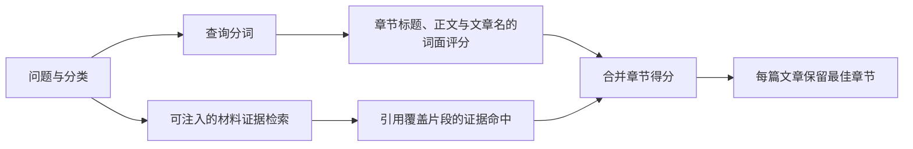

# 知识库 HTTP API：阅读、检索与生成编排

这组 Fastify 路由把知识仓储、固定版本证据解析、章节词面评分、可注入的材料证据检索与 Agent 生成流水线组织成统一接口，供知识目录、证据阅读、搜索、问题处理和页面生成使用。

来源：gpt-5.6-sol 分析，gpt-5.6-sol 独立复核；模型解释仍可被原始证据纠正。

## 把知识能力组织成一组稳定入口

`registerKnowledgeRoutes` 是知识库的 HTTP 适配层：调用方提供 Fastify 实例、路由前缀、存储与工作区，也可注入仓储、材料检索器、Agent 配置和发布回调。未注入仓储或材料检索器时，它分别创建 `KnowledgeRepository` 和 `KeywordRetrieval`，并在本进程中维护 `running` 与 `lastRun`。参考 [路由装配与默认材料检索器 ↗](../../../apps/server/src/knowledge/api.ts#L19 "支持该函数作为 HTTP 入口、依赖可注入、未注入时使用关键词材料检索器，以及进程内运行状态和文章元数据字段的说明。")

文章目录响应会返回这两个运行状态，供调用方观察整理任务；路由装配完成后，函数返回同一个仓储实例，方便宿主继续操作知识数据。参考 [目录与文章读取 ↗](../../../apps/server/src/knowledge/api.ts#L41 "支持目录刷新并暴露运行状态、文章按 revision 读取、引用展开以及缺失资源返回 404 的行为。") [返回知识仓储 ↗](../../../apps/server/src/knowledge/api.ts#L161 "支持路由注册函数在装配完成后返回所使用的知识仓储实例。")

## 阅读时保留证据版本与可追溯入口

目录接口先刷新知识状态，再返回文章元数据、材料清单及运行状态；文章详情可按 `revision` 读取，并把正文引用转换成可导航对象。解析引用时，必须先在文章依赖中找到同类、同 key 的固定依赖，再按依赖摘要读取文章版本或材料版本；找不到时明确返回不可操作状态和原因，不会悄悄改指向当前版本。参考 [固定版本引用解析 ↗](../../../apps/server/src/knowledge/api.ts#L27 "支持引用必须匹配文章依赖摘要，并区分文章与原始材料版本、当前性和不可用原因。") [目录与文章读取 ↗](../../../apps/server/src/knowledge/api.ts#L41 "支持目录刷新并暴露运行状态、文章按 revision 读取、引用展开以及缺失资源返回 404 的行为。")

材料接口返回原文、行数、当前性、代码语言、图片与链接等信息，还可附带关联知识文章的元数据。它识别 Markdown 相对链接；对 TS、JS、Vue 文件仅解析相对 import，生成“确定性模块依赖”链接，**并不声称这是完整调用图**。图片只允许 PNG、JPEG、WebP，记录或字节缺失都按不可用处理。参考 [材料响应与导航链接 ↗](../../../apps/server/src/knowledge/api.ts#L59 "支持材料详情返回原文、行数、当前性、可选关联知识元数据，以及 Markdown 相对链接和相对 import 导航。") [图片与问题操作 ↗](../../../apps/server/src/knowledge/api.ts#L86 "支持图片 MIME 白名单、问题列表、回答长度校验、回答回调与创建任务。")

## 代表性调用：从问题到最佳章节

例如请求 `GET {prefix}/search?q=如何追踪证据&topic=["软件开发","omem"]`。查询先去空白、截到 300 字并分词；空查询直接返回空数组，非法分类 JSON 返回 400。系统刷新仓储后，只保留当前且 `topicPath` 前缀匹配的文章；指定分类时，材料证据检索的可见范围限制为这些文章依赖的材料片段。这里可注入的是**材料证据检索能力**，未注入时使用关键词检索器。参考 [路由装配与默认材料检索器 ↗](../../../apps/server/src/knowledge/api.ts#L19 "支持该函数作为 HTTP 入口、依赖可注入、未注入时使用关键词材料检索器，以及进程内运行状态和文章元数据字段的说明。") [查询解析与材料证据检索 ↗](../../../apps/server/src/knowledge/api.ts#L99 "支持查询分词、分类范围约束，以及可注入检索器只形成材料片段命中排名的说明。")

两路评分彼此独立：章节词面分直接由查询词与章节标题、正文、文章名计算；材料检索命中则只用于评估该节所引用的材料片段，取最高归一化命中后乘以 `0.4` 再合并。因此即使材料检索没有命中，章节仍可能凭非零词面分返回。输出包含章节、节选、分数与文章元数据；排序后每篇文章只保留最佳章节，最多返回 50 篇。参考 [章节双路评分与排序 ↗](../../../apps/server/src/knowledge/api.ts#L113 "支持章节词面分独立计算、引用证据分合并、无证据命中仍可凭词面分返回，以及每篇最佳章节去重和 50 条上限。")

## 生成、回答与运行边界

问题接口可列出未决项、提交 1–20000 字回答，或把问题转为任务；回答成功返回新的 `revisionId`，并可触发宿主回调。参考 [图片与问题操作 ↗](../../../apps/server/src/knowledge/api.ts#L86 "支持图片 MIME 白名单、问题列表、回答长度校验、回答回调与创建任务。")

新建页面时，服务先要求可用 Agent、确认没有其他整理任务，再校验页面 brief 和 1–500 个材料 `revisionId`；只要选择项已更新或无法精确匹配，就要求刷新。校验通过后组装运行时网关和流水线，立即以 202 返回 `running`，真正的发布或失败异步写入 `lastRun`。参考 [页面异步生成 ↗](../../../apps/server/src/knowledge/api.ts#L133 "支持 Agent 配置、并发锁、brief 与材料版本校验、流水线组装、202 接收语义及 lastRun 状态更新。")

批量分析采用同样的 Agent、并发锁和固定版本检查，内部流水线并发度设为 2。两类生成共享一个 `running`，所以同一进程一次只允许一个整理任务；关闭 Fastify 时会停止尚在运行的流水线。202 只表示任务已接收，最终结果应通过文章目录中的 `running` 与 `lastRun` 再确认。参考 [批量分析与关闭处理 ↗](../../../apps/server/src/knowledge/api.ts#L149 "支持批量分析的输入限制、固定版本检查、并发度、异步结果记录以及服务关闭时停止流水线。")
