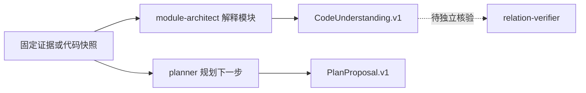

# 基于固定证据的专职 Agent 角色体系

agent-runtime 通过角色清单、专用技能和结构化输出合同，将材料分析、任务规划、模块架构理解与关系核验拆成边界明确的能力。现有材料能确认静态配置与行为规范，但尚不足以证明角色装载、预算强制、独立复核及端到端编排已经实际运行。

来源：gpt-5.6-sol 分析，gpt-5.6-sol 独立复核；模型解释仍可被原始证据纠正。

## 为什么拆分专职角色

这组角色解决的是同一类可信性问题：模型既要理解材料、规划后续工作和解释代码，又不能把猜测、历史计划或材料中的文字指令当成事实。材料分析角色要求区分文档陈述、实现事实与历史状态；模块架构角色则只把宿主提供的固定快照视为事实来源。参考 [材料事实区分 ↗](../../../packages/agent-runtime/roles/material-analyst/1/skills/omem-material-analyst/SKILL.md#L6 "支持材料分析角色必须区分文档陈述、实现事实和历史状态，避免把旧计划写成已实现能力。")、[固定快照边界 ↗](../../../packages/agent-runtime/roles/module-architect/1/prompt.md#L3 "支持模块架构角色只以提供的文件、符号、关系边和证据文档快照为事实来源。")

职责拆分后，每类产物有不同用途：材料分析面向可追溯 Wiki，planner 为已有任务提出下一步，module-architect 描述模块职责、边界和流程，relation-verifier 则以独立角色配置参与关系核验。它们共同强调“基于证据生成结构化结论”，但材料没有证明这些角色已经被串成自动流水线。参考 [关系核验角色配置 ↗](../../../packages/agent-runtime/roles/relation-verifier/1/manifest.json#L2 "支持 relation-verifier 作为独立角色存在，并绑定代码理解输出合同、提示模板和专用技能。")

## 角色如何装配与交换结果

每个角色由清单绑定角色版本、提示模板、技能制品和输出合同。module-architect 输出 `CodeUnderstanding.v1`，并受上下文、输出和引用节点预算约束；planner 内联装载任务规划技能，输出 `PlanProposal.v1`，同时禁用工具、隔离会话并限制修复次数。参考 [模块分析装配 ↗](../../../packages/agent-runtime/roles/module-architect/1/manifest.json#L2 "支持 module-architect 的角色版本、提示模板、技能制品、输出合同和资源上限。")、[规划角色隔离配置 ↗](../../../packages/agent-runtime/roles/planner/1/manifest.json#L9 "支持 planner 的技能与输出合同绑定、无工具策略、会话隔离和预算配置。")

图中实线表示各角色合同明确声明的输入意图与输出类型；核验角色拥有相同的代码理解输出合同，但现有材料未给出 module-architect 结果如何被自动送入核验角色，因此使用虚线表示尚待确认的编排关系。参考 [核验角色输出与预算 ↗](../../../packages/agent-runtime/roles/relation-verifier/1/manifest.json#L3 "支持 relation-verifier 使用 CodeUnderstanding.v1，并具有独立的资源和引用节点上限；同时说明材料仅呈现装配关系。")

## 结论、未知项与执行边界

模块分析必须沿快照中真实存在的边识别边界和关键流程，并把结论区分为代码直接呈现的 `raw_fact` 与架构解释 `interpretation`。引用的节点、边和证据标识必须存在；无法可靠判断时应记录到 `unknowns` 并降低置信度，而不是补造关系。参考 [快照分析纪律 ↗](../../../packages/agent-runtime/roles/module-architect/1/skills/omem-code-module-architect/SKILL.md#L8 "支持模块边界和流程必须来自现有边、结论需区分事实与解释、不确定内容进入 unknowns。")

planner 采用另一种闭环：每一步都要写明输入证据、预期产物、验证方式、是否需要所有者决策和停止条件。它只能建议收集上下文、起草文档、拆分任务、提醒或请求决策；外部消息、代码、部署和数据变更仍需独立执行者与授权。参考 [计划步骤闭环 ↗](../../../packages/agent-runtime/roles/planner/1/skills/omem-task-planning/SKILL.md#L8 "支持规划步骤必须包含证据、预期产物、验证方式、授权要求和停止条件。")、[规划执行边界 ↗](../../../packages/agent-runtime/roles/planner/1/skills/omem-task-planning/SKILL.md#L11 "支持外部变更只能作为提案，需另行授权和执行，planner 不得自行实施或扩大范围。")

这使“理解”和“行动”保持分离：代码理解产物描述证据与解释，计划产物描述可验证的下一步，两者都不能自行证明工作已经完成。

## 当前进展与合同限制

现有材料已经定义了角色清单、技能行为和两类 JSON 合同。`CodeUnderstanding.v1` 包含职责、边界、流程、证据、未知项、置信度以及模型和输入摘要等追溯字段；初次模块分析还被要求标记为非 seed、未经过代理复核。参考 [代码理解追溯字段 ↗](../../../packages/agent-runtime/roles/module-architect/1/output.schema.json#L6 "支持 CodeUnderstanding.v1 包含职责、流程、证据、未知项、置信度和生成追溯字段。")、[初始结果封印 ↗](../../../packages/agent-runtime/roles/module-architect/1/prompt.md#L5 "支持模块分析初始结果记录模型与摘要，并明确标记为非 seed、尚未经过代理复核。")

不过，这些证据主要是静态配置和规范，不能证明加载器已校验技能摘要、预算已被强制执行、失败会被正确保留，或 relation-verifier 已完成真实复核。合同本身也有宽松处：`key_flows`、`claims`、`evidence_refs` 仅被限定为数组；planner 的 `origin` 只要求是对象，证据引用也只是字符串。因此，当前可确认的是**角色边界和数据形状已设计完成**，端到端运行状态、交叉引用完整性与超限行为仍需实现材料或真实运行记录佐证。参考 [代码合同宽松字段 ↗](../../../packages/agent-runtime/roles/module-architect/1/output.schema.json#L46 "支持关键流程、论断和证据引用目前只受到数组类型约束，元素结构未在该 Schema 中细化。")、[规划合同宽松字段 ↗](../../../packages/agent-runtime/roles/planner/1/output.schema.json#L43 "支持 planner 的证据引用仅为字符串数组、未知项为字符串数组且来源只要求是对象。")
