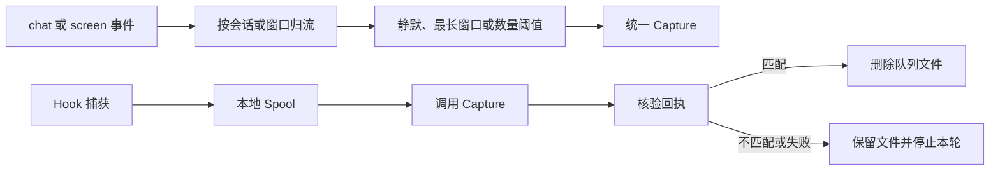

# 统一输入、外部接入与可靠投递

omem 以统一 Capture 合同承接手工、文件、Git、Hook、聊天、屏幕和飞书材料；聊天与屏幕事件可先聚合，Hook 可经本地磁盘队列补传。飞书接入覆盖应用注册、能力核验、所有者绑定、实时捕获、助手回复、决策卡片和通知投递，但当前仍是 personal 单用户实现，群采集授权、跨事务补偿及真实多 worker 验证仍待确认。

来源：gpt-5.6-sol 分析，gpt-5.6-sol 独立复核；模型解释仍可被原始证据纠正。

## 从不同来源进入同一证据链

统一输入解决的是“材料来自不同工具，却要按同一方式保存和追溯”的问题。即时材料进入 Capture，需要等待上下文的 chat/screen 事件先进入聚合入口；载荷可包含文本、图片和 HTTP(S) 链接，URL 只作为材料保存，不自动访问。参考 [统一捕获入口 ↗](../../../docs/implementation/inputs.md#L3 "支持即时 Capture、事件聚合入口、多模态输入以及 URL 不自动访问的总体边界。")

公共合同限定单个文本分片不超过 20 万字符、一次 Capture 最多 50 个 part，并允许每个分片携带说话人、观察时间、事件、回复及转发来源。参考 [多模态分片合同 ↗](../../../packages/contracts/src/index.ts#L4 "支持文本、图片、链接类型及逐分片来源字段。")[捕获数量与来源合同 ↗](../../../packages/contracts/src/index.ts#L49 "支持来源枚举、Capture provenance 和最多 50 个 part 的限制。") 文件连接器限制真实路径、大小、UTF-8 与 NUL；Git 将 ref 固定到提交 SHA；飞书文档连接器校验地址后获取正文、原文链接和引用映射；Hook 仅选取配置字段并进行基础令牌脱敏。参考 [本地文件安全读取 ↗](../../../apps/server/src/connectors.ts#L10 "支持真实路径根目录校验、文件大小限制、严格 UTF-8 解码和 NUL 检查。")[Git 固定版本读取 ↗](../../../apps/server/src/connectors.ts#L36 "支持 ref 与路径校验、提交 SHA 固定和指定文件读取。")[飞书文档连接器 ↗](../../../apps/server/src/connectors.ts#L76 "支持飞书地址限制、CLI 获取以及正文、原文链接和引用映射的组装。")[Hook 字段与事件身份 ↗](../../../apps/server/src/connectors.ts#L137 "支持字段白名单、基础令牌脱敏、字符预算及稳定事件标识生成。") 这些连接器构造共同输入形状，但材料未证明每个返回值都在连接器内部执行公共 schema 校验。

## 聚合上下文与离线补传

聊天按会话、屏幕按应用与窗口归流；事件以采集器和事件 ID 判重，同键同载荷可安全重放，同键异载荷拒绝。默认静默 15 秒、最长等待 5 分钟，或达到数量阈值后成批；相同内容只在同一 actor 下去重。参考 [聚合事件接入与幂等 ↗](../../../apps/server/src/inputs/aggregator.ts#L39 "支持 chat/screen 流键、事件身份、重复重放和冲突拒绝。")[成批时机与说话人去重 ↗](../../../apps/server/src/inputs/aggregator.ts#L124 "支持静默窗口、最长等待、数量阈值、actor 维度去重及分片预算。")

聚合结果保留逐片来源、观察时间范围、稳定批次标识及迟到关系。外部 Capture 完成后才在本地事务中复核事件仍为 pending，因此可阻止本地重复归批，却没有展示事务失败后外部 revision 或 job 的补偿方式。参考 [批次来源与迟到关系 ↗](../../../apps/server/src/inputs/aggregator.ts#L181 "支持逐片来源、稳定批次身份、观察时间范围和迟到批次关联。")[捕获与本地事务边界 ↗](../../../apps/server/src/inputs/aggregator.ts#L320 "支持先调用外部 Capture、再复核本地 pending 状态的流程及一致性限制。")

Spool 通过受限目录、临时文件、文件同步和重命名落盘。显式 `flush` 先按顺序调用 Capture，再核验回执中的生产者、事件 ID 与载荷摘要；匹配时删除文件，不匹配或发送失败时保留文件并停止本轮。参考 [Spool 耐久写入 ↗](../../../apps/server/src/inputs/spool.ts#L51 "支持受限目录、确定文件身份、临时文件写入、同步和重命名。")[Capture 调用与回执核验 ↗](../../../apps/server/src/inputs/spool.ts#L197 "支持 Spool 先调用 sender，再核验回执；匹配后删除，不匹配或失败时保留并停止本轮。") 默认七天保留期只是告警阈值，过期记录仍会返回，并不会自动删除。参考 [Spool 保留期行为 ↗](../../../apps/server/src/inputs/spool.ts#L174 "证明默认七天阈值只产生告警，过期记录仍被排序返回。")

## 飞书接入、绑定与实时捕获

已有应用导入在取得 Botmux 或直接提交的凭据后调用统一凭据接受流程；新建或 SDK 注册取得凭据后也调用同一流程。参考 [已有凭据导入汇入点 ↗](../../../apps/server/src/integrations/lark/onboarding.ts#L149 "直接支持已有应用导入取得凭据后调用统一 acceptCredentials 流程。")[注册凭据汇入点 ↗](../../../apps/server/src/integrations/lark/onboarding.ts#L167 "直接支持注册适配器返回凭据后调用同一 acceptCredentials 流程。") 凭据通过 AES-256-GCM 写入受限文件，再以引用创建候选连接版本并执行 OpenAPI 能力探测；公开接口不提供事件订阅列表，所以事件能力还需 WebSocket 实际投递确认。参考 [候选连接与能力探测 ↗](../../../apps/server/src/integrations/lark/onboarding.ts#L293 "支持凭据引用、候选版本创建、能力探测以及失败候选不替换活动版本。")[凭据加密落盘 ↗](../../../apps/server/src/integrations/lark/secret-store.ts#L72 "支持 AES-256-GCM、随机 IV、临时文件同步、重命名和文件权限设置。")[事件订阅核验边界 ↗](../../../apps/server/src/integrations/lark/registration.ts#L135 "说明公开应用接口不暴露事件列表，事件订阅需由 WebSocket 投递确认。")[OpenAPI 能力探测 ↗](../../../apps/server/src/integrations/lark/registration.ts#L141 "支持令牌、机器人、应用、权限与回调检查，并将事件核验标为运行时完成。") 能力满足后，服务签发默认五分钟有效的随机配对码；确认配对时，流程会核对候选身份并原子替换旧绑定、激活候选版本，建立通知、决策及可选群监控目标。现有材料没有证明确认者具有管理员身份。参考 [短期配对码签发 ↗](../../../apps/server/src/integrations/lark/onboarding.ts#L569 "支持随机配对码、默认五分钟有效期、摘要保存和旧码消费。")[配对确认与目标激活 ↗](../../../apps/server/src/integrations/lark/onboarding.ts#L665 "支持确认配对时核验候选身份、替换绑定、激活版本并创建通知、决策及群监控目标；该范围不证明确认者具有管理员身份。")

运行时以连接租约减少多个 worker 同时持有同一连接。事件先进入持久化收件箱，按应用和事件 ID 判重，同 ID 不同载荷会被拒绝。参考 [连接租约 ↗](../../../apps/server/src/integrations/lark/realtime.ts#L223 "支持连接的条件抢占、续租和释放机制。")[事件收件箱去重 ↗](../../../apps/server/src/integrations/lark/realtime.ts#L337 "支持事件持久化、按应用与事件 ID 去重以及同 ID 不同摘要冲突。") 绑定 owner 的私聊可进入助手，群聊还需明确提及机器人；其他群消息会建立或查找启用的监控目标，再转换为统一 chat 输入。参考 [绑定身份与助手路由 ↗](../../../apps/server/src/integrations/lark/realtime.ts#L503 "支持只有绑定所有者进入助手路径，且群聊还需明确提及机器人。")[群消息统一捕获 ↗](../../../apps/server/src/integrations/lark/realtime.ts#L602 "支持群监控目标、助手之外的群消息分流以及统一 InputAggregator 接入。") 文本、富文本和图片可形成带逐片来源的 parts；图片缺少下载条件时使用占位文本。参考 [富消息分片转换 ↗](../../../apps/server/src/integrations/lark/realtime.ts#L719 "支持文本、富文本、图片下载、占位回退和逐片来源信息。") 当前相关记录固定使用 `personal`，不能据此宣称已有租户隔离。

## 助手回复、决策卡片与投递状态机

助手回复遵循“先提交 outbox，再完成 inbox”。同一 turn 使用稳定平台 UUID；重投遇到已有 outbox 时不重复入队，turn 已完成但 outbox 缺失时则补写。参考 [回复入队与收件箱完成顺序 ↗](../../../apps/server/src/integrations/lark/realtime.ts#L550 "支持重投恢复以及先写 outbox、后完成 inbox 的可靠处理顺序。")[助手回复事务化 outbox ↗](../../../apps/server/src/integrations/lark/realtime.ts#L814 "支持按 turn 生成稳定平台 UUID，并在同一事务中写入投递意图和回合关联。") 决策卡片采用固定协议，动作限于批准、拒绝或请求上下文，并携带动作 ID、nonce、提案摘要、期限和预期版本摘要。参考 [决策卡片协议 ↗](../../../apps/server/src/integrations/lark/card-actions.ts#L13 "支持固定协议、动作枚举、nonce、摘要、期限和预期版本摘要字段。") 入口还会联合核对应用、操作者、消息位置、绑定、摘要与决策状态，成功后一次性消费并创建命令。参考 [决策卡片联合核验 ↗](../../../apps/server/src/integrations/lark/card-actions.ts#L119 "支持应用、操作者、消息位置、绑定、摘要、期限和决策状态核验后一次性创建命令。")

通知投递先用数据库租约抢占任务，再由 worker 读取加密凭据、核对应用、载荷摘要和 30 KB 卡片上限后发送。参考 [通知投递租约 ↗](../../../apps/server/src/integrations/lark/delivery.ts#L190 "支持到期任务选择、失效状态抑制、条件抢占和一小时结果不明窗口。")[通知投递 Worker ↗](../../../apps/server/src/integrations/lark/delivery.ts#L598 "支持读取加密凭据、核对应用与载荷摘要、检查卡片大小并调用发送适配器。") 限流可在五次尝试内重试；结果不明只在首次发送后一小时的平台去重窗口内重试，超窗转为 unknown。认证错误会停用采集目标、令连接失败，并终止同连接中仍待发送或等待重试的意图。参考 [投递重试与认证处置 ↗](../../../apps/server/src/integrations/lark/delivery.ts#L389 "支持限流与结果不明的不同重试条件，以及认证失败后的连接级处置。") 窗口通知可合并为摘要卡；运行时每轮先准备聚合，再顺序消费卡片命令与通知。参考 [通知窗口聚合 ↗](../../../apps/server/src/integrations/lark/delivery.ts#L461 "支持到期意图分组、摘要卡生成、成员合并取消和稳定提供方 UUID。")[运行时单轮处理顺序 ↗](../../../apps/server/src/integrations/lark/runtime.ts#L195 "支持先同步连接和准备聚合，再顺序处理卡片命令与通知投递。") 实现已形成状态机，但材料未提供真实租户联调或多 worker 竞争结果。
