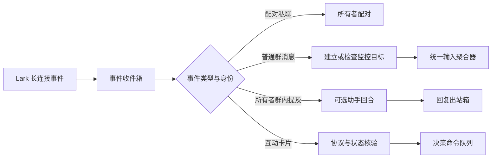

# 统一输入、外部接入与可靠投递

omem 以统一 Capture 合同承接手工、文件、Git、飞书、Agent、Hook、聊天与屏幕材料；即时材料直接保存，连续事件按会话或窗口聚合。外部接入围绕事件身份、来源元数据、稳定摘要和持久化投递组织：连接器限制读取范围，Hook 队列保留暂时未送达的数据，Lark 流程负责应用接入、所有者配对、实时消息捕获、可选助手交互与租约式投递。当前实现仍是 personal 范围，群监控授权、跨事务补偿、队列故障恢复、凭据轮换和真实租户联调仍需补齐。

来源：gpt-5.6-sol 分析，gpt-5.6-sol 独立复核；模型解释仍可被原始证据纠正。

## 从不同来源进入同一证据链

统一输入解决的是“材料来自不同工具，却必须用同一方式保存、追溯和检索”的问题。即时材料走捕获入口，需要静默窗口的聊天或屏幕事件走事件入口；共同载荷可包含文本、图片、链接、上下文和来源信息，链接只作为材料保存，不自动访问。参考 [统一捕获入口与载荷边界 ↗](../../../docs/implementation/inputs.md#L3 "支持即时捕获、事件聚合入口、多模态载荷、鉴权及链接不自动访问。")。逐分片来源还能保留发送者、观察时间、事件、引用与转发属性，避免聚合后丢失原始归属。参考 [逐分片来源与内容合同 ↗](../../../packages/contracts/src/index.ts#L4 "支持文本、图片、链接以及逐分片身份、时间、引用和转发来源字段。")。

文件、Git、飞书文档与 Hook 都被整理为同一输入形状，但各有边界：本地文件必须位于配置根目录并通过真实路径校验；Git 先解析固定提交再读取指定文件；飞书文档仅接受指定 HTTPS 主机，并通过外部 CLI 获取内容；Hook 只选取配置允许的字段并生成事件身份。参考 [本地文件安全读取 ↗](../../../apps/server/src/connectors.ts#L1 "支持显式有限读取、真实路径根目录校验、严格 UTF-8 解码和二进制拒绝。")、[固定版本 Git 读取 ↗](../../../apps/server/src/connectors.ts#L36 "支持 Git 参数约束、提交解析和按确定提交读取指定文件。")、[飞书文档受限读取 ↗](../../../apps/server/src/connectors.ts#L76 "支持飞书文档 HTTPS 路径和主机白名单、外部 CLI 调用、超时及响应正文检查。")、[Hook 字段与事件身份 ↗](../../../apps/server/src/connectors.ts#L137 "支持 Hook 字段白名单、基础令牌脱敏、字符预算和事件编号生成规则。")。这些连接器构造出对象并不等于已经完成公共合同的运行时校验，文件字节上限、CLI 输出上限与文本合同的字符上限也不是同一约束。延伸阅读：[输入整形子知识 ↗](fe2bd502927378e92217d69a28e09525ae3d1a2b898caa697823d01e20e5614d.md#role_and_boundaries "作为输入聚合和本地队列详细边界的延伸阅读。")。

## 连续事件聚合与离线缓冲

聊天按会话、屏幕按应用与窗口划分流；事件必须带采集器和事件编号。相同事件身份与相同载荷可安全重放，不同载荷复用同一身份会被拒绝。参考 [聚合事件接入与幂等 ↗](../../../apps/server/src/inputs/aggregator.ts#L39 "支持聊天和屏幕流键、事件身份要求、personal 工作区写入、相同载荷重放及冲突拒绝。")。待处理流在静默 15 秒、首事件等待 5 分钟或数量达到阈值时成批；批内以“内容摘要加说话人”去重，并受 50 个分片预算约束。身份缺失时统一按未知说话人处理，可能合并现实中来自不同匿名来源的相同内容。参考 [成批时机与分片预算 ↗](../../../apps/server/src/inputs/aggregator.ts#L124 "支持静默窗口、最大等待、数量阈值、按说话人去重及 50 个分片预算。")。

聚合结果把身份、时间和事件编号写入每个分片，并用稳定批次编号关联迟到事件；但引用目标目前固定为空，批次顶层身份也只检查部分字段是否一致。参考 [聚合来源与迟到批次 ↗](../../../apps/server/src/inputs/aggregator.ts#L181 "支持逐分片来源复制、稳定批次编号、迟到关联和顶层身份判定边界。")。刷新时先调用外部捕获，再在本地事务中复核事件仍为待处理；并发变化能阻止重复归批，却可能留下已创建但未关联的修订或任务。参考 [捕获与归批事务边界 ↗](../../../apps/server/src/inputs/aggregator.ts#L320 "支持外部捕获先于本地状态复核执行，以及并发变化触发归批失败的限制。")。

Hook 队列将记录写入受限临时文件，同步后原子重命名；容量超限会拒绝新记录，超过保留期只告警而不删除。参考 [队列权限与原子写入 ↗](../../../apps/server/src/inputs/spool.ts#L51 "支持受限目录、临时文件、文件同步、重命名及记录权限。")、[容量与保留期行为 ↗](../../../apps/server/src/inputs/spool.ts#L139 "支持容量拒绝、告警记录以及过期数据只告警而仍保留的行为。")。显式刷新按创建时间顺序发送，只有回执中的生产者、事件编号和载荷摘要匹配才删除文件，首次失败会停止本轮；队列代码本身没有证明存在自动调度或退避器。参考 [顺序刷新与回执删除 ↗](../../../apps/server/src/inputs/spool.ts#L197 "支持显式顺序发送、回执字段匹配、成功删除及首次失败停止。")。

## Lark 应用绑定、消息捕获与交互

Lark 接入面向个人助理，预留文档、日历、会议、任务和富内容能力，同时排除批量消息、群成员变更和权限管理用途。参考 [个人助理能力范围 ↗](../../../apps/server/src/integrations/lark/defaults.ts#L3 "支持 Lark 默认配置面向个人助理，并界定保留和排除的能力。")。新建或导入应用后，凭据被加密保存，系统为连接建立候选版本并执行能力探测；缺少能力时不会激活候选，已有活动版本可以继续使用。参考 [候选连接与能力探测 ↗](../../../apps/server/src/integrations/lark/onboarding.ts#L293 "支持凭据保存、personal 连接候选版本、能力探测以及失败时保留已有活动版本。")。探针通过 OpenAPI 获取访问令牌，检查应用权限、回调和机器人身份；事件订阅无法从公开应用接口列出，需由真实 WebSocket 投递确认。参考 [OpenAPI 能力探针 ↗](../../../apps/server/src/integrations/lark/registration.ts#L141 "支持访问令牌获取、应用权限和回调检查、机器人身份读取，并说明事件订阅由运行时投递确认。")、[事件订阅核验边界 ↗](../../../apps/server/src/integrations/lark/registration.ts#L135 "支持公开应用接口不能列出事件订阅，必须通过真实 WebSocket 投递确认。")。凭据采用随机 IV 的 AES-256-GCM 和受限文件权限落盘，但密文格式没有密钥标识或轮换流程。参考 [凭据认证加密 ↗](../../../apps/server/src/integrations/lark/secret-store.ts#L72 "支持随机 IV、AES-256-GCM、受限临时文件和原子落盘，并说明格式未记录密钥标识。")。

事件先按应用与事件编号持久化；相同摘要视为重复，不同摘要报告冲突，并记录实际收到的事件种类。参考 [实时事件收件箱 ↗](../../../apps/server/src/integrations/lark/realtime.ts#L337 "支持活动连接检查、事件摘要判重、冲突检测和实际事件能力记录。")。机器人加入群时会创建或重新启用监控目标，移出群时会禁用目标；普通群消息到达时也会先尝试创建启用目标，但 `INSERT OR IGNORE` 不会覆盖既有禁用记录。参考 [机器人进出群监控切换 ↗](../../../apps/server/src/integrations/lark/realtime.ts#L422 "支持机器人加入群时创建或重新启用监控目标，移出群时禁用目标。")、[普通群消息补建监控目标 ↗](../../../apps/server/src/integrations/lark/realtime.ts#L602 "支持普通群消息到达时自动创建启用目标、已有禁用目标不被覆盖及后续捕获许可查询。")。活动目标下的群消息进入统一聚合器，保存会话、发送者、绑定版本和逐分片来源；富文本会拆成段落，图片在媒体端口可用时下载，否则降级为文本提示。参考 [群消息进入统一输入 ↗](../../../apps/server/src/integrations/lark/realtime.ts#L629 "支持群消息写入聚合器，并保留会话、事件、发送者身份和绑定版本。")、[富消息转换为捕获分片 ↗](../../../apps/server/src/integrations/lark/realtime.ts#L719 "支持文本、富文本和图片转换、媒体下载降级及逐分片来源附着。")。

助手只有在配置模型时才创建。参考 [可选助手运行时 ↗](../../../apps/server/src/integrations/lark/runtime.ts#L96 "支持只有配置助手模型时才创建助手运行时。")。当前连接管理器注入配对接收器后，私聊会优先进入配对校验，普通私聊可能无法到达助手；群内助手入口要求绑定所有者明确提及机器人。参考 [私聊优先进入配对 ↗](../../../apps/server/src/integrations/lark/realtime.ts#L963 "支持连接管理器在存在配对接收器时将私聊消息优先送入配对流程。")。延伸阅读：[Lark 运行流程子知识 ↗](6f0934cde8ff03ab01e9f910df270b18de6f6a358ea684b35cdb2552f7f17f31.md#runtime-flow "作为实时事件、卡片与投递完整流程的延伸阅读。")。

## 事务型出站、重试与当前边界

助手回复和通知先写入投递意图，再由运行时准备通知聚合、消费卡片命令和投递任务。参考 [运行时任务编排 ↗](../../../apps/server/src/integrations/lark/runtime.ts#L195 "支持连接同步、通知聚合以及卡片命令和投递任务的顺序消费。")。互动卡片只接受严格协议，并核对操作者、消息位置、摘要、期限、随机数和决策版本；校验成功后才一次性消费动作并创建命令。参考 [决策卡片核验与入队 ↗](../../../apps/server/src/integrations/lark/card-actions.ts#L119 "支持严格协议解析、操作者与状态核验、一次性消费动作和命令创建。")。

投递仓储使用状态条件和租约令牌抢占任务；连接、绑定或标注会话失效时，相应任务会被失败、取消或抑制。参考 [投递任务租约领取 ↗](../../../apps/server/src/integrations/lark/delivery.ts#L190 "支持状态守卫、条件抢占、租约令牌以及失效连接、绑定或会话的发送抑制。")。限流错误可在五次尝试上限内重试；结果不明还必须处于首次发送后一小时的提供方去重窗口内，超窗后进入未知状态。认证错误会停用连接与捕获目标，并把同连接中状态为 `pending` 或 `retry_wait` 的其他意图标记失败；后者可能已有发送尝试，不能统称为尚未发送。参考 [投递重试与认证处置 ↗](../../../apps/server/src/integrations/lark/delivery.ts#L389 "支持限流和结果不明的差异化重试、去重窗口、次数上限，以及认证错误对 pending 和 retry_wait 意图的级联处置。")。

真正发送时，Worker 重新读取加密凭据，校验应用、载荷摘要和卡片大小，再把投递记录中的 provider UUID 交给飞书或 Lark SDK；成功后回写平台消息编号。参考 [投递 Worker 与平台发送 ↗](../../../apps/server/src/integrations/lark/delivery.ts#L598 "支持读取凭据、校验应用与载荷，并把投递记录中的 provider UUID 传给平台发送适配器后回写结果。")。数据库中的输入事件与连接候选固定使用 personal 工作区，不能宣称已有租户隔离。参考 [聚合事件接入与幂等 ↗](../../../apps/server/src/inputs/aggregator.ts#L39 "支持聊天和屏幕流键、事件身份要求、personal 工作区写入、相同载荷重放及冲突拒绝。")、[候选连接与能力探测 ↗](../../../apps/server/src/integrations/lark/onboarding.ts#L293 "支持凭据保存、personal 连接候选版本、能力探测以及失败时保留已有活动版本。")。代码路径和能力配置也不能替代真实应用授权、WebSocket 投递及网络发送的现场验证。参考 [事件订阅核验边界 ↗](../../../apps/server/src/integrations/lark/registration.ts#L135 "支持公开应用接口不能列出事件订阅，必须通过真实 WebSocket 投递确认。")。
