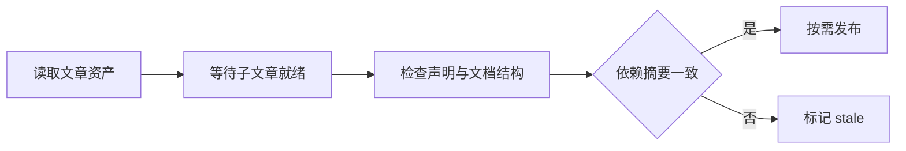

# 知识文章的发布、渲染与恢复

该模块把知识文章发布为便于阅读的 Markdown 和可恢复的 JSON，并在恢复时检查资产声明的复核结论、模型字段、文档结构及依赖摘要是否齐全或匹配。依赖已变化的资产会标为过期，缺少必要生成或复核声明的资产会被拒绝。

来源：gpt-5.6-sol 分析，gpt-5.6-sol 独立复核；模型解释仍可被原始证据纠正。

## 发布可读且可追溯的文章

文章渲染会把正文中的引用键转换为链接：文章引用指向对应文章及章节，仓库材料引用指向源码行，缺失引用则明确显示不可用。阅读版还展示生成与复核模型，并提醒模型解释可以由原始证据纠正。参考 [文章引用渲染 ↗](../../../apps/server/src/knowledge/artifacts.ts#L8 "支持引用替换、目标链接、章节锚点和模型来源提示的说明。")

发布时以文章键摘要作为稳定文件名，同时生成 JSON 与 Markdown；运行态字段不会进入资产，内容未变化时也不会重复写盘。参考 [双格式文章发布 ↗](../../../apps/server/src/knowledge/artifacts.ts#L21 "支持稳定文件名、移除运行态字段、生成 JSON 与 Markdown及按内容写入的说明。")

## 按依赖顺序恢复知识

恢复流程扫描目录中的 JSON 资产，解析失败的文件直接标为 rejected，其余进入待处理队列，并读取当前原始材料摘要作为依赖比对基准。参考 [恢复资产扫描 ↗](../../../apps/server/src/knowledge/artifacts.ts#L32 "支持目录检查、JSON 扫描、解析失败处理和当前材料摘要收集，并表明这里只定义恢复函数。")

父文章会等待匹配版本的子文章先恢复；循环无法继续推进时，剩余资产返回 missing，表示引用的子知识尚不可用。参考 [子文章依赖调度 ↗](../../../apps/server/src/knowledge/artifacts.ts#L41 "支持多轮恢复及等待匹配版本子文章先完成的流程。") [导入状态与缺失依赖 ↗](../../../apps/server/src/knowledge/artifacts.ts#L59 "支持已处理资产写入导入状态，以及无法推进的待处理资产仅返回 missing 的说明。")

## 资产检查与状态记录

可处理资产必须采用版本 1、声明复核结论为 accepted，并填写生成模型和复核模型；文档还要通过结构合同解析。这里检查的是**声明是否齐全**，并不验证模型身份、角色独立性或这些声明的真实性。材料或子文章摘要变化时，资产标为 stale；依赖一致且版本不同才调用仓库发布。参考 [资产声明与依赖检查 ↗](../../../apps/server/src/knowledge/artifacts.ts#L52 "支持对版本、accepted 声明、生成与复核模型字段、文档结构和依赖摘要的检查，也显示发布发生在状态记录之前。")

已处理资产的 restored、stale 或 rejected 状态会写入导入记录。资产 revision 依赖规范化摘要：对象键排序并忽略 `undefined`，减少属性顺序造成的无意义变化。参考 [稳定摘要算法 ↗](../../../apps/server/src/storage/digest.ts#L3 "解释资产 revision 使用的规范化摘要如何排序对象键并忽略 undefined 字段。")

仓库层另有引用键、正文内联引用、目标存在性和材料行范围等完整性规则，但现有材料不能证明恢复路径一定执行这些检查。延伸阅读：[引用完整性规则 ↗](../../../apps/server/src/knowledge/repository.ts#L41 "说明仓库模块另行定义内联引用、目标存在性和材料行范围检查，界定恢复文件本身能够证明的校验范围。")

## 运行与一致性边界

该文件只定义发布和恢复函数，没有展示调用方，因此不能据此判断服务是否会在启动时自动恢复资产，也不能确认是否存在用户可操作的恢复入口。参考 [恢复资产扫描 ↗](../../../apps/server/src/knowledge/artifacts.ts#L32 "支持目录检查、JSON 扫描、解析失败处理和当前材料摘要收集，并表明这里只定义恢复函数。")

发布文章与写入导入状态是顺序执行的两个调用；当前材料未给出 `publish` 的实现，无法确认两者是否共享事务或在故障时保持原子一致。参考 [资产声明与依赖检查 ↗](../../../apps/server/src/knowledge/artifacts.ts#L52 "支持对版本、accepted 声明、生成与复核模型字段、文档结构和依赖摘要的检查，也显示发布发生在状态记录之前。") [导入状态与缺失依赖 ↗](../../../apps/server/src/knowledge/artifacts.ts#L59 "支持已处理资产写入导入状态，以及无法推进的待处理资产仅返回 missing 的说明。")
