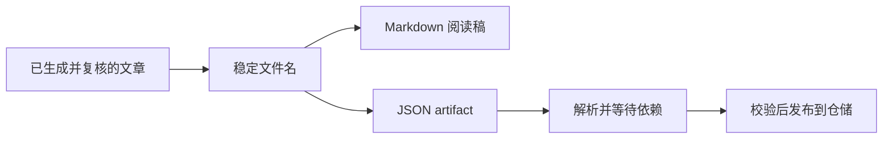

# 知识文章的文件导出与依赖恢复

这个模块把已经生成并复核的知识文章保存为可阅读的 Markdown 与可恢复的 JSON，并在新运行环境中按材料和子文章版本重新装载。它负责呈现、增量写盘、依赖排序与恢复结果记录；解析失败和最终依赖缺失虽然会出现在本次返回结果中，但不会写入持久化导入状态表。

来源：gpt-5.6-sol 分析，gpt-5.6-sol 独立复核；模型解释仍可被原始证据纠正。

## 为什么同时保存 Markdown 和 JSON

`articleMarkdown` 面向阅读：它把各章节拼成文章，将正文中的 `[[引用键]]` 替换为带标签、跳转地址和原因提示的链接。文章引用跳到另一篇文章的固定文件；材料引用由调用方提供地址，未提供时退化到 `#source-evidence`。页首还会标明生成与独立复核模型。参考 [Markdown 引用渲染 ↗](../../../apps/server/src/knowledge/artifacts.ts#L8 "支持章节拼接、引用替换、文章与材料链接退化以及生成复核来源提示的说明。")

`writeKnowledgeArticle` 面向发布和重启恢复：它移除仓储中的运行态字段 `current`、`revision`，以文章键摘要作为稳定文件名，同时输出 JSON 和 Markdown。写入前会比较已有内容，内容未变时不重写文件。参考 [双格式增量写盘 ↗](../../../apps/server/src/knowledge/artifacts.ts#L21 "支持移除运行态字段、稳定文件名、JSON 与 Markdown 双输出以及避免无变化重写的说明。")

## 一次发布如何变成下次启动可用的文章

可以把一次成功发布理解为两条用途不同的输出：Markdown 给人阅读，JSON 保存足以重建文章的 artifact。下次启动时，恢复器扫描目录中的 JSON；目录不存在就直接返回空结果，无法解析的 JSON 则立即作为 `rejected` 加入本次结果。随后它读取当前材料摘要，准备核对每篇文章依赖的固定版本。参考 [恢复入口与解析结果 ↗](../../../apps/server/src/knowledge/artifacts.ts#L32 "支持目录缺失、JSON 文件扫描、解析失败只加入返回结果以及当前材料摘要准备的说明。")

恢复按轮处理待恢复文章。若某篇文章依赖的子文章尚未进入仓储，或者仓储里仍是旧 revision、而待处理目录中存在所需的新 revision，它会先暂缓父文章，让匹配的子文章优先恢复。参考 [子文章依赖排序 ↗](../../../apps/server/src/knowledge/artifacts.ts#L41 "支持分轮处理、暂缓父文章并优先恢复匹配子文章 revision 的说明。")

## 新鲜度判断与状态可见范围

进入主循环的条目会检查 artifact 版本、复核结论、生成与复核模型以及文档结构。材料摘要或子文章 revision 不一致时标为 `stale`；依赖匹配且仓储中不是同一 revision 时才调用仓储发布；校验或发布抛错则标为 `rejected`。这些已经在主循环中完成处理的 `restored`、`stale` 和 `rejected` 条目会写入 `knowledge_imports`，同时加入本次返回结果。参考 [校验发布与导入落库 ↗](../../../apps/server/src/knowledge/artifacts.ts#L52 "支持 restored、stale、异常 rejected 的判定，以及主循环已处理条目写入 knowledge_imports 的范围说明。")

状态的持久化范围比返回结果窄：**读取阶段 JSON 解析失败的 `rejected`** 只加入返回结果，因为此时尚未进入主循环；**循环结束后仍在等待依赖的 `missing`** 也只加入返回结果，因为导入表写入点已经过去。后者可能来自依赖链无法推进，或在最多 100 轮内仍未完成。最后恢复器刷新仓储的 current 状态并返回全部逐文件结果。参考 [恢复入口与解析结果 ↗](../../../apps/server/src/knowledge/artifacts.ts#L32 "支持目录缺失、JSON 文件扫描、解析失败只加入返回结果以及当前材料摘要准备的说明。")、[未满足依赖与最终刷新 ↗](../../../apps/server/src/knowledge/artifacts.ts#L62 "支持循环无法推进时停止、剩余条目仅加入 missing 返回结果以及最终刷新仓储的说明。")
