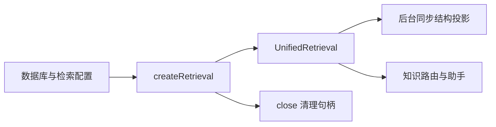

# 统一检索服务的配置与生命周期装配

该工厂把 SQLite、词法检索、可选中文向量模型和可选重排器装配成统一检索端口，并负责后台启动与安全关闭，是服务端调用方与具体检索实现之间的边界。

来源：gpt-5.6-sol 分析，gpt-5.6-sol 独立复核；模型解释仍可被原始证据纠正。

## 它解决什么问题

`factory.ts` 把检索实现的创建规则集中在一处：上层只接触 `RetrievalPort`，不用分别管理 SQLite 词法检索、中文向量模型和重排模型。这个端口本来就是读者搜索、助手和 Agent 工具共享的契约。参考 [共享检索端口 ↗](../../../apps/server/src/retrieval/port.ts#L1 "说明 RetrievalPort 是读者、助手和 Agent 工具共享的检索边界，并列出其搜索与健康检查能力。")

配置由严格的 Zod 对象解析：`enabled` 默认关闭，向量模型别名默认 `memory-zh`，重排器可选；别名只允许字母、数字、下划线和连字符，未知字段也会被拒绝。独立配置文件则同步读取、解析 JSON 后立即校验，因此格式或字段错误会在装配前暴露。参考 [检索配置解析 ↗](../../../apps/server/src/retrieval/factory.ts#L9 "支持默认开关、模型别名、重排器选项、严格字段校验以及配置文件读取行为。")

## 一次服务启动如何经过工厂

代表性调用发生在服务端启动：应用把共享数据库和 `config.retrieval` 交给 `createRetrieval`，得到的检索端口随后同时注入知识路由与助手运行时。参考 [服务端检索注入 ↗](../../../apps/server/src/app.ts#L81 "证明服务端以数据库和配置创建检索服务，并把同一端口交给知识路由和助手运行时。")

工厂只把模型加载函数作为惰性依赖传入，随即调用 `start()`，再返回“检索端口 + 关闭函数”。参考 [工厂装配结果 ↗](../../../apps/server/src/retrieval/factory.ts#L14 "支持工厂传入惰性模型加载器、启动统一检索并返回检索端口和关闭函数的流程。") `start()` 会延迟 100 毫秒启动后台轮询，让 HTTP 监听先就绪；之后同步检索单元，启用向量时分批补索引，成功后约每秒继续检查，出错则约 30 秒后重试。参考 [后台启动循环 ↗](../../../apps/server/src/retrieval/unified.ts#L71 "说明后台投影和向量索引的启动延迟、轮询周期、错误重试与不阻塞 HTTP 启动的设计。")

## 降级边界与修改入口

未提供配置或 `enabled=false` 时，工厂不传入向量加载器，统一检索仍保留 SQLite 词法路径；搜索在模型尚未可用时会直接整理词法候选。语义计算异常也会回退词法结果。参考 [词法降级路径 ↗](../../../apps/server/src/retrieval/unified.ts#L323 "支持模型未就绪时直接返回词法候选，以及语义计算失败后回退词法结果的边界。") 重排器虽然由独立配置项决定是否提供加载器，但实际搜索只有在语义模型已就绪并完成融合后才会调用它；重排失败会记录错误并保留已有候选继续输出。参考 [可选候选重排 ↗](../../../apps/server/src/retrieval/unified.ts#L389 "说明重排发生在词法与语义融合之后，按需加载模型，并在重排失败时仅记录降级错误。")

修改默认开关和模型别名应从工厂的配置 schema 入手；修改召回、融合或重排时机应进入 `UnifiedRetrieval`；修改本地模型校验与加载则分别进入 embedding/reranker 模块。服务关闭时，应用调用工厂返回的 `close`，实现会停止定时器、等待在途投影/索引/加载，并释放已加载模型。参考 [检索资源释放 ↗](../../../apps/server/src/retrieval/unified.ts#L556 "说明关闭流程停止定时器、等待在途任务并释放向量与重排模型。") [应用关闭钩子 ↗](../../../apps/server/src/app.ts#L674 "证明服务端关闭时会调用工厂返回的检索关闭句柄，然后再关闭数据库。")
