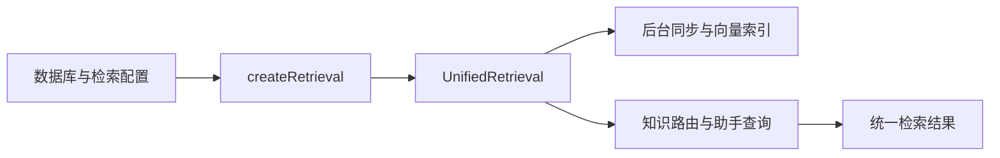

# 统一检索的配置与生命周期装配

说明服务如何从一份受校验的配置创建统一检索器，按需接入中文向量与重排模型，启动后台索引，并在服务关闭时释放模型和任务资源。

来源：gpt-5.6-sol 分析，gpt-5.6-sol 独立复核；模型解释仍可被原始证据纠正。

## 它解决什么问题

`factory.ts` 是检索子系统的**装配边界**：调用方只需提供 SQLite 数据库和可选配置，就得到统一的 `RetrievalPort` 与配套关闭函数，不必知道关键词、向量和重排实现如何组合。配置采用严格对象校验：`enabled` 默认关闭语义检索，模型别名默认 `memory-zh`，重排器可选；两个别名只能含字母、数字、下划线和连字符，额外字段、非法 JSON 或非法值会在读取时直接报错。参考 [检索配置校验 ↗](../../../apps/server/src/retrieval/factory.ts#L9 "支持配置默认值、别名格式、严格对象及文件读取行为的说明。")

这使同一工厂既能服务默认的词面/符号检索，也能在显式配置后接入本地中文模型；切换点集中在配置而非各个 API 调用方。参考 [检索器创建入口 ↗](../../../apps/server/src/retrieval/factory.ts#L14 "支持工厂按配置注入模型加载器、启动检索器并返回统一端口与关闭函数。")

## 一条代表性调用如何流动

以普通服务启动为例：`buildApp` 把数据库与 `config.retrieval` 交给 `createRetrieval`，随后将返回的同一个检索端口同时注入知识路由和助手运行时。参考 [服务端检索装配 ↗](../../../apps/server/src/app.ts#L92 "证明普通服务调用工厂，并把同一检索端口交给知识路由和助手运行时。")

工厂根据开关传入 embedding 加载函数，根据 `reranker` 传入重排加载函数，调用 `start()` 后立即返回端口；真正的投影同步与向量补索引由稍后启动的循环完成，因此 HTTP 服务无需等待新语料追平。参考 [检索器创建入口 ↗](../../../apps/server/src/retrieval/factory.ts#L14 "支持工厂按配置注入模型加载器、启动检索器并返回统一端口与关闭函数。") [后台索引启动 ↗](../../../apps/server/src/retrieval/unified.ts#L78 "说明 start 延后执行投影同步和向量补索引，并按成功或错误状态继续调度。")

收到查询后，统一检索器先同步投影并处理调用方/定义意图，再生成词面和符号候选；已有语义模型时才计算向量候选并融合，配置了重排器时再对候选池评分，最后输出统一结果。参考 [查询与词面降级 ↗](../../../apps/server/src/retrieval/unified.ts#L476 "支持查询先同步、处理代码意图，以及无语义模型或语义异常时返回词面和符号结果。") [融合与候选重排 ↗](../../../apps/server/src/retrieval/unified.ts#L534 "支持向量候选与词面、符号候选融合，以及可选重排器对候选池再次评分的流程。")

## 降级边界与资源回收

`enabled=false` 或未提供配置时，工厂不会注入 embedding 加载器，查询会走词面与符号结果；模型加载或向量计算失败时，统一检索器也记录错误并退回这一路径。由控制流可进一步确定：仅填写 `reranker` 而未开启 embedding 时，查询会在“无语义模型”处提前返回，重排器不会实际参与。参考 [检索器创建入口 ↗](../../../apps/server/src/retrieval/factory.ts#L14 "支持工厂按配置注入模型加载器、启动检索器并返回统一端口与关闭函数。") [查询与词面降级 ↗](../../../apps/server/src/retrieval/unified.ts#L476 "支持查询先同步、处理代码意图，以及无语义模型或语义异常时返回词面和符号结果。")

启用 embedding 后，加载器只接受 osdk 返回的锁定 BGE 快照，核对仓库、版本和文件哈希，并禁止远程模型；因此运行时不会隐式下载，模型缺失或不匹配会成为可见错误。参考 [本地向量模型加载 ↗](../../../apps/server/src/retrieval/embedding.ts#L18 "支持 embedding 通过 osdk 定位锁定快照、校验版本与哈希并禁止远程模型的限制。")

关闭服务时，应用先调用工厂返回的 `close`；统一检索器停止定时器，等待投影、索引和模型加载任务收束，再释放 embedding 与 reranker，之后应用才关闭数据库。这一顺序避免后台工作继续访问已关闭的 SQLite。参考 [检索资源关闭 ↗](../../../apps/server/src/retrieval/unified.ts#L787 "说明统一检索器停止后台任务、等待在途工作并释放两个模型。") [应用关闭顺序 ↗](../../../apps/server/src/app.ts#L897 "证明服务关闭钩子先关闭检索服务，再关闭底层存储。")
