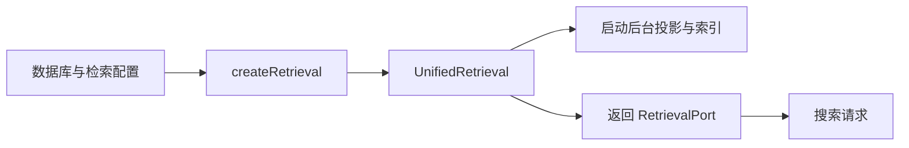

# 统一检索服务的配置与生命周期装配

说明服务端如何从受校验的配置和 SQLite 数据库创建统一检索端口，按需接入中文向量与重排模型，并把启动、降级和关闭职责交给同一服务对象。

来源：gpt-5.6-sol 分析，gpt-5.6-sol 独立复核；模型解释仍可被原始证据纠正。

## 为什么需要这一层工厂

`factory.ts` 是检索子系统的装配边界：它把数据库、统一检索实现、中文向量加载器和候选重排加载器组合起来，同时只向上层暴露 `RetrievalPort` 与一个异步关闭函数。这样，请求入口不必知道具体模型如何加载，也能获得统一的搜索能力；生产应用创建服务后，会把同一个检索端口交给开发知识适配或直接供后续接口使用。参考 [工厂依赖边界 ↗](../../../apps/server/src/retrieval/factory.ts#L1 "支持工厂连接检索端口、数据库、统一检索实现以及两类模型加载器的说明。")、[生产入口装配检索 ↗](../../../apps/server/src/app.ts#L100 "证明生产应用调用该工厂，并将返回的检索端口继续交给开发知识适配或直接使用。")。

## 一次代表性启动如何流转

以配置 `{ enabled: true, osdkModel: "memory-zh" }` 为例：上层传入 SQLite 数据库与配置，工厂构造 `UnifiedRetrieval`，把 embedding 包装成延迟加载函数；若配置了 `reranker`，也以同样方式传入。随后立即调用 `start()`，返回 `{ retrieval, close }`。参考 [创建与返回协议 ↗](../../../apps/server/src/retrieval/factory.ts#L14 "支持数据库、两个可选模型加载器的独立传入条件、启动动作以及 retrieval 和 close 返回值。")。

`start()` 会先让 HTTP 监听有机会启动，再周期性同步检索投影并补建向量索引。模型尚未就绪时，搜索仍返回词法与代码符号候选；embedding 可用、搜索完成语义融合且存在候选后，才可能首次加载重排器，发起该次搜索会等待加载完成。参考 [后台同步与索引启动 ↗](../../../apps/server/src/retrieval/unified.ts#L72 "说明 start 延后首次后台任务，并周期性同步投影和补建向量索引。")、[模型未就绪时的检索 ↗](../../../apps/server/src/retrieval/unified.ts#L413 "证明搜索在 embedding 模型为空时直接返回词法与符号候选，不会继续到语义融合和重排分支。")、[重排器延迟加载 ↗](../../../apps/server/src/retrieval/unified.ts#L475 "证明重排器分支位于语义融合之后，仅在存在候选时首次加载，并由该次搜索等待加载完成。")。

## 配置边界与资源收尾

配置采用严格 Zod 对象：`enabled` 默认关闭，模型别名默认 `memory-zh`，`reranker` 可选；别名只允许字母、数字、下划线和连字符。独立配置文件会先读取 UTF-8 JSON 再解析，所以非法 JSON、额外字段或非法别名会直接失败，而不是静默忽略。参考 [检索配置校验 ↗](../../../apps/server/src/retrieval/factory.ts#L9 "支持默认开关、默认模型别名、可选重排器、别名格式与严格 JSON 解析边界。")。

未提供配置或 `enabled` 为假时，工厂不注入 embedding。`reranker` 字段可以独立决定是否把重排加载器传给 `UnifiedRetrieval`，但这只是装配层的独立性：当前 `search()` 在 embedding 模型为空时会直接返回词法与符号结果，只有 embedding 已就绪并继续完成语义融合后才会进入重排分支。因此仅配置 `reranker`、却关闭 embedding 时，重排加载器不会被调用，重排器也不会参与搜索。参考 [创建与返回协议 ↗](../../../apps/server/src/retrieval/factory.ts#L14 "支持数据库、两个可选模型加载器的独立传入条件、启动动作以及 retrieval 和 close 返回值。")、[模型未就绪时的检索 ↗](../../../apps/server/src/retrieval/unified.ts#L413 "证明搜索在 embedding 模型为空时直接返回词法与符号候选，不会继续到语义融合和重排分支。")、[重排器延迟加载 ↗](../../../apps/server/src/retrieval/unified.ts#L475 "证明重排器分支位于语义融合之后，仅在存在候选时首次加载，并由该次搜索等待加载完成。")。

生产入口会在应用关闭钩子中调用工厂返回的 `close()`。底层关闭会停止定时器，等待投影收敛、当前索引批次和 embedding 加载，再关闭已经加载并赋给实例的 embedding 与 reranker。它**不会等待尚在进行的 reranker 首次加载**：该加载保存在 `rankingLoad`，搜索会等待它，而 `close()` 没有等待这个 Promise。因此关闭开始时若重排器仍在首次加载，当前实现不能保证释放随后才返回的模型。参考 [应用关闭钩子 ↗](../../../apps/server/src/app.ts#L895 "证明生产应用在关闭阶段调用工厂返回的 close，再关闭存储。")、[重排器延迟加载 ↗](../../../apps/server/src/retrieval/unified.ts#L475 "证明重排器分支位于语义融合之后，仅在存在候选时首次加载，并由该次搜索等待加载完成。")、[统一检索资源释放 ↗](../../../apps/server/src/retrieval/unified.ts#L660 "说明关闭会等待投影、索引工作和 embedding 加载，并只关闭当时已赋值的模型；该路径没有等待 rankingLoad。")。修改默认模型名或字段约束应从 schema 入手；修改融合、降级或加载生命周期则应进入 `UnifiedRetrieval`。
