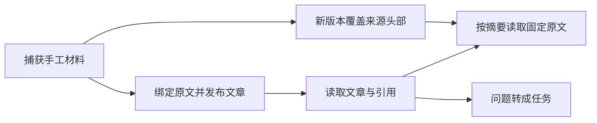

# 知识 API 的固定引用、问题转任务与历史材料保障

该集成测试验证手工捕获材料从发布为知识文章、读取内联引用、回溯固定历史版本，到将未决问题转成任务的主链路；同时覆盖无模型配置时的显式失败和被新版本替代后历史图片仍可读取。

来源：gpt-5.6-sol 分析，gpt-5.6-sol 独立复核；模型解释仍可被原始证据纠正。

## 解决的风险与使用场景

这项测试关注知识系统最关键的可追溯性：文章可以由手工材料生成，但读者点击引用时必须回到**发布时固定的原文版本**，不能被同一来源后来捕获的新内容悄悄替换。场景以“发布前核对回滚步骤”为原始材料，构造带行内引用和待确认责任人的知识文档，再附带材料摘要与独立复核信息发布。参考 [固定引用测试场景 ↗](../../../apps/server/tests/knowledge-api.test.ts#L11 "支持手工材料、带行内引用的知识文档以及发布时固定依赖版本这一测试背景。")

它还把文章中的开放问题视为可执行事项：问题可通过 API 转成任务，说明知识阅读与后续行动共用同一服务入口，而不是停留在静态文档。参考 [问题转为任务 ↗](../../../apps/server/tests/knowledge-api.test.ts#L26 "支持开放问题通过知识 API 创建任务，并验证存储中出现任务的论断。")

## 端到端验证流程

测试先创建临时 SQLite 存储并注册知识路由；发布时通过 `bindKnowledgeQuotes` 将引用绑定到材料，再验证文章响应保留人类可读的标签、理由和可操作状态，引用解析结果则携带材料摘要。参考 [文章与引用解析断言 ↗](../../../apps/server/tests/knowledge-api.test.ts#L18 "支持文章响应公开引用标签、理由、可操作性，并将引用解析到固定材料摘要。")

随后再次捕获相同外部来源，使旧材料不再是当前版本；按旧摘要读取仍返回原句并标记 `current: false`。这证明 API 区分“当前头部”与“仍可追溯的历史证据”。参考 [历史原文仍可读取 ↗](../../../apps/server/tests/knowledge-api.test.ts#L23 "支持来源更新后仍能按旧摘要读取历史原文，且该版本被标记为非当前。")

## 边界条件与覆盖范围

测试明确覆盖两个退化场景：未配置生成模型时，分析接口返回 503；图片材料被后续文本版本替代后，旧资源仍能按资产标识读取，并保持 `image/png` 类型。参考 [无模型与历史图片边界 ↗](../../../apps/server/tests/knowledge-api.test.ts#L29 "支持未配置模型返回 503，以及图片被新版本替代后仍可读取并保留媒体类型。")

从断言范围看，它验证了路由、仓储、存储和合同类型协作后的外部行为，但没有覆盖模型成功分析、独立复核拒绝、无效引用范围、缺失依赖、404 分支、权限或并发。测试只断言任务已创建，未检查任务字段如何映射，也未证明跨进程重启后的持久化行为。测试使用临时目录，并在结束时关闭应用和数据库、递归清理现场。参考 [临时资源清理 ↗](../../../apps/server/tests/knowledge-api.test.ts#L37 "支持测试最终关闭 Fastify、存储并清理临时目录；同时界定该测试是单次进程内集成验证。")
