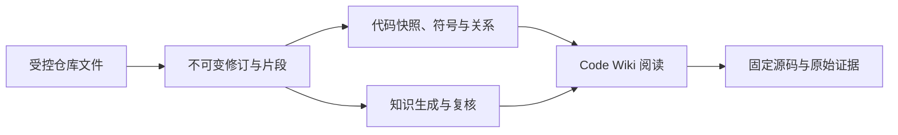

# 代码知识投影与仓库评审

Code Wiki 将仓库文件先纳入统一的不可变证据链，再投影为可浏览的代码快照、符号关系、人工关联和已复核知识。它支持从知识文章逐层追到模块、文件、符号与固定源码，但派生图和模型理解都不能替代原始材料；当前仍受单文件解析、单用户存储、历史目标失效反馈及部分一致性边界限制。

来源：gpt-5.6-sol 分析，gpt-5.6-sol 独立复核；模型解释仍可被原始证据纠正。

## 解决“实现为什么存在、依据在哪里”

Code Wiki 面向需要理解陌生仓库或复核改动的读者：入口先展示完整知识文章，再允许沿引用进入模块、文件、符号和原始片段。它不是第二套代码知识库；仓库文件仍进入 Capture→Revision→Fragment 链，代码表只是同一评审 SQLite 上可重建的结构投影。参考 [统一证据链上的代码投影 ↗](d8e08ba54848a2eb68345034e492827765b3a9a6e8e57c4758fc499db7d5d280.md#purpose_model "子知识解释代码结构是固定 Capture 修订上的派生视图，而非独立事实权威。") [代码图存储边界 ↗](../../../apps/server/src/code/store.ts#L1 "原始实现说明代码侧表位于同一隔离 SQLite，并给出确定性文件、符号、边和快照身份。")

仓库评审运行时与个人工作区隔离，不启动助手、Lark、学习或通知 worker；请求由 token 或回环 Host 与 Origin 门禁保护。这适合本地单用户评审，但不代表已经具备团队租户隔离。参考 [仓库评审运行时隔离 ↗](../../../apps/server/src/review/store.ts#L1 "原始材料证明评审运行时复用通用 Store 与捕获能力，但不触碰个人工作区或启动其他 worker。") [本地请求门禁 ↗](../../../apps/server/src/review/app.ts#L97 "原始实现支持 token、回环 Host 与允许 Origin 的访问限制，并界定本地安全边界。")

## 从仓库文件到可追溯阅读

仓库同步以相对路径保持来源身份，内容变化追加修订；脏工作树、Git 失败和单文件失败会被记录，并避免错误推进同步基线。随后代码同步只读取已捕获的固定 head revision，按仓库、提交、脏状态和内容摘要形成幂等快照。参考 [仓库增量同步 ↗](a57f3cbe22aae80c80124eb0110c71ef27faafc8362e44e64de57e9ea8fb6239.md#incremental-sync "子知识说明路径身份、增量选择、失败记录以及脏状态下不推进基线的同步语义。") [固定修订与代码快照 ↗](../../../apps/server/src/code/sync.ts#L170 "原始实现证明代码分析读取已捕获 head revision，并以全部捕获行摘要构造快照身份。")

离线解析器从 TypeScript、Vue、路由和测试中提取结构。声明边可确认，未解析导入记为缺失；调用只在单文件名称表内匹配，即使命中也保持候选，因此依赖图不能被当作完整的类型级调用图。人工 associations 则把代码符号连接到意图、需求、决策、调研和测试；找不到目标时保留 `missing`，不会用语义相似度自动升级。参考 [离线解析范围 ↗](../../../apps/server/src/code/parse.ts#L1 "原始材料明确解析器是单文件 AST，没有跨文件类型解析，调用仅为名称级候选。") [人工关系构建 ↗](../../../apps/server/src/review/sync.ts#L699 "原始实现支持代码到意图及需求、决策、调研、测试的边形，并规定无法定位时保留缺失状态。")

## 知识、结构与证据如何串联

页面从真实接口并行加载当前快照、代码图和模块理解，将文件与符号聚合为模块视图；知识首页、结构总览、模块依赖图、模块详情和文件详情共同构成阅读入口。内部标识仅用于路由，界面使用可读标题、路径和符号名。参考 [代码知识浏览入口 ↗](c7d146673237fb15547f8534001912445b4b4ef8cb6c32403bc9d240682a5c76.md#flow "子知识解释 Code Wiki 如何组织知识首页、模块图、详情与证据下钻。") [人类可读 DTO ↗](../../../apps/server/src/code/dto.ts#L1 "原始材料说明内部操作键与可见标签分离，缺失或过期目标需带不可操作原因。")

阅读下钻统一进入证据轨迹抽屉：知识引用、模块、文件、符号和片段共享同一帧栈，可返回、跳转、检测循环并恢复焦点。URL hash 可恢复主视图和轨迹；源码接口按指定快照读取固定修订文本，不会用当前工作树补造历史内容。参考 [统一证据轨迹 ↗](../../../apps/web/src/codewiki/CodeWiki.vue#L371 "原始界面实现显示知识、模块、文件、符号和片段共用同一轨迹抽屉。") [固定快照源码 ↗](../../../apps/server/src/review/app.ts#L400 "原始 API 实现证明源码范围读取绑定指定快照，不回退实时工作树，并明确错误边界。")

## 当前进展与能力边界

目前已串起增量捕获、不可变修订、代码快照、人工关系、知识恢复、检索、固定源码和证据轨迹。搜索会先过滤当前可见材料，再交给关键词或显式启用的语义检索排序；代码理解模型默认关闭，只有显式配置传输端口后才生成，失败或越界引用不会成为当前结果。参考 [知识恢复与检索边界 ↗](1d40b7d26d0e45f48020a86c0a04e64e7c23827274441b6e238dee9f39308cd0.md#knowledge-and-search "子知识说明知识恢复、可见性前置过滤、显式模型生成和失败不提升的整体关系。") [显式模型生成入口 ↗](../../../apps/server/src/review/app.ts#L579 "原始实现证明无模型时返回不可用，目标与预算显式传入，失败按状态返回且不作为成功结果。")

仍需注意：解析没有跨文件类型绑定；公开的代码同步 `only` 参数尚未生效；符号按快照存储，但部分按 ID 查询未显式限定快照；恢复出的失效轨迹目标可能只显示空白；模型生成主记录与引用镜像并非同一事务。人工 seed、生成结果和结构校验也不等于独立语义复核，只有 verifier 明确提升后才可称为 verified。参考 [当前限制汇总 ↗](d8e08ba54848a2eb68345034e492827765b3a9a6e8e57c4758fc499db7d5d280.md#progress_limits "子知识归纳跨文件语义、选择性同步、快照查询和模型引用一致性等已确认限制。") [生成与验证状态合同 ↗](../../../packages/agent-runtime/src/code-understanding.ts#L228 "原始合同区分 seed、generated 与 verified，并要求 verified 必须具有独立代理复核标志。")
