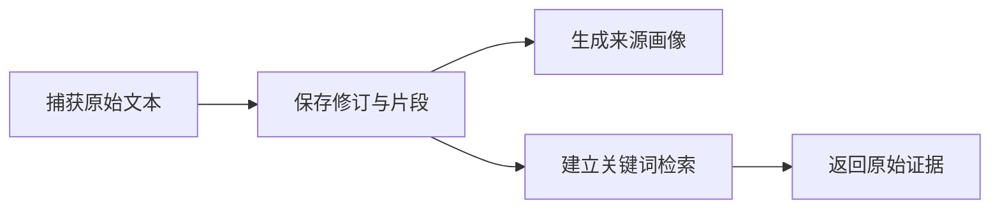

# 原始证据检索与来源画像的集成测试

这组进程内集成测试验证手工捕获的原始材料会生成来源画像并立即参与关键词检索，同时覆盖篇章与时态识别、代码示例隔离、活跃记忆查询、固定证据读取、部分降级、结果过滤和派生内容排除等行为。

来源：gpt-5.6-sol 分析，gpt-5.6-sol 独立复核；模型解释仍可被原始证据纠正。

## 测试目标与运行环境

这组测试关注材料捕获后的两项基础能力：保存可回溯的原始证据，以及生成帮助理解内容结构的来源画像。每个场景在独立临时目录中创建 `Store`，结束后关闭数据库并清理目录。参考 [临时存储隔离与清理 ↗](../../../apps/server/tests/retrieval-source-profile.test.ts#L11 "支持各场景使用独立 Store，并在测试后关闭数据库、清理临时目录。")

测试通过统一辅助函数校验手工文本与来源信息后执行捕获；`Store` 初始化 SQLite、仓储和画像服务，测试再直接读取画像或调用关键词检索。参考 [统一捕获辅助函数 ↗](../../../apps/server/tests/retrieval-source-profile.test.ts#L39 "支持测试通过共享输入合同校验手工文本和来源信息后调用 Store.capture。")、[存储与画像服务装配 ↗](../../../apps/server/src/store.ts#L38 "支持 Store 创建 SQLite 数据库并装配相关仓储和 SourceProfileService。")

## 从捕获到理解与召回

Markdown 捕获后，画像应识别标题和篇章结构，原始片段可立即按中文关键词命中，且不会产生逐句确认决策。参考 [捕获后的画像与即时检索 ↗](../../../apps/server/tests/retrieval-source-profile.test.ts#L93 "支持 Markdown 标题和篇章结构被识别、原始片段立即可检索且不产生逐句确认决策。") 画像还区分当前事实与未来计划，为回指保留父标题；SQL、TODO 和代码对象被视为示例，不转成所有者任务。参考 [时态与父级语境 ↗](../../../apps/server/tests/retrieval-source-profile.test.ts#L133 "支持画像区分当前状态和未来计划，并为回指内容保留最近父标题。")、[代码示例不转为任务 ↗](../../../apps/server/tests/retrieval-source-profile.test.ts#L175 "支持代码、SQL 和 TODO 被归类为示例，且不会生成所有者任务。")

对于已应用的活跃记忆，直接以复用相关关键词的文本查询时可以命中，无关查询不命中。该场景只证明词法查询行为，并未捕获一份新材料来验证自动触发召回。参考 [活跃记忆关键词查询 ↗](../../../apps/server/tests/retrieval-source-profile.test.ts#L210 "支持直接使用复用关键词的查询文本命中活跃记忆、无关查询不命中，同时界定该用例没有捕获新材料。")

## 原始证据优先与检索边界

固定修订和片段可读取精确原文，未知目标返回 `null`。表格等未完整处理的内容会形成覆盖缺口并使画像进入 `partial`，但原始片段仍被保留。参考 [固定证据读取 ↗](../../../apps/server/tests/retrieval-source-profile.test.ts#L232 "支持按固定修订和片段读取原文，以及未知修订或片段返回空值。")、[画像部分降级 ↗](../../../apps/server/tests/retrieval-source-profile.test.ts#L250 "支持表格形成覆盖缺口、画像进入 partial 状态且原始片段仍保留，也表明该场景未模拟异常抛出。")

记忆别名可作为召回路线，最终结果仍指向关联的原始片段；可见性、时间范围和来源新修订会过滤旧结果。参考 [记忆路线与结果过滤 ↗](../../../apps/server/tests/retrieval-source-profile.test.ts#L268 "支持记忆别名召回原始片段，以及可见性、时间范围和来源新修订对结果的过滤作用。") 标题与短中文词可以命中，派生答案被排除，过滤发生在结果上限之前。参考 [短中文、标题与派生排除 ↗](../../../apps/server/tests/retrieval-source-profile.test.ts#L289 "支持标题和短中文词命中、派生答案排除及过滤先于结果上限，同时显示查询发生在同一 Store 中。") 检索入口还会规范化数量、分词并执行时间与可见性判断；画像结构保存篇章类型、父标题、时态、覆盖缺口和处理状态。参考 [检索入口过滤逻辑 ↗](../../../apps/server/src/retrieval/keyword.ts#L53 "解释关键词检索如何限制返回数量、分词，并按时间范围和可见性筛选候选。")、[来源画像数据结构 ↗](../../../apps/server/src/source-profile/service.ts#L21 "解释画像显式保存篇章类型、父标题、时态、覆盖缺口、证据引用和处理状态。")

## 已验证范围与待补场景

这些用例直接实例化 `Store` 和 `KeywordRetrieval`，结论限于 SQLite、画像与词法检索的进程内集成路径，并不直接覆盖 HTTP 或外部采集链路。参考 [临时存储隔离与清理 ↗](../../../apps/server/tests/retrieval-source-profile.test.ts#L11 "支持各场景使用独立 Store，并在测试后关闭数据库、清理临时目录。")、[统一捕获辅助函数 ↗](../../../apps/server/tests/retrieval-source-profile.test.ts#L39 "支持测试通过共享输入合同校验手工文本和来源信息后调用 Store.capture。")

名称含“restore”的用例只在同一个 `Store` 中于捕获后立即查询，没有重开数据库，因此不能证明进程重启后的索引恢复。参考 [短中文、标题与派生排除 ↗](../../../apps/server/tests/retrieval-source-profile.test.ts#L289 "支持标题和短中文词命中、派生答案排除及过滤先于结果上限，同时显示查询发生在同一 Store 中。") “profile failure”场景实际验证的是表格引起的覆盖缺口和 `partial` 状态，没有模拟画像器抛出异常或进入 `failed`。参考 [画像部分降级 ↗](../../../apps/server/tests/retrieval-source-profile.test.ts#L250 "支持表格形成覆盖缺口、画像进入 partial 状态且原始片段仍保留，也表明该场景未模拟异常抛出。")
