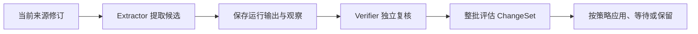

# 从原始材料到可信记忆的学习流水线

学习流水线以当前固定修订为证据，经候选提取、独立复核和整批策略评估后更新记忆；评估结果包括自动应用、等待决定、拒绝、延后使用、仅保留来源和忽略噪声等策略，并保留可追溯的角色运行记录。

来源：gpt-5.6-sol 分析，gpt-5.6-sol 独立复核；模型解释仍可被原始证据纠正。

## 在模型输出与记忆写入之间建立可信边界

`LearningPipeline` 负责把捕获材料转化为可审查的记忆变更，而不是直接采信模型回答。它注册提取、复核和来源刷新三类持久化作业，要求 extractor、verifier 使用与当前 Agent Profile 匹配的角色包，并把模型、effort 及提示词、技能、工具指纹纳入作业运行信息。参考 [学习作业与运行指纹 ↗](../../../apps/server/src/learning/pipeline.ts#L86 "支持流水线注册三类作业、校验角色配置，并记录模型及运行组件指纹的说明。")

流水线依赖持久化 worker 按限定的 kind 领取租约和分派处理器；没有可领取作业时结束本轮，遇到未注册的处理器则以配置错误完成失败记录。因此学习 worker 只消费自己声明的作业类型。参考 [持久化作业领取与分派 ↗](../../../apps/server/src/jobs/worker.ts#L47 "支持 worker 按限定 kind 领取租约，以及无作业和缺少处理器时的处理方式。")

## 只使用当前修订构造受约束上下文

每次角色运行都会重新解析作业引用，确认修订存在、仍是来源 head、sourceId 一致且 validity epoch 未变化；不满足任一条件便以 `STALE_JOB_INPUT` 拒绝处理，避免旧材料生成当前记忆。参考 [修订新鲜度校验 ↗](../../../apps/server/src/learning/pipeline.ts#L180 "支持对来源 head、sourceId 和 validity epoch 的校验及过期输入拒绝机制。")

上下文将“捕获发生的位置”与“可信项目归属”分开：在没有已确认项目链接时，项目标识为空且 `project_trusted=false`。固定 fragment 还会按顺序映射回原始 part，保留发言者、回复关系、观察时间、转发状态等来源信息；图片材料则附带对应资产内容。参考 [材料来源与图片上下文 ↗](../../../apps/server/src/learning/pipeline.ts#L207 "支持区分捕获位置和可信项目，并保留逐部分来源信息及图片资产的说明。")

召回到的既有记忆仅作为背景，失效记忆以原 memory identity 作为刷新目标；角色被明确要求只依据当前原始材料重核验，不得把旧派生正文当作证据或复制出重复记忆。参考 [召回与失效记忆刷新约束 ↗](../../../apps/server/src/learning/pipeline.ts#L276 "支持既有记忆作为背景召回、失效记忆按原身份重核验且旧派生正文不得充当证据的说明。")

## 提取、独立复核与整批策略评估

提取阶段校验角色版本，运行 extractor，解析候选合同并保存运行输出；保存内容包含生效模型与 effort、各类指纹、角色包、上下文、会话、工具、用量、输出和 trace。存在 proposal 时才派生 verifier 作业；无候选时以 abstention 协调来源刷新。参考 [角色运行记录保存 ↗](../../../apps/server/src/learning/pipeline.ts#L332 "支持保存模型、effort、指纹、会话、工具、用量、输出和完整 trace 等运行字段的说明。") [候选提取阶段 ↗](../../../apps/server/src/learning/pipeline.ts#L421 "支持 extractor 运行、候选解析、观察记录、复核作业入队和无候选时记录 abstention 的流程。")

复核阶段会验证父作业关系、已保存输出的 schema 与摘要、提取 job_id、角色包哈希，并要求 verifier 对每个规范化候选给出且仅给出一个摘要匹配的判断。参考 [复核输入完整性检查 ↗](../../../apps/server/src/learning/pipeline.ts#L458 "支持 verifier 校验父作业、输出 schema 与摘要、角色包哈希以及候选覆盖完整性的说明。") 随后所有候选一次性交给 `evaluateBatch`，按去重后的联合影响计算预算，避免拆分变更绕过限制。评估结果包括自动应用、等待决定或拒绝等策略，完整策略集合还包含延后使用、仅保留来源和忽略噪声；流水线当前的 usage 统计只单独计数前三类。参考 [整批策略评估 ↗](../../../apps/server/src/learning/pipeline.ts#L525 "支持将整个 ChangeSet 一次性交给记忆服务评估、按联合影响控制预算，并统计部分策略结果的说明。") [完整策略结果集合 ↗](../../../apps/server/src/memory/service.ts#L18 "支持评估策略除自动应用、等待决定和拒绝外，还包括延后使用、仅保留来源和忽略噪声。")

## 来源刷新、失败处理与运行边界

来源变化后，流水线先记录受影响项；若目标修订已不再是当前 head，则以 `source_advanced` 原因协调并结束本次刷新。否则它复用普通捕获的提取身份入队，避免并行启动另一套 extractor 而重复创建记忆。参考 [来源更新后的重提取 ↗](../../../apps/server/src/learning/pipeline.ts#L126 "支持记录来源刷新、目标修订不再为当前版本时以 source_advanced 协调，以及复用提取身份重新入队。")

异常信息在持久化前会清除常见密钥和认证字段、压平换行并限制长度，再按坏输出、认证、瞬态、配置或永久错误分类。提取或复核失败只把错误交给来源刷新协调流程，不会继续应用失败结果。参考 [安全错误分类 ↗](../../../apps/server/src/learning/pipeline.ts#L30 "支持错误脱敏、长度限制以及坏输出、认证、瞬态、配置和永久错误的分类。")

运行器既支持单步处理和有上限的排空，也支持后台轮询；状态接口暴露运行中标志、累计处理数和最近错误。停止时会中止轮询控制器、通知 worker 并等待当前循环退出。参考 [轮询、排空与停止 ↗](../../../apps/server/src/learning/pipeline.ts#L572 "支持单步处理、有限排空、后台轮询、状态报告和停止流程的说明。")
