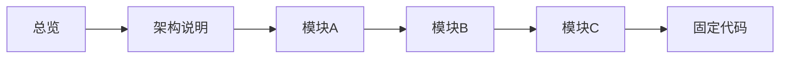

# 知识浏览与递归证据追踪的端到端验证

该脚本在临时仓库中构造代码、材料与知识文章，启动真实服务并通过 Chromium 验证递归引用、代码跳转、深链接恢复、焦点归还、响应式布局、待办创建和源码安全展示。它覆盖 Vue、API 与 SQLite 的成功路径，不依赖 LLM。

来源：gpt-5.6-sol 分析，gpt-5.6-sol 独立复核；模型解释仍可被原始证据纠正。

## 验证真实知识阅读链路

脚本验证的是一条完整的读者流程：用户从知识首页进入叙述中的引用，逐层查看章节和模块说明，最终定位到固定代码；过程同时经过真实 Vue 页面、服务 API 与 SQLite。知识内容由显式 fixture 构造，不调用 LLM，因此失败可以稳定复现和定位。参考 [端到端验证定位 ↗](../../../scripts/knowledge-browser.ts#L1 "支持脚本使用真实 Vue、API、SQLite，并以显式 fixture 取代 LLM 的测试定位。")

它先在临时目录写入 A→B→C 的最小 TypeScript 依赖链，以及一份包含脚本标签的 HTML；随后创建 Store，执行评审同步、仓库材料捕获和代码同步，再建立知识仓储。参考 [临时仓库与同步流程 ↗](../../../scripts/knowledge-browser.ts#L14 "支持临时代码和 HTML 的创建，以及 Store、评审同步、材料捕获、代码同步和知识仓储初始化流程。")

## 从固定材料到递归引用

`publish` 为每个模块组装带内联引用的知识文档，绑定材料原文，并把材料摘要或目标文章修订号记录为依赖；模块 A 还带有实现引用和一个待确认问题。参考 [知识文档发布逻辑 ↗](../../../scripts/knowledge-browser.ts#L24 "解释 fixture 文档、内联引用、问题、原文绑定和依赖摘要如何组装并发布。")

脚本按上述顺序发布文章并设置引用目标，从而形成可递归展开的证据链。参考 [递归文章链 ↗](../../../scripts/knowledge-browser.ts#L37 "支持总览、架构、A、B、C 与固定材料之间逐层引用关系的构造。") 知识仓储会校验每节是否使用内联引用、引用是否确有目标，以及材料行号是否有效，所以这些 fixture 也必须满足正式知识合同。延伸阅读：[知识引用合同 ↗](../../../apps/server/src/knowledge/repository.ts#L44 "说明知识仓储对内联引用、目标存在性和材料行号范围的正式校验。")

## 浏览器断言与能力边界

浏览器断言覆盖五层面包屑、代码内容、Esc 返回一层、刷新后恢复深链接、关闭后归还焦点，以及从 import 行引用跳到目标模块知识。参考 [递归导航与恢复 ↗](../../../scripts/knowledge-browser.ts#L47 "支持逐层打开引用、面包屑深度、代码展示、Esc 返回、刷新恢复、焦点归还和 import 跳转等断言。") 脚本还在 1440、768、390 三种宽度检查无横向溢出，并验证用户能把未解决问题加入待办且 Store 中产生对应任务。参考 [响应式与待办 ↗](../../../scripts/knowledge-browser.ts#L75 "支持三种视口无横向溢出，以及由未解决知识显式创建待办并写入 Store 的行为。")

安全检查会打开含 `<script>` 的 HTML 原文：界面应显示源码，而页面全局变量仍为未定义，说明材料没有作为脚本执行。进入浏览器断言阶段后，无论断言成功还是抛错，`finally` 都会尝试关闭浏览器和服务并删除临时目录；它不覆盖此前的 Store 创建、同步、发布、服务启动或 Chromium 启动失败。参考 [源码安全与清理边界 ↗](../../../scripts/knowledge-browser.ts#L43 "支持 HTML 只显示而不执行，并准确限定 finally 仅保护进入 try 后的浏览器断言阶段。")

当前验收只启动 Chromium，且生成与复核元数据使用固定 fixture 值，因此不能证明 Firefox、WebKit 上行为一致，也不能代表真实模型的生成质量。同步失败、发布校验失败和待办写入失败时的用户可读反馈同样未被这条成功路径验证。参考 [Chromium 与固定元数据 ↗](../../../scripts/knowledge-browser.ts#L33 "支持测试仅启动 Chromium、发布时使用固定生成和复核元数据，并界定失败路径和真实模型质量不在当前验证范围内。")
