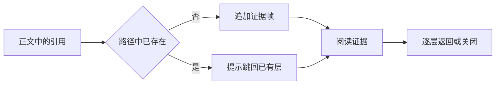

# 共享知识阅读界面与证据导航

共享 UI 包把响应式页面骨架、内容来源提示、安全代码高亮与递归证据路径组织为一致的知识阅读体验。读者可以在桌面或移动界面中辨认内容性质、逐层查看引用，并在返回时恢复焦点和阅读位置；URL 深链预算仍需宿主流程落实。

来源：gpt-5.6-sol 分析，gpt-5.6-sol 独立复核；模型解释仍可被原始证据纠正。

## 从统一页面骨架开始阅读

共享界面首先解决不同知识页面如何保持一致阅读方式的问题。应用外壳把顶部工具、导航、正文和可选助理区留作插槽；正文承担主要阅读任务，左右区域分别容纳目录与追问能力。参考 [页面插槽结构 ↗](../../../packages/ui/src/components/OmShell.vue#L8 "支持顶部、导航、正文与可选助理区域的组成，以及各区域由调用方注入内容的说明。")

桌面端采用可独立滚动的三栏布局，主内容弹性占据剩余空间。视口不超过 1100 像素时，助理转为右侧抽屉；不超过 700 像素时，导航也转为左侧抽屉，顶栏随之压缩。参考 [三栏滚动布局 ↗](../../../packages/ui/src/components/OmShell.vue#L46 "支持全视口外壳、固定宽度侧栏、弹性正文和各区域独立滚动的说明。") [响应式侧栏 ↗](../../../packages/ui/src/components/OmShell.vue#L107 "支持助理和导航在两个视口断点下转为固定抽屉，以及移动端顶栏压缩的说明。")

共享样式定义黑白灰颜色、正文与标题字体基线，并分别提供清晰的键盘焦点轮廓和“减少动态效果”适配。参考 [颜色与正文基线 ↗](../../../packages/ui/src/tokens.css#L1 "支持共享颜色、字体变量及页面背景、正文颜色和正文字体基线的说明。") [标题排版层级 ↗](../../../packages/ui/src/tokens.css#L47 "支持一级、二级标题采用共享衬线字体，并设置字重、行高和字号层级。") [键盘焦点轮廓 ↗](../../../packages/ui/src/tokens.css#L38 "支持按钮、链接、表单控件和展开摘要获得清晰的可见焦点轮廓。") [减少动态效果 ↗](../../../packages/ui/src/tokens.css#L91 "支持根据系统偏好关闭动画、过渡和平滑滚动的说明。")

## 辨认内容来源并安全阅读代码

知识页面可能同时展示原始证据、派生解释、候选判断、过期内容、加载错误或人工整理结果。状态提示组件把这些来源阶段映射为固定中文标签，并以注记语义附在内容旁；它只说明内容处于什么来源层级，不代替关系是否成立的判断。参考 [内容来源状态 ↗](../../../packages/ui/src/components/OmStatusLine.vue#L2 "支持来源层级与关系状态的职责区分，以及六种中文状态标签和注记语义。")

代码阅读会按语言别名加载高亮器；未知语言不自动猜测，而是转义特殊字符后原样展示。参考 [安全高亮流程 ↗](../../../packages/ui/src/highlight.ts#L21 "支持未知语言转义降级，以及已知语言按需注册并生成高亮 HTML 的流程。") 为支持行号和逐行定位，高亮结果在换行处临时闭合开放的 `span`，下一行再恢复，使跨行注释保持样式连续，同时让每行成为可独立渲染的片段。参考 [跨行样式恢复 ↗](../../../packages/ui/src/highlight.ts#L35 "支持通过开放标签栈将高亮 HTML 拆成独立行，同时延续跨行词法样式。") 当前测试覆盖了跨行注释，以及已知、未知语言输入中的标记转义。参考 [高亮行为验证 ↗](../../../packages/ui/src/highlight.test.ts#L4 "支持跨行注释样式，以及已知和未知语言输入均安全转义标记的当前验证范围。")

## 沿证据深入并保留返回路径

读者从解释继续打开文件、符号、知识或原始来源时，`useEvidenceTrail` 用响应式帧栈记录路径。新目标若与已有帧的类型和身份相同，系统记录循环位置而不重复入栈；返回会移除末层，跳转会截断到指定层，完整关闭则清空路径。参考 [证据轨迹状态 ↗](../../../packages/ui/src/useEvidenceTrail.ts#L4 "支持重复帧检测、触发元素记录、入栈、返回、跳转和关闭的状态流程。")

抽屉通过面包屑、上一层入口和循环提示呈现这些操作。参考 [路径导航界面 ↗](../../../packages/ui/src/components/OmTrailDrawer.vue#L107 "支持面包屑回跳、上一层入口、循环提示和完整关闭等读者可见操作。") Esc 在多层路径中返回上一层，在根层关闭；切换帧时还会保存滚动位置，并在异步内容重新增长期间持续校正。用户开始滚轮、触摸、指针或键盘操作后，滚动控制权交还给用户。参考 [分层退出与滚动恢复 ↗](../../../packages/ui/src/components/OmTrailDrawer.vue#L54 "支持帧间滚动位置保存与恢复、用户接管滚动，以及 Esc 分层退出行为。")

## 公共入口、状态恢复与能力边界

按钮、外壳、状态提示、代码阅读器、证据抽屉、轨迹类型、路由函数和组合式状态均由同一包入口导出，上层页面可以围绕一组稳定名称组装知识阅读流程。参考 [共享界面公共入口 ↗](../../../packages/ui/src/index.ts#L1 "支持基础组件、阅读组件、轨迹能力、路由函数与组合式状态由统一入口导出。") 抽屉打开后会把焦点移到当前标题；完整关闭时优先归还给显式触发元素，否则回到打开前的活动元素。参考 [抽屉焦点管理 ↗](../../../packages/ui/src/components/OmTrailDrawer.vue#L35 "支持模态打开时聚焦标题，以及关闭后将焦点归还触发元素或原活动元素。")

页面外壳只管理两侧区域的本地显隐，不负责路由或业务数据；证据抽屉呈现受控帧栈，内容加载与 URL 同步仍属于宿主。轨迹模型规定 URL 最多持久化 200 层，并要求触顶时显式提示，但通用 `pushFrame` 当前只是追加数组，没有执行上限检查，因此共享包本身不能证明深链限额已经在端到端流程中落实。参考 [深链深度边界 ↗](../../../packages/ui/src/trail.ts#L37 "支持 URL 持久化上限与显式提示要求，同时显示通用入栈函数尚未执行上限检查。")
