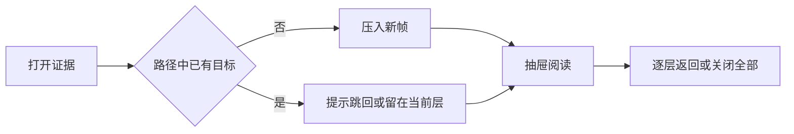

# 共享知识阅读界面与证据导航

共享 UI 包为个人记忆与仓库知识提供一致的页面骨架、来源提示、代码阅读和证据 Trail。现有实现覆盖响应式布局、分层返回、条件式焦点归还、滚动恢复及基础高亮测试；深链超限处理、窄屏侧栏交互和端到端浏览器验证仍待确认。

来源：gpt-5.6-sol 分析，gpt-5.6-sol 独立复核；模型解释仍可被原始证据纠正。

## 统一不同知识入口的阅读语言

该模块是供上层应用复用的 Vue 3 界面层。包入口集中公开页面外壳、Markdown 与代码阅读器、引用、关系图、来源状态和 Trail 抽屉，也导出 Trail 状态及哈希路由接口，使个人记忆与仓库知识能够采用相同的阅读组件。参考 [共享 UI 公共入口 ↗](../../../packages/ui/src/index.ts#L1 "支持基础控件、知识阅读组件、Trail 状态与哈希路由能力通过同一包级入口公开。")

内容块可标明原始证据、派生说明、候选、过期、错误或人工整理，帮助读者区分材料来源与可信阶段；这种提示不表示关系边是否已确认。参考 [内容来源状态 ↗](../../../packages/ui/src/components/OmStatusLine.vue#L2 "支持来源阶段的中文标签，并说明来源提示与关系状态职责分离。")

## 从桌面三栏到窄屏侧栏

页面外壳通过插槽接收顶部工具、导航、正文和可选助理内容。参考 [页面外壳插槽结构 ↗](../../../packages/ui/src/components/OmShell.vue#L8 "支持顶部、导航、正文和可选助理区域由插槽组成。") 外壳占满动态视口并限制根滚动，导航、主内容和助理区域各自滚动，适合在阅读长文时保留目录或辅助内容。参考 [三栏布局与滚动规则 ↗](../../../packages/ui/src/components/OmShell.vue#L46 "支持全视口外壳以及导航、主内容和助理区域各自滚动的布局说明。")

视口不超过 1100 像素时，助理改为右侧固定层；不超过 700 像素时，导航也改为左侧固定层。两者由独立状态控制，现有材料未显示互斥、遮罩、Esc 关闭或焦点管理。参考 [响应式侧栏切换 ↗](../../../packages/ui/src/components/OmShell.vue#L107 "支持两个断点下助理和导航变为固定侧栏，并显示两套显隐状态彼此独立。") 全局令牌则统一浅色纸面、中文优先字体与基础排版，并为常见交互元素提供可见的键盘焦点轮廓。参考 [视觉令牌与键盘焦点 ↗](../../../packages/ui/src/tokens.css#L1 "支持共享颜色、中文字体、页面排版以及常见交互元素的可见焦点轮廓。")

## 沿证据路径深入并返回

Trail 把模块、文件、符号、知识、引用和来源表示为可序列化帧；每帧带有稳定身份、人读标题及可选滚动位置，从而保留进入当前材料的路径。参考 [Trail 帧合同 ↗](../../../packages/ui/src/trail.ts#L1 "支持可序列化帧、帧类型、稳定身份、人读标题和滚动位置等核心概念。")

组合式函数负责查重、入栈、后退、跳转和关闭，并在状态变化后调用回调，可供外层同步路由或持久化；重复目标只记录循环位置，不再次入栈。参考 [Trail 状态管理流程 ↗](../../../packages/ui/src/useEvidenceTrail.ts#L6 "支持重复检测、入栈、后退、跳转、关闭以及状态变化后调用通用回调的流程。") 抽屉打开时聚焦当前标题，逐帧保存并恢复滚动。正常完整关闭后，如果目标仍存在，会优先把焦点归还给显式触发元素，否则尝试回到打开前的元素；卸载时只尝试后者。参考 [抽屉焦点管理 ↗](../../../packages/ui/src/components/OmTrailDrawer.vue#L35 "支持打开时聚焦标题，以及正常关闭时有条件地归还给显式触发元素或打开前元素。") [逐帧滚动与卸载清理 ↗](../../../packages/ui/src/components/OmTrailDrawer.vue#L54 "支持帧切换时保存和恢复滚动，并说明卸载时只在打开前元素仍存在时尝试恢复焦点。") 面包屑、Esc、上一层入口和循环提示共同提供分层导航。参考 [证据路径导航界面 ↗](../../../packages/ui/src/components/OmTrailDrawer.vue#L107 "支持面包屑、Esc、上一层入口、循环提示和关闭全部等用户可见交互。")

200 层常量仅是 URL 持久化预算，渲染栈不应静默截断；当前压栈函数并未实施该限制，因此实际拒绝与提示仍取决于未提供的路由调用层。参考 [Trail 深链预算 ↗](../../../packages/ui/src/trail.ts#L37 "支持 200 层只限制 URL 持久化、渲染不应静默截断，并表明压栈实现没有应用该限制。")

## 安全代码高亮与验证边界

代码高亮按语言别名加载语法定义；未知语言直接转义文本，避免把捕获内容解释为页面标记。参考 [代码高亮安全降级 ↗](../../../packages/ui/src/highlight.ts#L21 "支持语言别名选择、语法定义加载及未知语言转义处理。") 为生成可独立渲染的编号行，拆分器会在换行处闭合活动样式，并在下一行重新打开，从而保留多行注释等词法状态；它只适用于 highlight.js 生成的受控 HTML。参考 [跨行高亮拆分 ↗](../../../packages/ui/src/highlight.ts#L35 "支持在换行处闭合并重开样式标签，并界定拆分器只接受高亮器生成内容。")

现有测试验证了 TypeScript 多行注释拆分，以及已知和未知语言下形似图片标签的输入不会成为真实标签。参考 [代码高亮行为测试 ↗](../../../packages/ui/src/highlight.test.ts#L4 "支持多行注释拆分和已知、未知语言输入的标记转义，同时界定当前自动测试范围。") 这些用例不能证明 Trail、来源状态、响应式侧栏或焦点归还在真实浏览器中的完整表现。

## 仍需确认的集成边界

当前材料已经给出共享组件及局部状态合同，但未包含哈希路由调用点、页面外壳的浏览器测试或完整应用接线。因此深链超限提示、窄屏双侧栏策略和跨组件无障碍行为仍应通过实际调用方与端到端测试核验。参考 [响应式侧栏切换 ↗](../../../packages/ui/src/components/OmShell.vue#L107 "支持两个断点下助理和导航变为固定侧栏，并显示两套显隐状态彼此独立。") [Trail 状态管理流程 ↗](../../../packages/ui/src/useEvidenceTrail.ts#L6 "支持重复检测、入栈、后退、跳转、关闭以及状态变化后调用通用回调的流程。") [Trail 深链预算 ↗](../../../packages/ui/src/trail.ts#L37 "支持 200 层只限制 URL 持久化、渲染不应静默截断，并表明压栈实现没有应用该限制。") [代码高亮行为测试 ↗](../../../packages/ui/src/highlight.test.ts#L4 "支持多行注释拆分和已知、未知语言输入的标记转义，同时界定当前自动测试范围。")
