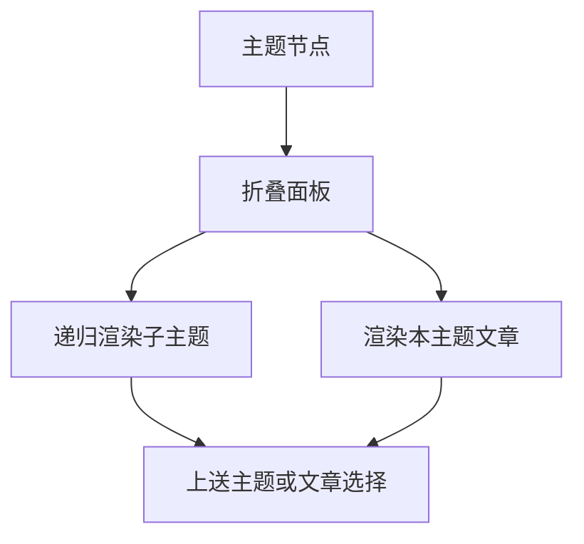

# 知识主题文件夹的递归浏览与选中联动

该组件把主题节点递归渲染为可折叠目录，并在主题选择、文章选择和当前路径变化之间维持一致状态；文章关系树由另一个组件负责，但此处只展示主题节点直接包含的文章。

来源：gpt-5.6-sol 分析，gpt-5.6-sol 独立复核；模型解释仍可被原始证据纠正。

## 解决主题目录的浏览问题

知识库文章带有层级主题后，读者需要先按主题逐层缩小范围，再打开具体文章。`KnowledgeFolder` 接收一个主题节点、当前文章和活动主题路径，用折叠面板显示主题名称与文章数量；只有路径与当前主题完全相等且未选中文章时，目录标题才呈现活动状态。参考 [主题文件夹输入与高亮 ↗](../../../apps/web/src/knowledge/KnowledgeFolder.vue#L6 "支持组件接收主题节点、选中项和活动路径，并据此判断当前主题高亮的说明。")

主题节点并非组件临时推断：上游会按文章的 `topicPath` 建树，将文章排序后放入对应节点，并沿途累计数量。该组件消费这一稳定结构，避免把目录组织逻辑混入视图。延伸阅读：[主题树构建规则 ↗](../../../apps/web/src/knowledge/topics.ts#L5 "说明主题节点、文章归属和累计数量来自上游正式建树逻辑。")

## 展开、递归与事件上送

组件初始化时会展开活动路径上的目录以及第一层目录；当外部切换活动路径时，匹配的新祖先目录会自动展开，但已打开的其他目录不会被强制收起。参考 [目录自动展开 ↗](../../../apps/web/src/knowledge/KnowledgeFolder.vue#L12 "支持初始展开第一层或活动路径，以及活动路径变化时展开匹配目录的行为。")

子主题继续使用 `KnowledgeFolder`，并原样转发 `topic` 与 `select` 事件；本层文章交给 `KnowledgeTree`，文章点击最终上送文章键。参考 [递归渲染与事件转发 ↗](../../../apps/web/src/knowledge/KnowledgeFolder.vue#L35 "支持子主题递归、直接文章渲染以及选择事件逐层上送的流程。")

## 边界与组件分工

该组件负责**主题层级**，不在这里展开文章之间的子级关系：传给 `KnowledgeTree` 的文章集合固定为空，因此后者无法从集合中解析当前文章的 `children`。这意味着文件夹内只显示该主题节点直接收纳的文章；是否有意禁用文章关系展开，仅凭现有材料不能确认。参考 [文章子级解析边界 ↗](../../../apps/web/src/knowledge/KnowledgeTree.vue#L11 "结合空文章集合的传参和 KnowledgeTree 的子级查找逻辑，支持此处无法展开文章子关系的判断。")

活动判断采用“节点路径是活动路径前缀”的规则，所以祖先目录会保持展开；高亮则额外要求路径长度相等。样式只提供缩进、左侧层级线和活动背景，具体折叠交互与可访问性标题由共享的 `OmDisclosure` 承担，但其内部行为不在材料范围内。参考 [层级样式与活动背景 ↗](../../../apps/web/src/knowledge/KnowledgeFolder.vue#L57 "支持文件夹仅定义层级缩进、边线和活动背景等局部视觉职责。")
