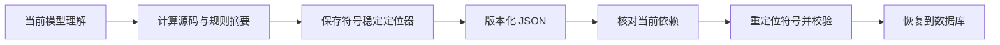

# 代码理解成果的版本化导出与安全恢复

该模块把当前、有效的模型代码理解保存为可提交的 JSON 产物，并在仓库重新同步后依据源码摘要和稳定符号定位器恢复结果。它严格区分派生知识与原始证据，对过期依赖、越界引用、无法重定位的符号和伪造模型来源分别标记为 stale 或 rejected。

来源：gpt-5.6-sol 分析，gpt-5.6-sol 独立复核；模型解释仍可被原始证据纠正。

## 解决什么问题

代码理解结果通常保存在运行时数据库中，难以随仓库版本携带。本模块将其导出成便携 JSON，并保留模型输出、生成预算、依赖摘要和符号定位信息；Markdown 仅是可读投影，二者都不会被重新摄取为独立原始证据。参考 [派生知识边界 ↗](../../../apps/server/src/code/artifacts.ts#L1 "说明 JSON 与 Markdown 都是派生视图，不会作为独立原始证据重新摄取。") [版本化产物结构 ↗](../../../apps/server/src/code/artifacts.ts#L14 "支持产物包含目标、依赖、节点定位器、模型输出和可选预算的说明。")

这样既能提交和迁移派生知识，又不会把模型总结冒充新的事实来源。导出只接受当前快照上成功、非 seed、未过期的模型结果，避免把失败或旧结果固化。参考 [导出资格与产物写入 ↗](../../../apps/server/src/code/artifacts.ts#L38 "说明仅当前成功模型结果可以导出，以及节点定位器和 JSON 文件的生成过程。")

## 导出与恢复流程

参考 [依赖摘要生成 ↗](../../../apps/server/src/code/artifacts.ts#L25 "支持源码与规则证据按实际提供内容计算哈希的导出阶段。") [恢复入口与过期判断 ↗](../../../apps/server/src/code/artifacts.ts#L63 "说明恢复前检查目录、快照、来源声明和依赖摘要，并把变化结果标为过期。")

导出时，模块从理解快照取得目标覆盖的源码以及规则证据，分别计算内容哈希；随后收集输出实际引用的节点，用“路径、限定名、种类”保存定位器。恢复时先比较依赖清单：内容或目标文件集合变化则标记为过期，不覆盖现有有效结果。依赖一致时再把旧节点编号映射到当前快照中的符号，并通过统一的交叉引用校验器验证完整输出。参考 [符号重定位与合同校验 ↗](../../../apps/server/src/code/artifacts.ts#L80 "支持使用路径、限定名和种类重定位符号，并对重映射后的输出执行统一校验。")

## 失败边界与模块关系

恢复具有明确的三态结果：依赖变化为 `stale`；来源声明非法、定位器越界、符号无法解析或合同校验失败为 `rejected`；已有同一生成结果或成功插入则为 `restored`。写入事务同时保存节点和证据引用，并明确注明“来源与引用已校验，但未进行独立语义复核”。参考 [恢复写入与结果分类 ↗](../../../apps/server/src/code/artifacts.ts#L97 "说明重复恢复、事务写入、引用保存、未独立语义复核声明和异常拒绝行为。")

该模块直接依赖代码图存储提供当前快照、源码和符号；代码图本身是已捕获片段的确定性投影，不另存文件正文。参考 [代码图存储边界 ↗](../../../apps/server/src/code/store.ts#L1 "解释当前快照和符号来源于已捕获片段的确定性投影，且图存储不另存文件正文。") 它还依赖运行时的稳定摘要与 `CodeUnderstanding.v1` 校验器；后者只检查固定快照内的合同和交叉引用，不负责调用真实模型。参考 [代码理解校验职责 ↗](../../../packages/agent-runtime/src/code-understanding.ts#L1 "说明运行时校验器固定输入、检查交叉引用且自身不调用真实模型。")
