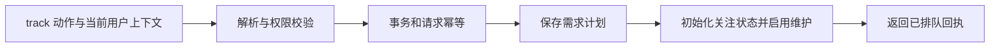

# 需求跟进与编码交办的受控工作流

AssistantWork 是日常助手的需求工作服务层：它聚合需求现状，持久化关注策略与用户反馈，受控地启动跟进或编码任务，并在知识页更新后生成去重的进展通知。所有写操作均返回可持久化回执，并通过身份、原话、版本与请求幂等约束避免越权或重复执行。

来源：gpt-5.6-sol 分析，gpt-5.6-sol 独立复核；模型解释仍可被原始证据纠正。

## 把知识跟进、反馈和开发状态汇成一个工作面

`AssistantWork` 连接知识页服务、开发队列和可选的决策服务，并在同一存储中维护关注策略、反馈、操作回执和通知快照；因此它解决的是“助手如何持续跟进一个需求，同时不把模型建议直接当成授权”的问题。参考 [服务依赖与持久表 ↗](../../../apps/server/src/assistant/work.ts#L52 "支持 AssistantWork 连接知识页、开发队列、决策服务并维护四类持久状态的说明。")

读侧的 `status` 会合并目标、关注版本、材料范围、当前知识文章、反馈与开发任务；暴露给研究代理的工具只负责列目录、查状态、分页看开发结果或获取分流建议，其中快速模型结果被明确标为建议而非事实或权限。参考 [需求状态聚合 ↗](../../../apps/server/src/assistant/work.ts#L105 "支持 status 汇总计划、知识文章、反馈和开发任务的说明。")、[只读工作工具 ↗](../../../apps/server/src/assistant/work.ts#L246 "支持研究代理可读取目录、状态、开发结果及建议，并限制建议权威性的说明。")

## 代表性调用：从“持续跟进”到持久化回执

例如（教学性代表调用），当前用户在本人私聊中要求持续跟进某目标，运行时传入 `track` 动作与包含请求 ID、会话和用户原话的 actor。`apply` 先解析动作、校验交办身份，再在事务中计算签名；相同请求和相同内容直接复用旧回执，相同请求却换了动作则拒绝。参考 [事务与请求幂等 ↗](../../../apps/server/src/assistant/work.ts#L369 "支持动作解析、身份校验、事务执行和 requestId 幂等冲突处理的流程。")

`track` 以请求 ID 生成需求键，保存标题、目标、上下文/材料范围，并把用户原话写入关注指令；随后初始化状态、启用后台维护，输出“已开始跟进、当前已排队”的持久回执，而不是宣称调查已经完成。参考 [建立需求跟进 ↗](../../../apps/server/src/assistant/work.ts#L388 "支持代表性 track 调用如何生成计划、启用维护并返回排队回执。")

## 写操作的权限、并发与反馈边界

所有需求和编码操作仅接受 owner 的私聊；启动开发还要求交办片段确实出现在当前用户消息中、包含明确实现意图且没有相邻否定表达。由此，阅读代码或询问方案不能被升级成编码授权。参考 [交办权限校验 ↗](../../../apps/server/src/assistant/work.ts#L34 "支持 owner 私聊限制以及编码必须有当前用户明确、未否定交办的边界。")

对既有需求的反馈、范围、暂停/恢复和刷新采用 `expectedVersion` 乐观并发控制。纠错文本必须来自当前用户原话，并被捕获为独立材料后触发重新调查；关注点反馈必须携带新策略。调整范围时，仍然有效的纠错材料会被保留，成功变更后版本统一递增。参考 [版本化反馈 ↗](../../../apps/server/src/assistant/work.ts#L431 "支持乐观版本校验、用户原话捕获、纠错材料化和关注策略校验。")、[范围与维护控制 ↗](../../../apps/server/src/assistant/work.ts#L487 "支持范围调整保留有效反馈材料、暂停恢复刷新及统一递增版本的说明。")

## 区分排队、独立副本、应用与通知

开发状态刻意区分 `queued`、独立副本中的检查/评审和 `applied`：ready 只表示副本完成本地检查与独立评审；applied 也只表示补丁已应用到登记仓库，不能推断已经推送或上线。结果接口读取保存的评审补丁并重新计算副本指纹；指纹不匹配或无法检查时，不得声称当前文件仍等同于已评审版本。参考 [开发交付语义 ↗](../../../apps/server/src/assistant/work.ts#L134 "支持 queued、独立副本、applied 与推送上线之间的明确区分。")、[评审结果读取 ↗](../../../apps/server/src/assistant/work.ts#L168 "支持保存补丁分页、指纹复核及不匹配时不得宣称一致的限制。")

知识页发布后，只有“当前版本、含需求结构、自动维护已启用”的文章才进入通知流程。代码用上次需求快照去重，提炼目标、非目标、验收项和行动变化；纯证据变化不会被当作验收/行动内容变化。新状态总会落库，有可通知变化时最多取八条，记录变更并排入 owner 通知。参考 [发布变化提炼 ↗](../../../apps/server/src/assistant/work.ts#L559 "支持发布前置条件、快照去重以及需求字段变化提炼规则。")、[进展通知入队 ↗](../../../apps/server/src/assistant/work.ts#L618 "支持先持久化新状态、截取至多八条变化并生成 owner 通知的说明。")
