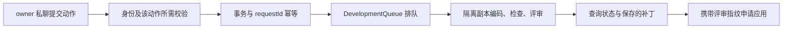

# 需求跟进与开发任务的受控编排

AssistantWork 将需求页、个人行动项、仓库准备和开发队列组织成一个可查询、可追踪的服务层。所有经 apply 提交的 WorkAction 都先要求操作者是 owner 且来自私聊；携带 delegation 的动作还会核对当前消息中的交办原话与对应动词。否定检查只按各源码分支列出的模式生效：不能据此推断它覆盖 cancel_development，且 unfollow_action 显式跳过通用否定检查。其他动作的保护条件依具体分支而异：回答与反馈检查本人原话，相关需求操作检查 expectedVersion，行动项关联检查需求修订；scope 通过版本门槛后保存请求给出的范围。成功处理的动作在事务中保存回执；开发结果明确区分隔离副本、评审指纹与是否已应用。需求发布后，服务还会比较前后状态，并对真实变化和阻塞决策去重通知。

来源：gpt-5.6-sol 分析，gpt-5.6-sol 独立复核；模型解释仍可被原始证据纠正。

## 解决什么问题：把身份授权与操作校验分层

`AssistantWork` 是需求跟进的编排边界：它连接知识页、开发队列、仓库准备队列、行动项和外部能力回执，并为关注设置、反馈、动作回执和通知建立持久状态。模型生成的方向、材料内容或快速模型分数本身不构成操作权限。参考 [编排器职责与持久状态 ↗](../../../apps/server/src/assistant/work.ts#L108 "说明 AssistantWork 连接能力回执、行动项、仓库队列和开发队列，并创建关注、反馈、动作回执及通知状态表。")

调用方通过 `apply` 提交动作时，第一层门槛对所有 `WorkAction` 都相同：操作者必须是 `owner`，会话必须是私聊。第二层只处理结构中带有 `delegation` 的动作：`assertWorkDelegation` 要求交办引文出现在当前消息中，并按具体操作核对对应动词。否定检查并不是对所有这些动作的一项统一保证，而是各分支按源码列出的模式执行：仓库准备、项目配置和开始开发各有自己的否定模式；通用分支的否定模式只列出继续、恢复、重试、应用、合入、放回、跟进、关注和待办，不能据此推断它会拦截“不要取消开发”，且 `unfollow_action` 显式跳过这项通用否定检查。参考 [分层授权与按分支校验 ↗](../../../apps/server/src/assistant/work.ts#L47 "说明所有 WorkAction 先要求 owner 私聊；携带 delegation 时校验当前消息中的引文和对应动词，而否定模式只按具体分支生效，cancel_development 不在通用否定词列表中，unfollow_action 还显式跳过该检查。")

不带 `delegation` 的动作仍可能有自己的保护条件。例如，回答问题必须逐字来自当前本人消息且问题仍开放；行动项关联使用需求页的 `expectedRevision` 防止基于旧页面修改。反馈、撤销反馈、范围调整、暂停、恢复和刷新都会先校验 `expectedVersion`，通过后再执行对应分支；其中反馈还检查文本来自当前消息，`attention` 反馈要求给出调整内容，撤销反馈要求目标仍可撤销。`scope` 分支直接保存动作给出的 `contextIds` 和 `materialKeys`，并合并仍活跃的纠正材料；暂停与恢复切换维护状态，恢复和刷新会安排重新调查。参考 [回答必须来自本人原话 ↗](../../../apps/server/src/assistant/work.ts#L720 "说明 answer_question 不使用 delegation 动词匹配，而是在分支中校验回答原话和问题当前状态。")、[行动项修订保护 ↗](../../../apps/server/src/assistant/work.ts#L688 "支持行动项关联前校验 expectedRevision，防止基于过期需求页修改。")、[需求操作的版本门槛与分支行为 ↗](../../../apps/server/src/assistant/work.ts#L753 "支持这些需求操作统一校验 expectedVersion；反馈另查当前原话及 attention 内容，撤销反馈检查目标是否仍可撤销，而 scope 保存请求给出的上下文和材料键，暂停、恢复与刷新按分支改变维护或刷新状态。")

## 代表性调用：从明确交办到可核验开发结果

以 `start_development` 为例，调用方传入 `WorkAction` 与包含请求 ID、用户原话和会话身份的 `WorkActor`。`apply` 先做 schema 解析和上述授权检查，再进入事务；同一个 `requestId` 会用动作与操作者的完整摘要做幂等检查，摘要相同则返回旧回执，不同则拒绝。动作成功处理后，回执写入 `assistant_work_receipts`。这里的回执保证针对的是 `apply` 动作，不包括 `published`、`preparePage` 等内部状态更新。参考 [事务入口与请求幂等 ↗](../../../apps/server/src/assistant/work.ts#L566 "支持 schema 解析、授权检查、事务执行，以及同一 requestId 仅在动作与操作者摘要完全相同时返回既有回执。")、[动作回执持久化 ↗](../../../apps/server/src/assistant/work.ts#L862 "说明 apply 分支成功完成后统一写入 WorkReceipt 并返回。")

通过校验后，`start_development` 确认需求页存在，可选地保存项目配置，然后把需求键、项目、操作者、能力和输入回执交给开发队列；即时回执只表示“已交办、尚未完成”。参考 [开发任务入队 ↗](../../../apps/server/src/assistant/work.ts#L649 "支持 start_development 校验需求、保存可选配置、交给开发队列并返回尚未完成的回执。")

参考 [事务入口与请求幂等 ↗](../../../apps/server/src/assistant/work.ts#L566 "支持 schema 解析、授权检查、事务执行，以及同一 requestId 仅在动作与操作者摘要完全相同时返回既有回执。")、[开发任务入队 ↗](../../../apps/server/src/assistant/work.ts#L649 "支持 start_development 校验需求、保存可选配置、交给开发队列并返回尚未完成的回执。")、[继续与应用开发 ↗](../../../apps/server/src/assistant/work.ts#L670 "支持 resume 和 apply 都进入 continueTask，且应用时传递 reviewedFingerprint。")

后续状态会显示队列阶段、检查、评审、变更计划和交付位置，并明确 `ready` 仍位于隔离副本，登记仓库尚未改变。参考 [隔离副本交付语义 ↗](../../../apps/server/src/assistant/work.ts#L256 "支持状态输出区分任务阶段、检查、评审、隔离副本和是否已应用。") `result` 读取保存的评审补丁并重新计算当前副本指纹；`matchesReviewed` 为 `false` 或 `null` 时，不能声称当前文件仍是已评审版本。申请 `apply_development` 时，该评审指纹会传入继续任务接口。参考 [补丁与评审指纹核验 ↗](../../../apps/server/src/assistant/work.ts#L294 "支持读取已保存补丁、重新计算当前副本指纹，并说明不匹配时不能声称仍是已评审版本。")、[继续与应用开发 ↗](../../../apps/server/src/assistant/work.ts#L670 "支持 resume 和 apply 都进入 continueTask，且应用时传递 reviewedFingerprint。")

## 边界条件：仓库范围、并发、反馈与通知

仓库准备不会自行扩大代码读取范围：若 URL 或非 `HEAD` 版本不同于已知配置，它们必须逐字出现在本人消息中；该动作只排队读取指定版本，不代表编码、安装依赖或推送。参考 [仓库读取范围约束 ↗](../../../apps/server/src/assistant/work.ts#L595 "支持新 URL 和指定版本必须来自本人原话，且仓库准备只表示后台读取。") 对需求页的可变操作采用乐观并发控制：行动项用 `expectedRevision`，反馈、撤销反馈、范围调整、暂停、恢复和刷新等用 `expectedVersion`，状态过期就要求重新读取。纠正类反馈会被捕获为新的原始材料，关注类反馈会更新关注策略；范围、维护状态与重新调查则在通过版本门槛后按各自分支处理。参考 [行动项修订保护 ↗](../../../apps/server/src/assistant/work.ts#L688 "支持行动项关联前校验 expectedRevision，防止基于过期需求页修改。")、[需求操作的版本门槛与分支行为 ↗](../../../apps/server/src/assistant/work.ts#L753 "支持这些需求操作统一校验 expectedVersion；反馈另查当前原话及 attention 内容，撤销反馈检查目标是否仍可撤销，而 scope 保存请求给出的上下文和材料键，暂停、恢复与刷新按分支改变维护或刷新状态。")

知识页发布后的通知不是 `apply` 动作回执。只有“当前版本、包含需求结构、自动维护已启用”同时成立才进入发布通知流程；系统比较前后需求状态，记录目标、非目标、验收项或行动项等真实变化，并排队通知本人。若状态摘要完全相同则返回；在通知策略为 `all` 时，即使细分变化列表为空，也会使用文章摘要作为变化内容。参考 [需求变更通知 ↗](../../../apps/server/src/assistant/work.ts#L895 "支持发布时的前置条件、前后状态比较、变化持久化和本人通知。") 对需要本人选择的阻塞决策，系统只取开放的 `decision` 问题，按问题内容摘要去重，并在内容变化时最多发送前三项，避免相同问题反复提醒。参考 [阻塞决策去重 ↗](../../../apps/server/src/assistant/work.ts#L988 "支持只通知开放且阻塞的决策问题，并以摘要去重、限制通知数量。")
