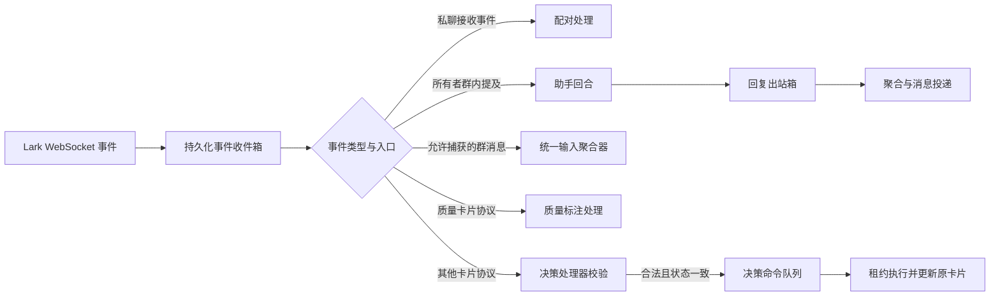

# Lark 接入：应用绑定、消息捕获与可靠交互

Lark 模块把飞书或 Lark 应用接入、能力核验、所有者配对、群消息捕获、可选助手问答、互动卡片和通知投递组织为持久化流程。当前实现固定使用个人工作区；私聊消息在现有装配下优先进入配对处理，普通助手问答的实际可达入口主要是所有者在群内明确提及机器人。

来源：gpt-5.6-sol 分析，gpt-5.6-sol 独立复核；模型解释仍可被原始证据纠正。

## 个人助理入口与当前可达范围

该模块面向个人助理场景，默认申请消息、文档、日历、任务和会议等能力，同时排除批量消息、成员变更及权限管理用途。参考 [个人助理默认能力边界 ↗](../../../apps/server/src/integrations/lark/defaults.ts#L3 "支持默认配置面向个人助理，并说明保留与排除的能力范围。")。助手不是接入后的必备组件，只有配置模型时运行时才创建助手。参考 [可选助手运行时 ↗](../../../apps/server/src/integrations/lark/runtime.ts#L96 "支持只有配置助手模型时才创建助手运行时。")。

当前装配会为每个连接管理器注入 onboarding 配对接收器，连接管理器又把所有收到的私聊消息优先交给配对流程；不符合 32 位配对码格式的普通私聊会被结束并忽略。参考 [连接管理器运行时装配 ↗](../../../apps/server/src/integrations/lark/runtime.ts#L131 "支持每个连接管理器都接收 onboarding 配对接收器，并展示助手回调的装配位置。")、[私聊优先进入配对 ↗](../../../apps/server/src/integrations/lark/realtime.ts#L963 "支持连接管理器把收到的私聊消息优先送入配对处理，而非普通消息处理。")、[配对消息格式校验 ↗](../../../apps/server/src/integrations/lark/realtime.ts#L660 "支持普通私聊因不符合配对码格式而被结束并忽略的当前行为。")。因此，虽然普通消息处理器本身允许绑定所有者的私聊进入助手，当前装配下该分支不会收到这些私聊；实际可达的助手入口主要是绑定所有者在群内明确提及机器人。参考 [普通消息助手条件 ↗](../../../apps/server/src/integrations/lark/realtime.ts#L524 "说明消息到达普通处理器后，助手要求发送者为绑定所有者，并在群聊中明确提及机器人。")。

允许捕获的群消息则以 `chat` 来源进入统一输入聚合器，并保留会话、事件、发送者和绑定版本；文本、图片及逐部分来源复用公共输入合同。参考 [群消息统一捕获 ↗](../../../apps/server/src/integrations/lark/realtime.ts#L629 "支持群消息进入统一输入聚合器，并保留会话、事件、发送者和绑定来源。")、[公共捕获内容合同 ↗](../../../packages/contracts/src/index.ts#L4 "支持文本、图片及逐部分来源信息复用公共输入合同。")。

## 应用接入、能力核验与所有者配对

接入既可注册新应用，也可导入已有应用。凭据写入独立加密存储后，服务为连接创建递增候选版本并执行能力探测；缺少能力时候选失败，已有活动版本仍可保留。参考 [候选版本与能力探测 ↗](../../../apps/server/src/integrations/lark/onboarding.ts#L293 "支持加密保存凭据、创建连接候选版本、能力探测和失败时保留已有活动版本。")。探针通过 OpenAPI 检查权限、卡片回调和机器人身份，但公开接口不能列出事件订阅，事件能力仍需由实际 WebSocket 投递在运行时确认。参考 [事件订阅核验边界 ↗](../../../apps/server/src/integrations/lark/registration.ts#L135 "说明公开应用接口不能列出事件订阅，需通过实际 WebSocket 投递确认。")、[OpenAPI 能力探针 ↗](../../../apps/server/src/integrations/lark/registration.ts#L141 "支持令牌获取、权限和回调检查、机器人身份读取及缺失能力计算。")。

凭据采用随机 IV 的 AES-256-GCM 写入受限文件。参考 [凭据认证加密写入 ↗](../../../apps/server/src/integrations/lark/secret-store.ts#L72 "支持随机 IV、AES-256-GCM、受限临时文件、同步和重命名写入流程。")。候选版本进入待配对状态后，可签发默认五分钟有效的随机配对码，数据库只保存摘要。参考 [短期配对码签发 ↗](../../../apps/server/src/integrations/lark/onboarding.ts#L569 "支持待配对阶段签发随机码、默认有效期、旧码消费和摘要存储。")。管理端确认配对时，会在一个事务中替换旧绑定、激活候选版本并创建通知和决策目标；群聊候选还会启用群监控。参考 [确认配对与绑定激活 ↗](../../../apps/server/src/integrations/lark/onboarding.ts#L665 "支持确认时替换旧绑定、激活候选版本、创建通知和决策目标，并为群聊启用监控。")。连接与接入记录固定使用个人工作区，不能据此宣称已有租户隔离。

## 实时事件、卡片处理与可靠投递

事件按应用与事件编号入箱；相同编号、相同摘要视为重复，不同摘要则报告冲突，并记录实际观察到的事件能力。参考 [事件收件箱与重复检测 ↗](../../../apps/server/src/integrations/lark/realtime.ts#L337 "支持事件持久化、摘要冲突检测、重复识别和运行时事件能力记录。")。

运行时只按协议名把质量协议交给质量标注服务，其他协议交给普通决策卡片处理器。参考 [质量与普通卡片处理分流 ↗](../../../apps/server/src/integrations/lark/runtime.ts#L178 "支持质量协议进入质量处理器、其他协议仅被交给普通决策卡片处理器继续校验。")。普通处理器仅接受严格的 `omem.decision.v1` 合同；未知或畸形协议会被拒绝，只有应用、操作者、消息位置、摘要、期限、随机数和决策状态全部核验通过后，才会一次性消费动作并创建排队命令。参考 [决策卡片协议合同 ↗](../../../apps/server/src/integrations/lark/card-actions.ts#L13 "支持普通决策处理器只接受严格的决策协议和完整动作字段。")、[决策动作核验与入队 ↗](../../../apps/server/src/integrations/lark/card-actions.ts#L119 "支持无效协议被拒绝，以及仅在上下文和数据库状态全部核验后创建排队命令。")。

助手回复先在事务中写入投递意图并关联回合，再确认入站事件。参考 [助手回复事务型出站箱 ↗](../../../apps/server/src/integrations/lark/realtime.ts#L814 "支持回复卡片、稳定提供方标识、投递意图和回合关联在同一事务中写入。")。运行时随后准备通知聚合，并顺序消费卡片命令与投递任务。参考 [运行时单轮任务编排 ↗](../../../apps/server/src/integrations/lark/runtime.ts#L195 "支持连接同步、通知聚合以及卡片命令和投递任务的顺序限量消费。")。投递任务通过租约令牌防止陈旧 worker 写回；限流可在次数上限内重试，结果不明还受一小时去重窗口约束，认证错误会停用连接及捕获目标。参考 [投递租约领取 ↗](../../../apps/server/src/integrations/lark/delivery.ts#L190 "支持任务状态守卫、条件抢占、尝试记录、租约令牌和去重窗口处理。")、[投递重试与认证处置 ↗](../../../apps/server/src/integrations/lark/delivery.ts#L389 "支持限流和结果不明的差异化重试、一小时去重窗口、次数上限及认证错误停用连接。")。

## 授权、配对与凭据边界

群监控有两个自动启用入口：机器人加入群时会创建或重新启用目标；普通群消息到达且目标不存在时，也会创建启用目标，但不会覆盖已有禁用记录。参考 [机器人进出群监控切换 ↗](../../../apps/server/src/integrations/lark/realtime.ts#L422 "支持机器人加入群时启用监控目标、移出群时禁用目标。")、[普通群消息创建监控目标 ↗](../../../apps/server/src/integrations/lark/realtime.ts#L602 "支持目标缺失时由普通群消息创建启用目标，同时不覆盖既有禁用目标。")。材料未说明这些入口是否配有明确授权、群内提示和撤销操作。

无效配对码会先增加尝试次数再抛错，但接入事务遇到异常统一回滚，因此失败计数及达到上限后的消费状态不会持久化。参考 [接入事务回滚规则 ↗](../../../apps/server/src/integrations/lark/onboarding.ts#L39 "说明接入事务中的异常会统一触发回滚。")、[无效配对码尝试更新 ↗](../../../apps/server/src/integrations/lark/onboarding.ts#L604 "支持无效配对码先更新尝试次数、随后在同一事务中抛出异常的事实。")。默认权限和事件清单只能说明申请与订阅目标，不能证明每项能力已有消费者或完成真实租户联调。延伸阅读：[默认权限与事件范围 ↗](840fc7f6d898898b6e1adcc49ac69a58029a12edd6798145d8bc46cc49a574da.md#events-and-limits "提供默认权限和事件入口的背景，并说明配置范围不能等同于已实现及已联调能力。")。

凭据文件记录格式版本和算法，却没有密钥标识或双密钥迁移机制；成功解密后的 JSON 也仅通过类型断言成为凭据对象。参考 [凭据解密与格式检查 ↗](../../../apps/server/src/integrations/lark/secret-store.ts#L102 "支持密文仅记录格式版本和算法，且解密后的 JSON 只通过类型断言成为凭据对象。")。密钥轮换、损坏密文恢复和运行时载荷校验仍需明确。
