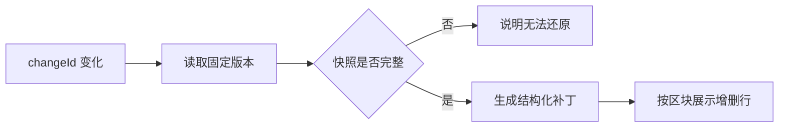

# 历史内容差异查看器

该组件按变更标识读取固定版本内容，将前后快照转换为带上下文的文本补丁，并明确呈现加载失败、历史不完整、无文字变化和逐块差异等状态。它依赖同目录 API 客户端，但当前材料未展示接口响应合同及请求竞态处理。

来源：gpt-5.6-sol 分析，gpt-5.6-sol 独立复核；模型解释仍可被原始证据纠正。

## 解决什么问题

组件用于查看一条历史变更前后的正文差异。调用方只需传入 `changeId`；组件会监听该值，并在首次挂载或标识变化时重新读取对应的固定版本内容。每次请求前都会清空旧内容和错误，避免把上一条变更继续显示为当前结果。参考 [变更内容读取流程 ↗](../../../apps/web/src/ChangeComparison.vue#L5 "支持组件监听 changeId、请求前清理状态、调用 API 并捕获错误的说明。")

界面将“请求失败”“正在读取”和“历史版本关联不完整”分开呈现。其中错误使用 `role="alert"`，加载提示使用 `role="status"`；若服务端声明存在前序版本却未返回快照，则明确说明无法还原差异，而不是生成误导性的空对比。参考 [加载与异常状态 ↗](../../../apps/web/src/ChangeComparison.vue#L17 "支持界面对错误、加载中和历史快照不完整三类状态分别反馈的说明。")

## 从快照到可读差异

拿到后置快照后，组件以旧正文和新正文生成结构化补丁；首次保存没有旧快照时，以空字符串作为比较起点。补丁保留三行上下文，使读者既能看到增删，也能理解修改所在位置。参考 [结构化补丁生成 ↗](../../../apps/web/src/ChangeComparison.vue#L14 "支持以新旧正文生成补丁、首次保存使用空旧文本并保留三行上下文的说明。")

界面先显示版本迁移关系，再逐个渲染补丁区块、原新行号及具体行；以 `+`、`-` 前缀识别新增和删除。若没有任何 hunk，则提示正文与引用没有文字变化，并把此次更新解释为复核或来源记录变化。参考 [差异区块呈现 ↗](../../../apps/web/src/ChangeComparison.vue#L22 "支持版本说明、无文字差异提示以及按区块和行渲染增删内容的说明。")

## 边界与模块关系

差异区块限制最大高度并允许滚动，标题固定在区块顶部；长行会换行，从而适应窄屏和较长正文。新增与删除使用不同背景色，但材料中没有展示额外的颜色图例或高对比度主题适配。参考 [差异阅读样式 ↗](../../../apps/web/src/ChangeComparison.vue#L31 "支持滚动区块、固定标题、长行换行和增删背景色等展示行为的说明。")

组件通过同目录 `api` 客户端发起请求，但请求函数实现和 `/changes/:id/content` 的服务端合同不在给定材料中。API 层可见部分复用了共享 contracts 中的 `Revision`、`Fragment`、`Change` 类型，而本组件对比较接口的 `Snapshot` 与响应结构采用本地声明，材料未证明两者存在直接类型约束。参考 [共享 API 类型背景 ↗](../../../apps/web/src/api.ts#L1 "支持 API 层从共享 contracts 引入并导出 Revision、Fragment、Change 类型，同时说明材料未显示比较响应与这些类型的直接约束。")

此外，监听回调没有可见的取消、序列号或结果去重逻辑；当 `changeId` 快速连续变化时，较早请求是否可能覆盖较晚结果，需结合 API 客户端行为进一步确认。参考 [变更内容读取流程 ↗](../../../apps/web/src/ChangeComparison.vue#L5 "支持组件监听 changeId、请求前清理状态、调用 API 并捕获错误的说明。")
