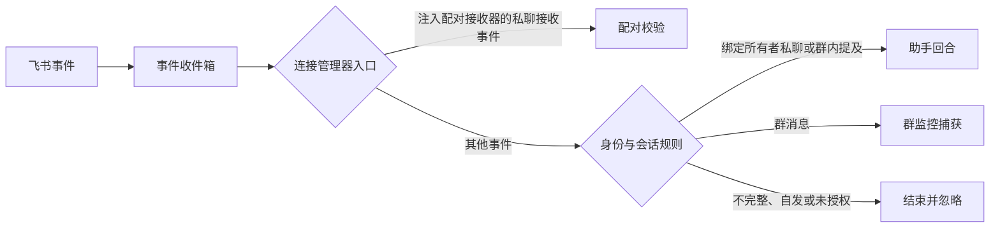

# 飞书实时消息接入、证据捕获与助手回复

该模块将飞书长连接事件规范化并可靠写入收件箱，再根据配对状态、绑定身份、会话类型和群监控目标分流到配对、助手或统一捕获链路；租约、稳定摘要与事务型出站箱用于减少重复处理和回复丢失。

来源：gpt-5.6-sol 分析，gpt-5.6-sol 独立复核；模型解释仍可被原始证据纠正。

## 建立单活的实时连接

模块先把飞书 SDK 的不同字段形态整理为统一事件，兼容事件编号、时间、会话、发送者和消息类型；缺少事件编号时，以规范化负载的稳定摘要作为标识。参考 [飞书事件规范化 ↗](../../../apps/server/src/integrations/lark/realtime.ts#L96 "支持不同事件字段的统一、时间转换、发送者识别及缺失事件编号时生成稳定摘要。")。摘要会递归排序对象键并忽略 `undefined`，避免属性顺序影响结果。参考 [稳定摘要算法 ↗](../../../apps/server/src/storage/digest.ts#L3 "说明摘要前会递归规范化对象、过滤未定义值并排序键。")。

官方适配器订阅消息、群成员变化和卡片动作，通过飞书或 Lark WebSocket 接收事件，并在连接失败时周期性尝试恢复。参考 [实时连接适配器 ↗](../../../apps/server/src/integrations/lark/realtime.ts#L154 "支持事件注册、WebSocket 状态反馈和失败后的周期恢复。")。每个连接启动前必须取得数据库租约，再按当前活动或待配对版本读取加密凭据。连接或版本失效、租约被其他实例接管导致令牌失效，或心跳过程抛错时，当前实例会停止；单纯到达原租约过期时间并不会阻止持有相同令牌的实例续期。参考 [连接租约机制 ↗](../../../apps/server/src/integrations/lark/realtime.ts#L226 "支持带令牌的租约获取、续期和释放，并表明续期只校验连接编号与令牌。")、[连接管理生命周期 ↗](../../../apps/server/src/integrations/lark/realtime.ts#L924 "支持连接版本选择、心跳续租，以及配置变化、令牌失效或心跳异常时停止连接。")。凭据存储要求 32 字节环境密钥，并校验引用格式。延伸阅读：[飞书凭据约束 ↗](../../../apps/server/src/integrations/lark/secret-store.ts#L24 "补充环境密钥、密钥长度和凭据引用格式限制。")。

## 先持久化，再按配对、身份和会话分流

事件先进入收件箱：只有活动或待配对应用可接收；相同应用与事件编号再次到达时，摘要一致视为重复，不一致则报告冲突。事件、连接、会话、发送者和原始负载在事务中保存，同时更新连接版本观察到的事件能力。参考 [事件收件箱 ↗](../../../apps/server/src/integrations/lark/realtime.ts#L337 "支持活动连接检查、负载冲突检测、重复事件处理和事件能力记录更新。")。

参考 [助手身份分流 ↗](../../../apps/server/src/integrations/lark/realtime.ts#L499 "支持消息完整性、连接状态、自发消息过滤，以及绑定所有者进入助手的条件。")、[私聊配对入口 ↗](../../../apps/server/src/integrations/lark/realtime.ts#L963 "证明注入配对接收器时，所有收到的私聊消息会先进入配对处理而非普通消息处理。")。

若连接管理器注入了配对接收器，所有 `im.message.receive_v1` 私聊都会先进入配对处理；不符合 32 位配对码格式的普通私聊会直接结束，不会到达助手分支。只有未被该入口截获、且发送者匹配绑定所有者的私聊，或绑定所有者在群内明确提及机器人的消息，才可能进入助手。参考 [私聊配对校验 ↗](../../../apps/server/src/integrations/lark/realtime.ts#L660 "支持配对消息的事件类型、会话范围、代码格式和拒绝错误处理。")、[私聊配对入口 ↗](../../../apps/server/src/integrations/lark/realtime.ts#L963 "证明注入配对接收器时，所有收到的私聊消息会先进入配对处理而非普通消息处理。")。

## 自动建立群监控并转换为统一证据

机器人加入群时会启用监控目标，移出群时会禁用目标。对于已经进入普通消息处理、且未走助手分支的群消息，系统还会先以 `INSERT OR IGNORE` 自动创建启用中的监控目标：目标不存在时，首条群消息即可建立捕获范围；已有禁用行不会被这一步重新启用，随后查询不到活动目标时消息仍会被忽略。参考 [群监控启停 ↗](../../../apps/server/src/integrations/lark/realtime.ts#L422 "支持机器人加入时启用、移出时禁用群监控目标的行为。")、[群目标自动创建 ↗](../../../apps/server/src/integrations/lark/realtime.ts#L602 "证明普通群消息在查询捕获权限前会自动创建缺失的启用目标，同时不会覆盖已有禁用目标。")。

允许捕获的群消息以 `chat` 来源交给统一输入聚合器，外部标识由应用与消息编号组成，并保存会话、事件、发送者外部身份和绑定版本。只有发送者匹配当前绑定所有者时，才写入所有者主体身份及验证依据。参考 [群消息统一捕获 ↗](../../../apps/server/src/integrations/lark/realtime.ts#L629 "支持统一输入的外部标识、上下文、发送者身份和绑定来源字段。")。

普通文本、富文本和图片会被转换为统一 parts：富文本拆出标题、段落、链接、提及和图片占位；图片通过媒体端口下载，条件不足时退化为文本提示；回复关系、事件时间和发送者来源附着在每个 part 上。参考 [富消息转换 ↗](../../../apps/server/src/integrations/lark/realtime.ts#L719 "支持文本、富文本和图片的转换、降级行为以及逐 part 来源信息。")。这些字段符合公共文本、图片及逐 part 来源合同；实际落库由 `Store` 中的 `InputAggregator` 完成，但本组材料没有展示其修订与去重策略。参考 [统一输入合同 ↗](../../../packages/contracts/src/index.ts#L4 "说明文本、图片和逐 part 来源字段的公共校验约束。")、[统一输入聚合器 ↗](../../../apps/server/src/store.ts#L38 "证明实时接入使用 Store 提供的 InputAggregator，但该片段未展示其内部修订策略。")。

## 回复出站、重复投递与实现边界

助手回复遵循“先写出站箱，再完成收件箱”。重复事件若对应回合仍在执行，不会再次入箱；已有出站记录时只确认收件箱；回合完成但出站记录缺失时，则走恢复入箱路径。参考 [助手重复投递恢复 ↗](../../../apps/server/src/integrations/lark/realtime.ts#L550 "支持执行中重复事件、已有出站记录和缺失出站记录三种恢复路径。")。回复被包装为卡片并截断到 8000 字符，提供商去重标识优先由聊天和回合稳定生成；变更记录、投递意图及回合关联在同一事务中写入。参考 [回复出站事务 ↗](../../../apps/server/src/integrations/lark/realtime.ts#L814 "支持卡片构造、稳定去重标识以及事务内写入投递意图和回合关联。")。

配对只接受收到的私聊消息，要求发送者、会话和符合格式的 32 位代码齐全；接收器异常会被整理为单行限长错误并记录为拒绝。参考 [私聊配对校验 ↗](../../../apps/server/src/integrations/lark/realtime.ts#L660 "支持配对消息的事件类型、会话范围、代码格式和拒绝错误处理。")。现有材料能够证明事件入箱、捕获调用和回复投递意图的创建，但没有给出实际投递工作器、飞书发送适配器以及输入聚合器的内部实现，因此不能据此确认网络重试、提供商去重和消息更新生成修订的最终行为。
