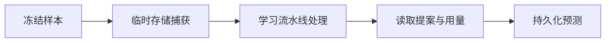

# 隔离运行记忆提取质量样本

该脚本以冻结数据集为固定输入，逐条调用在线学习流水线，在隔离存储中收集提案、耗时和令牌用量，并将结果写入可续跑的预测文件；它支持重复执行检查，但不承诺在线模型输出完全一致。

来源：gpt-5.6-sol 分析，gpt-5.6-sol 独立复核；模型解释仍可被原始证据纠正。

## 解决什么问题

该脚本用于对**冻结数据集**执行基于固定输入、可重跑的在线质量检查。启动时必须指定数据集，确认其已冻结，并选择 ACP 当前提供的模型；输出用于判断样本应提取记忆、放弃提取，还是需要更多上下文。由于执行仍依赖在线模型，并写入当前时间、耗时等运行数据，相同输入并不等于预测结果必然确定一致。参考 [冻结输入与在线模型准备 ↗](../../../scripts/quality-run.ts#L27 "支持脚本要求数据集、验证冻结状态并选择在线 ACP 模型，也说明固定的是输入而非模型输出。") [ACP 模型选择 ↗](../../../scripts/live-model.ts#L4 "支持模型通过 ACP 可选项发现和校验，同时表明当前材料只展示 effort 被写入 profile，未展示其能力校验。")

已有预测会先通过结构校验，再按样本 ID 跳过已完成项；环境变量还可限制本次处理数量，因此批量运行中断后能够接着处理剩余样本。结果通过临时文件重命名写入，并收紧文件权限。参考 [续跑与原子保存 ↗](../../../scripts/quality-run.ts#L40 "支持校验已有预测、跳过已完成样本、限制处理数量及通过临时文件重命名保存结果。")

## 隔离执行流程

每个样本都会创建独立临时目录和 `Store`，将文本、来源位置、参与者可信度与转发状态重新捕获为一次输入，再组装记忆服务、反馈服务和 `LearningPipeline`。流水线调用 `drain(10)` 后停止，随后从该临时库读取提案和作业尝试。参考 [样本隔离处理 ↗](../../../scripts/quality-run.ts#L63 "支持每个样本使用独立临时存储、捕获来源上下文、调用学习流水线及固定执行 drain(10) 的说明。")

这条路径复用了应用中的角色运行、持久任务、记忆和检索相关组件，而不是另建一套只供评测使用的提取器。延伸阅读：[学习流水线组成 ↗](../../../apps/server/src/learning/pipeline.ts#L14 "说明质量运行所复用的学习流水线关联角色运行、任务处理、记忆服务与检索端口。")

## 如何形成预测

脚本只采用状态为已应用、等待决策或已批准的提案：存在提案时标记为 `extract`，否则为 `abstain`。预测对象保存类型、可读陈述和证据摘录；任务对象还可附带负责人、截止时间及原始时间表达。只要任一提案已应用，`autoApply` 就为真。参考 [提案到预测的映射 ↗](../../../scripts/quality-run.ts#L109 "支持提案状态筛选、提取或放弃判定、对象字段、自动应用状态及运行用量汇总。")

结果写入前必须通过统一合同，合同约束样本标识、质量标签、耗时、令牌用量和错误字段。标签只允许任务、主张、事件和流程四类对象，并要求 `extract` 至少包含一个对象。参考 [预测结果合同 ↗](../../../apps/server/src/quality/evaluator.ts#L4 "支持预测必须包含合法样本标识和质量标签，并可记录耗时、令牌用量与错误。") [质量标签约束 ↗](../../../apps/server/src/quality/repository.ts#L39 "支持处置类型、对象种类与字段约束，以及 extract 必须至少包含一个对象。")

## 失败恢复与已知边界

单个样本异常不会终止整批运行，而会生成 `needs_context`、空对象且禁止自动应用的预测，并保存截断后的错误信息。无论成功或失败，临时数据库都会关闭并删除；每处理完一个样本便持久化一次结果，降低中途退出留下半写文件的风险。参考 [失败降级与清理 ↗](../../../scripts/quality-run.ts#L157 "支持失败样本降级为 needs_context、关闭并删除临时存储，以及逐样本持久化结果。")

当前材料不能证明 `drain(10)` 足以处理样本产生的全部后续任务，也不能确认环境变量指定的 effort 会在执行前按 ACP 能力被拒绝；模型名称本身则会根据 ACP 暴露的选项进行选择和可用性检查。参考 [样本隔离处理 ↗](../../../scripts/quality-run.ts#L63 "支持每个样本使用独立临时存储、捕获来源上下文、调用学习流水线及固定执行 drain(10) 的说明。") [ACP 模型选择 ↗](../../../scripts/live-model.ts#L4 "支持模型通过 ACP 可选项发现和校验，同时表明当前材料只展示 effort 被写入 profile，未展示其能力校验。")
