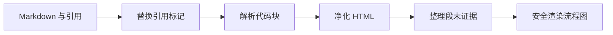

# 安全 Markdown 阅读与证据交互

该组件把 Markdown、代码块、流程图和内联证据转换为经过净化的可交互内容。证据查看与站内导航通过事件交给宿主，外部链接则由组件补充安全属性后交由浏览器打开；异步渲染使用代次门控，避免旧结果覆盖新正文。

来源：gpt-5.6-sol 分析，gpt-5.6-sol 独立复核；模型解释仍可被原始证据纠正。

## 解决什么问题

该组件服务于文章和证据阅读场景：输入 Markdown 正文与可选引用清单，输出统一的阅读内容，并向父级发送证据查看和站内导航事件。参考 [正文输入与导航事件 ↗](../../../packages/ui/src/components/OmMarkdown.vue#L7 "支持组件接收 Markdown 和引用，并将证据查看及站内导航通过事件交给父级的说明。") 引用目标不存在时显示“引用不可用”，目标被标记为不可操作时也只呈现带原因的禁用文本，避免把失效证据伪装成可访问入口。参考 [引用可用性呈现 ↗](../../../packages/ui/src/components/OmMarkdown.vue#L38 "支持缺失引用和不可操作引用显示为不可用文本，而非有效链接的说明。")

正文或引用变化都会启动新一代异步渲染；解析依赖按需加载，最终结果、错误状态和加载状态只有在代次仍为最新时才能写回，从而避免快速切换文章时旧任务覆盖新内容。参考 [异步渲染启动 ↗](../../../packages/ui/src/components/OmMarkdown.vue#L25 "支持渲染代次递增、空正文提前返回及解析依赖按需加载的说明。") [最新代次写回 ↗](../../../packages/ui/src/components/OmMarkdown.vue#L111 "支持结果与状态仅由最新代次写回，以及输入变化触发重新渲染的说明。")

## 从 Markdown 到安全内容

渲染过程分为引用替换、Markdown 解析、安全净化、证据整理和流程图生成：

普通代码块在解析阶段调用共享高亮函数；已知语言按需注册后高亮，未知语言退化为转义后的纯代码。参考 [代码块解析入口 ↗](../../../packages/ui/src/components/OmMarkdown.vue#L48 "支持普通代码块调用共享 highlightCode、Mermaid 代码块改写为占位内容的调用关系。") [共享代码高亮 ↗](../../../packages/ui/src/highlight.ts#L25 "支持已知语言按需加载高亮规则、未知语言安全退化为转义代码的说明。") 解析结果只保留白名单标签、属性和允许的 URI，且禁止 data 属性。参考 [HTML 净化白名单 ↗](../../../packages/ui/src/components/OmMarkdown.vue#L62 "支持渲染结果限制标签、属性和 URI，并禁用 data 属性的安全边界。")

Mermaid 代码块先被替换为转义后的占位内容，随后在严格模式下生成 SVG并再次净化；失败时保留原始描述，不使整篇文章失效。参考 [流程图占位转换 ↗](../../../packages/ui/src/components/OmMarkdown.vue#L53 "支持 Mermaid 源码在 Markdown 解析阶段先以经过转义的占位块进入文档。") [流程图安全渲染 ↗](../../../packages/ui/src/components/OmMarkdown.vue#L100 "支持 Mermaid 严格模式、SVG 二次净化以及失败时保留原始描述的流程。")

## 引用整理与链接导航

组件会识别句末或独立出现的引用，将其整理到段落、列表项、表格单元或引用块末尾，并按引用目标去重；嵌在自然语句中的引用仍保留原位。参考 [段末证据整理 ↗](../../../packages/ui/src/components/OmMarkdown.vue#L69 "支持独立引用识别、移动至容器末尾以及按引用目标去重的行为说明。")

点击证据链接时组件阻止默认跳转并发送 `cite` 事件；相对路径等内部链接发送 `navigate-internal`。HTTP、邮件和电话链接不会交给宿主处理，而是在点击时补充新窗口及隔离属性，再由浏览器执行默认导航。参考 [链接点击分流 ↗](../../../packages/ui/src/components/OmMarkdown.vue#L121 "支持证据链接、外部链接和内部链接分别采用事件分发或浏览器默认导航的说明。")

## 加载状态与失败边界

界面明确区分加载、渲染失败和成功内容三种状态；发生异常时会显示 Markdown 原文，避免阅读内容完全消失。参考 [加载与失败展示 ↗](../../../packages/ui/src/components/OmMarkdown.vue#L136 "支持模板区分加载、失败回退和成功 HTML 三种展示状态。")

仍需注意一个异步边界：空正文会递增代次、清空 HTML 后直接返回，却不会主动清除 `loading`；若此时上一代任务尚未结束，它也会因代次失效而跳过最终清理，因此加载提示可能持续存在。参考 [异步渲染启动 ↗](../../../packages/ui/src/components/OmMarkdown.vue#L25 "支持渲染代次递增、空正文提前返回及解析依赖按需加载的说明。") [最新代次写回 ↗](../../../packages/ui/src/components/OmMarkdown.vue#L111 "支持结果与状态仅由最新代次写回，以及输入变化触发重新渲染的说明。")
