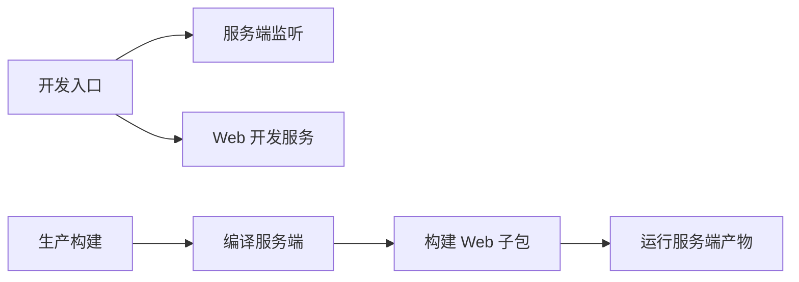

# 项目运行、构建与依赖配置

根包配置定义了 omem 的 Node.js 运行基线、前后端开发与构建入口、分层检查脚本及主要依赖。它反映项目预期采用的工具链和可调用工作流，但不能单独证明功能已经实现、依赖可重复安装或真实集成检查已经通过。

来源：gpt-5.6-sol 分析，gpt-5.6-sol 独立复核；模型解释仍可被原始证据纠正。

## 运行基线与项目形态

omem 根包是版本为 0.1.0 的私有 ESM 项目，要求 Node.js 24 或更高版本。这些配置限定了服务端产物的模块加载方式与最低运行环境；部署或本地开发前，需要先确认 Node.js 版本符合要求。参考 [运行环境约束 ↗](../../../package.json#L2 "支持项目为私有 ESM 包、当前版本及 Node.js 最低版本的说明。")

## 开发、构建与启动流程

统一开发入口由 Bun 执行，同时提供服务端监听和 Web 子包开发命令。生产构建先编译服务端 TypeScript，再通过 pnpm 构建 Web 子包；启动命令运行编译后的 Node.js 服务文件。类型检查分别覆盖服务端 TypeScript 与 Vue 工程。参考 [开发与构建命令 ↗](../../../package.json#L9 "支持开发入口、前后端命令、构建顺序、启动方式和类型检查范围的说明。")

该图描述的是配置声明的命令关系，实际可运行性仍需结合命令退出码和行为检查确认。参考 [开发与构建命令 ↗](../../../package.json#L9 "支持开发入口、前后端命令、构建顺序、启动方式和类型检查范围的说明。")

## 测试与质量检查分层

配置将 Vitest 全量测试、浏览器冒烟检查，以及角色、学习、流水线和 Lark 主机等 live 场景分成独立入口，并另设 Lark 标注与质量评估命令。这种划分便于区分常规自动化测试和依赖外部环境的检查，但脚本存在不等于对应场景已经验证通过。参考 [测试与质量入口 ↗](../../../package.json#L16 "支持普通测试、浏览器检查、live 冒烟场景及质量评估命令的分层描述。")

## 依赖所呈现的技术范围

运行依赖涵盖 Agent Client Protocol SDK、Fastify、Hugging Face Transformers、Lark SDK 与 Zod，可确认项目配置了代理协议、HTTP 服务、模型处理、Lark 接入和数据校验所需的软件包；仅凭依赖清单，不能进一步确定模型是否本地运行、采用何种模型或是否需要联网下载。参考 [应用运行依赖 ↗](../../../package.json#L28 "支持代理协议、HTTP 服务、模型处理、Lark 接入和数据校验相关软件包已经列入运行依赖的论断。")

开发依赖覆盖 Playwright、Vue 单文件组件编译、TypeScript、Vite、Vitest 与 Vue 类型检查，支撑前端构建、浏览器测试和静态校验。依赖版本虽被精确声明，但完整的可重复安装机制仍取决于本材料未展示的锁文件和工作区配置。参考 [开发工具依赖 ↗](../../../package.json#L36 "支持浏览器测试、Vue 编译、TypeScript、Vite、Vitest 与类型检查工具链的说明。")
