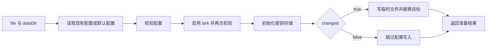

# 飞书本地接入准备与向导链接生成

该文件负责飞书接入前的本地准备：读取并校验配置、启用 lark、初始化加密密钥存储，并在配置确有变化时安全落盘；同时生成指向前端飞书向导的 HTTP(S) 地址。它不创建平台应用，也不申请权限或发送消息。

来源：gpt-5.6-sol 分析，gpt-5.6-sol 独立复核；模型解释仍可被原始证据纠正。

## 解决的问题与职责边界

这段代码把“打开飞书接入能力”拆成两个本地动作：准备服务配置，以及生成浏览器向导地址。`prepareLarkSetup` 只处理配置文件和密钥存储的可用性；注释明确排除了平台应用创建、权限操作和消息写入。配置变更前后都会经过校验，避免把原本无效或启用后无效的内容写回磁盘。参考 [本地准备职责边界 ↗](../../../apps/server/src/integrations/lark/setup.ts#L9 "支持该文件只做显式本地准备，并排除平台创建、权限操作和消息写入。")、[配置读取与启用流程 ↗](../../../apps/server/src/integrations/lark/setup.ts#L11 "说明现有配置与默认配置的选择、两次配置校验、lark 启用、changed 判定和密钥存储初始化。")

## 代表性调用：准备本地配置

以 `prepareLarkSetup(file, dataDir)` 为例：`file` 存在时读取原文件，否则读取随包默认配置；随后把 `lark.enabled` 设为 `true`，并初始化 `dataDir` 下的加密密钥存储。只有文件不存在或飞书原先未启用时，`changed` 才为真。参考 [配置读取与启用流程 ↗](../../../apps/server/src/integrations/lark/setup.ts#L11 "说明现有配置与默认配置的选择、两次配置校验、lark 启用、changed 判定和密钥存储初始化。")

写入分支先以 `0700` 模式创建父目录，再用随机文件名和 `wx` 独占标志写入 `0600` 临时文件，之后通过重命名替换目标；`finally` 会清理残留临时文件。参考 [原子配置写入 ↗](../../../apps/server/src/integrations/lark/setup.ts#L23 "支持仅在 changed 为真时创建受限目录、独占写入临时文件、重命名替换并清理临时文件。")

返回值提供配置路径、数据目录、是否发生变更，以及密钥来自 `OMEM_SECRET_KEY` 环境变量还是个人文件。即使 `changed` 为假，密钥存储初始化仍会执行，只是不会重写配置。参考 [准备结果与密钥来源 ↗](../../../apps/server/src/integrations/lark/setup.ts#L39 "说明返回字段，以及 keySource 如何根据 OMEM_SECRET_KEY 是否存在来选择。")

## 向导地址与输入限制

`larkSetupUrl(base, onboardingId)` 先用标准 `URL` 解析基础地址，只接受 `http:` 和 `https:`；其他协议会直接抛错。函数把片段改为 `#/lark`，传入非空 `onboardingId` 时再用 `URLSearchParams` 添加 `onboarding` 查询参数，因此参数会被编码；未提供或传入空字符串时不加该参数。原地址已有的 hash 会被覆盖。参考 [飞书向导 URL 规则 ↗](../../../apps/server/src/integrations/lark/setup.ts#L47 "支持协议限制、hash 路由、可选 onboarding 参数和最终字符串输出。")
