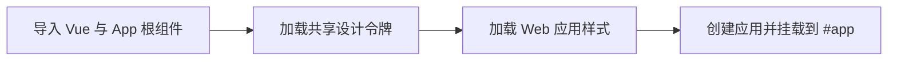

# Web 应用启动入口

该文件是 Vue 前端的最小启动入口：导入 Vue 运行时与根组件，依次加载共享设计令牌和应用级样式，随后将以 App 为根组件的应用挂载到页面中的 #app 容器。业务界面状态由根组件继续组织。

来源：gpt-5.6-sol 分析，gpt-5.6-sol 独立复核；模型解释仍可被原始证据纠正。

## 解决什么问题

`main.ts` 负责把浏览器页面、Vue 运行时和 omem 的根界面连接起来，是 Web 应用开始执行的入口。它以 `App` 为根组件创建 Vue 应用，并将应用挂载到页面的 `#app` 节点，后续界面渲染由此启动。参考 [Vue 应用启动入口 ↗](../../../apps/web/src/main.ts#L1 "支持入口导入的直接依赖、以 App 为根组件创建应用并挂载到 #app 的论断。")

入口本身不保存业务数据，也不编排导航或页面生命周期，职责集中在依赖装载、全局样式引入和根应用挂载。

## 启动与样式加载流程

启动流程保持为一条同步链路：

共享的 `tokens.css` 在本地 `styles.css` 之前导入，使 Web 端样式建立在 UI 包提供的设计变量之上；最终效果仍取决于样式规则及构建后的级联顺序。参考 [全局样式加载顺序 ↗](../../../apps/web/src/main.ts#L3 "支持共享设计令牌先于 Web 应用本地样式加载的流程说明。")

文件最后直接调用 Vue 的创建与挂载接口，没有展示插件注册、异步准备或启动错误处理。参考 [根应用创建与挂载 ↗](../../../apps/web/src/main.ts#L5 "支持入口直接创建并挂载应用，未在该文件中安排其他初始化步骤的论断。")

## 与根组件的关系及边界

入口直接导入 Vue 的 `createApp`、`App.vue`、共享设计令牌和本地样式，并将 `App.vue` 作为根组件；导航选择、当前视图和页面标题等业务界面状态由根组件继续组织。参考 [Vue 应用启动入口 ↗](../../../apps/web/src/main.ts#L1 "支持入口导入的直接依赖、以 App 为根组件创建应用并挂载到 #app 的论断。")、[根组件界面状态 ↗](../../../apps/web/src/App.vue#L39 "支持导航、当前视图和页面标题由 App 根组件继续组织的论断。")

当前材料没有包含宿主 HTML，因此只能确认运行页面需要存在 `#app`，无法判断该容器由哪个模板提供，也无法确认容器缺失时的反馈方式。材料同样未提供入口测试，尚不能判断挂载行为和样式加载顺序是否有自动化断言。
