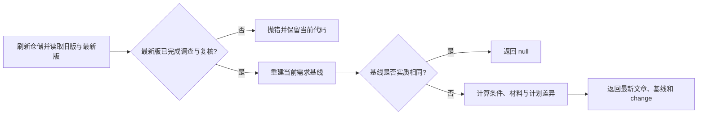

# 开发任务续跑前的需求变更检测

该模块在既有编码任务继续执行前，对固定旧需求与当前已复核需求做确定性比较：过滤无实质变化，生成验收条件、输入材料和计划的结构化差异，并把最新文章与基线交给调用方继续处理。

来源：gpt-5.6-sol 分析，gpt-5.6-sol 独立复核；模型解释仍可被原始证据纠正。

## 解决什么问题

编码任务可能尚在进行或已经产出代码，但需求文章、所依据的材料或计划随后发生变化。`inspectRequirementChange` 接收知识仓储和运行记录中的需求键、固定修订及可选旧基线，目标是描述真实变化，让编码 Agent 结合原交办与当前代码判断影响，而不是再调用一个规划模型。参考 [变更检查职责与输入 ↗](../../../apps/server/src/development/replanning.ts#L24 "说明函数面向真实需求变化、由编码 Agent解释影响，并给出仓储与运行记录输入。")

它依赖 `KnowledgeRepository` 读取版本，依赖 `requirementBasis` 重建当前基线，并用 `stableDigest` 做稳定内容比较；输出类型同时保存旧/新修订、完整需求状态、验收条件分类、材料摘要变化和计划变化标记。参考 [模块依赖 ↗](../../../apps/server/src/development/replanning.ts#L1 "支持该模块依赖需求契约、知识仓储、稳定摘要与需求基线计算。")、[变更结果结构 ↗](../../../apps/server/src/development/replanning.ts#L9 "定义调用方可获得的修订、需求状态、条件、材料与计划变化字段。")

## 一次检查如何完成

函数先刷新仓储，按固定修订取 `previous`、按键取 `current`；旧版或新版缺少需求，或最新版不是 `current`，都会立即报错。随后比较新旧基线；有旧基线时比较稳定摘要，没有旧基线的兼容路径则比较修订号。参考 [版本读取与变化门槛 ↗](../../../apps/server/src/development/replanning.ts#L34 "支持刷新仓储、校验当前已复核版本，以及现代基线摘要和旧版修订号两条去重路径。")

**说明性示例：**运行记录固定在 `r1`，条件 `function` 的描述后来在 `r2` 改写，同时材料 `spec` 的摘要从 `d1` 变为 `d2`。调用后，`criteria.changed` 含 `function`，`materials` 含 `{key: spec, before: d1, after: d2}`，并返回指向 `r2` 的文章和新基线；条件按 ID 建表，材料则对新旧键集合取并集后比较摘要。参考 [验收条件分类 ↗](../../../apps/server/src/development/replanning.ts#L51 "支持按条件 ID 和描述区分新增、删除、修改与保留。")、[材料与计划差异输出 ↗](../../../apps/server/src/development/replanning.ts#L73 "支持材料键并集、摘要比较、缺失值处理、计划变化标记及最终返回值。")

## 判定边界与调用方约定

验收条件的 `added`、`removed` 只看 ID；`changed` 只在同一 ID 的描述不同时产生，`retained` 表示描述相同。材料新增或删除以 `null` 表示缺失，`planChanged` 仅比较计划摘要。参考 [验收条件分类 ↗](../../../apps/server/src/development/replanning.ts#L51 "支持按条件 ID 和描述区分新增、删除、修改与保留。")、[材料与计划差异输出 ↗](../../../apps/server/src/development/replanning.ts#L73 "支持材料键并集、摘要比较、缺失值处理、计划变化标记及最终返回值。")

这套逻辑刻意区分“新修订”和“实质变化”：存在旧基线时，即使文章修订号变化，只要整个基线摘要一致仍返回 `null`；旧运行记录没有基线时，同修订号直接视为无变化。反过来，基线变化可能来自需求定义、选择范围或输入，而结构化分类只专门展开条件、材料和计划；其他需求字段的差异仍可由返回的 `before` 与 `after` 查看。调用方应将成功返回的 `article` 与 `basis` 写回运行状态，避免重复处理同一变化。参考 [变更结果结构 ↗](../../../apps/server/src/development/replanning.ts#L9 "定义调用方可获得的修订、需求状态、条件、材料与计划变化字段。")、[版本读取与变化门槛 ↗](../../../apps/server/src/development/replanning.ts#L34 "支持刷新仓储、校验当前已复核版本，以及现代基线摘要和旧版修订号两条去重路径。")、[材料与计划差异输出 ↗](../../../apps/server/src/development/replanning.ts#L73 "支持材料键并集、摘要比较、缺失值处理、计划变化标记及最终返回值。")
