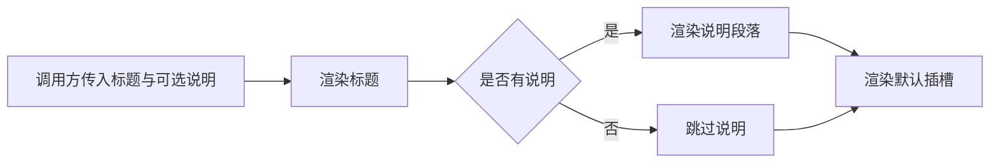

# 统一的空状态展示组件

OmEmpty 为无数据、无搜索结果或尚未开始配置等场景提供统一容器：调用方必须给出标题，可选补充说明，并能通过默认插槽放入按钮或其他操作。组件同时约束居中布局、文字层级和说明文字宽度，但不负责判断何时进入空状态，也不定义具体操作行为。

来源：gpt-5.6-sol 分析，gpt-5.6-sol 独立复核；模型解释仍可被原始证据纠正。

## 解决空白页面缺少引导的问题

`OmEmpty` 把空状态中反复出现的标题、说明和操作区域封装成统一组件。标题是必填字符串，说明文字可省略，因此它既适合简短的“暂无内容”，也能承载带原因解释的空状态。参考 [空状态输入属性 ↗](../../../packages/ui/src/components/OmEmpty.vue#L1 "支持标题必填、说明可选，以及组件只接收展示数据的论断。")

组件只负责呈现调用方传入的信息，不包含数据查询、状态判断或业务文案。这意味着列表页、搜索页等上层模块仍需自行决定何时显示它，以及标题和说明应该表达什么。

## 内容渲染与扩展流程

渲染时，组件先输出标题；只有 `description` 有值时才创建说明段落，避免可选内容留下空节点；随后无条件渲染默认插槽。调用方可以在插槽中放置“新建”“重试”或“返回”等操作，也可以不提供任何内容。参考 [空状态渲染结构 ↗](../../../packages/ui/src/components/OmEmpty.vue#L4 "支持标题、条件说明和默认插槽的实际渲染顺序与边界。")

该流程仅由当前模板直接证明；插槽中具体有哪些控件、点击后调用哪些模块，需要查看使用方代码才能确认。

## 视觉约束与边界

空状态容器采用较大的上下内边距、居中排版和次要文字颜色，标题则切换为主文字色，从而形成清晰的信息层级。参考 [容器与标题样式 ↗](../../../packages/ui/src/components/OmEmpty.vue#L11 "支持居中布局、内边距及主次文字颜色层级的说明。") 说明段落被限制为 480px，并在底部预留间距，避免长说明铺满宽屏，同时为后续插槽操作留出空间。参考 [说明文字宽度与间距 ↗](../../../packages/ui/src/components/OmEmpty.vue#L20 "支持说明段落最大宽度及其与插槽区域间距的论断。")

样式通过 `scoped` 限定在组件内，但颜色依赖 `--om-secondary` 与 `--om-ink` 两个外部 CSS 变量。当前材料没有展示变量的定义、响应式调整或无障碍约束；组件也没有为插槽规定按钮布局，因此这些行为由全局主题和调用方共同决定。
