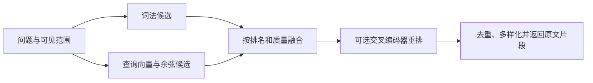

# 词法保底的本地语义证据检索

SemanticRetrieval 在 SQLite 固定原文之上补充向量召回与可选交叉编码器重排，同时保留词法检索、可见性过滤和原文身份。它后台增量建立分窗向量；查询时先取词法候选，再按条件加入语义候选、融合、重排和多样化，任何模型故障都回退到仍可用的词法结果。

来源：gpt-5.6-sol 分析，gpt-5.6-sol 独立复核；模型解释仍可被原始证据纠正。

## 解决同义表达找不到原文的问题

`SemanticRetrieval` 不是独立的向量资料库，而是在 `KeywordRetrieval` 上增加语义能力：向量、重排器和最终排序都围绕同一批 SQLite 固定原文工作，返回值仍是可追溯的 `SourceCandidate`。这适合“用户问法与材料措辞不同”的场景，同时避免让模型生成的摘要取代证据。参考 [混合检索职责 ↗](../../../apps/server/src/retrieval/semantic.ts#L13 "说明该类继承词法检索、依赖向量与重排接口，并明确个人 SQLite 中不另设向量事实权威。")

是否启用由检索工厂决定：关闭时直接使用词法检索；开启时注入 embedding 与可选 reranker，并启动后台索引追赶。参考 [检索工厂启用流程 ↗](../../../apps/server/src/retrieval/factory.ts#L15 "支持配置关闭时使用词法实现、开启时创建语义实现并启动后台索引。")

## 一次搜索怎样变成证据结果

以评审搜索收到问题 `q` 为例：调用方先算出允许展示的片段集合，把 `text`、`limit: 20` 和 `visible` 谓词传入异步检索，再把命中的片段身份、分数、摘要和命中路线返回页面。参考 [评审搜索调用 ↗](../../../apps/server/src/review/app.ts#L289 "给出代表性调用的输入、可见性过滤、异步检索调用和页面输出字段。")

实现先取最多 100 个未多样化的词法候选；空查询或路径、标识符式字面查询直接走词法结果，防止语义“猜中”不存在的名称。普通问题最多取前 400 字生成查询向量，对同一片段只保留得分最高的窗口，并在排序前应用可见性和捕获时间过滤。参考 [查询候选生成 ↗](../../../apps/server/src/retrieval/semantic.ts#L87 "支持词法保底、精确查找分支、查询向量、可见性与时间过滤以及每片段最佳语义窗口。")

语义余弦分数采用 `max(0.35, 最佳分-0.07)` 的保守门槛，随后与词法分数做一次按排名衰减的融合。可选重排器只看前 40 项，用“交叉编码器 70% + 原融合分 30%”重排；最后的 `rankEvidence` 还会合并重复摘要、限制单一来源占满首屏并利用向量降低冗余。参考 [语义门槛与融合 ↗](../../../apps/server/src/retrieval/semantic.ts#L113 "说明语义尾部过滤、词法归一化、一次融合公式和 embedding 异常时的词法回退。")、[交叉编码器重排 ↗](../../../apps/server/src/retrieval/semantic.ts#L131 "支持前 40 项重排、弱匹配过滤、70/30 权重和重排器失败降级。")、[最终证据多样化 ↗](../../../apps/server/src/retrieval/ranking.ts#L7 "解释融合或重排后如何去重、限制单一来源数量并惩罚冗余。")

## 增量索引、降级与调参边界

索引按当前原始版本和模型身份查缺补漏。长片段以 **400 字窗口、320 字步长**重叠切分，每 16 个窗口送入模型；标题前 64 字会拼到 passage 前。一个片段的所有向量与完成标记在同一事务中写入，因此失败不会留下“已完成但不完整”的索引。参考 [分窗向量入库 ↗](../../../apps/server/src/retrieval/semantic.ts#L56 "支持增量选取未索引片段、重叠分窗、批量嵌入、归一化与事务写入完成标记。")

后台循环默认约每秒追赶一批，失败后约 30 秒再试；正在建索引不会阻塞查询。模型尚未加载或 embedding 计算失败时仍返回词法候选，reranker 失败也回退到普通证据排序；健康状态分别暴露索引与重排降级。关闭时会停止定时器、等待在途索引并释放两个模型。参考 [后台追赶与关闭 ↗](../../../apps/server/src/retrieval/semantic.ts#L40 "说明后台索引的重试节奏、不阻塞启动以及关闭时等待工作并释放模型。")

需要修改效果时，主要入口是语义门槛与相对带宽、融合质量换算、重排池大小和 70/30 权重，以及窗口尺寸。余弦与 sigmoid 都不是“事实可信度”，这些常量与具体模型身份、切窗方式绑定；更换模型时还必须改变模型身份，否则维度不一致会被明确拒绝。参考 [语义门槛与融合 ↗](../../../apps/server/src/retrieval/semantic.ts#L113 "说明语义尾部过滤、词法归一化、一次融合公式和 embedding 异常时的词法回退。")、[交叉编码器重排 ↗](../../../apps/server/src/retrieval/semantic.ts#L131 "支持前 40 项重排、弱匹配过滤、70/30 权重和重排器失败降级。")、[窗口与向量校验 ↗](../../../apps/server/src/retrieval/semantic.ts#L159 "支持 400/320 分窗参数、空文本处理和无效或零范数向量拒绝逻辑。")
