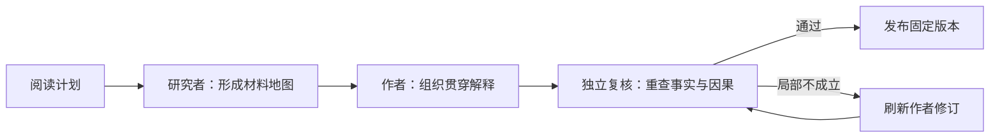

# Agent 怎样把材料讲明白：从自主调查到发布

以“批量导入”教学示例贯穿一篇功能解释文章的生成：阅读目标如何驱动调查，固定原件与工具如何支持补读，研究者、作者和独立复核如何交接，以及产物怎样携带来源发布并在材料换版后更新。

来源：gpt-5.6-sol 分析，gpt-5.6-sol 独立复核；模型解释仍可被原始证据纠正。

## 先定义新人读完能做什么

假设你选择一份“批量导入”的功能设计和对应实现，希望新人读完后能说清：输入是什么、请求怎样被分批处理、页面能观察到什么结果，以及要改批大小时从哪里入手。本文沿用这个**教学构造示例**，不把它冒充真实运行记录。

第一步不是让模型分别概括两个文件，而是写清读者、场景、目标、问题和起始入口。本页的阅读计划也以这些信息约束调查：它要求覆盖原件工作区、调查工具、角色交接、发布更新和质量边界。参考 [本页阅读计划 ↗](../../../config/wiki-pages.json#L142 "支持目标读者、教学场景、核心问题和调查入口。")

目标同时决定文章的阅读路线。功能机制页应从场景和完整例子进入，再解释必要概念、主流程、关键分支与修改位置，而不是按文件逐一摘要。参考 [读者优先的页面结构 ↗](../../../docs/reader-first/writing.md#L3 "支持从场景和完整例子进入，再讲概念、机制与行动入口。")

## 阅读目标怎样变成调查路线

生成入口先刷新已有知识；只有文章仍是当前版本、阅读计划未变、角色组合版本也未变时才复用。否则，流水线按用户选择的材料建立范围，把完整阅读计划交给研究者；研究者必须自行完成调查后，才能把 findings 与 gaps 交给写作阶段。参考 [读者页生成入口 ↗](../../../apps/server/src/knowledge/pipeline.ts#L245 "支持页面复用条件、选材范围、研究者运行和研究结果交接。")

在教学示例中，研究者先围绕“CSV 输入、导入结果、批处理入口”搜索并读完整实现，沿调用者确认输入怎样进入处理、状态怎样返回。若实现只显示“循环分批”却没有解释 **为什么**，研究者就改用设计中的业务词补读决策章节；代码导航提供定义、import 和候选调用位置，但候选仍要回到完整上下文确认。任务工具还可读取章节、历史版本、既有知识与记忆，其中派生内容只帮助找背景，新增事实仍回到原件。参考 [自主调查工具 ↗](../../../docs/reader-first/agent-research.md#L15 "支持材料发现、补读、混合搜索、知识背景、代码导航和历史读取能力。")

研究者的产物不是文章，而是一张可交接的地图：场景输入输出、主链、关键分支、设计因果、依据位置、修改入口和仍未知之处。

## 固定原件与证据快照怎样支持补读

每个角色都有临时任务工作区。获准材料被导出到 `originals/`，安全的相对目录尽量保留；绝对路径或冲突路径会映射到任务目录内，避免导出文件写到任务目录之外。参考 [原件导出与路径保护 ↗](../../../apps/server/src/knowledge/agent-research.ts#L107 "支持固定原件导出、安全相对路径保留和冲突路径映射。")

`catalog.json` 记录材料 key、固定修订、可读路径、行数和图片；`knowledge.json` 只列快照允许使用的既有文章。检索快照只纳入所选来源、可见片段，以及范围内的材料说明和显式关系。参考 [材料与知识目录 ↗](../../../apps/server/src/knowledge/agent-research.ts#L152 "支持目录记录材料身份、固定修订、可读路径和获准文章。") [研究快照范围 ↗](../../../apps/server/src/knowledge/research-snapshot.ts#L50 "支持快照只复制获准来源、可见片段及范围内说明和关系。")

准确地说，omem 提供的 `originals/` 与材料类 MCP 操作基于同一组所选来源和固定修订，因而引用与检索不会在任务中悄悄换版；这是**宿主授权和证据快照的边界**，不是完整文件系统沙箱。原生 CLI 仍可能看到工作区或祖先位置中的其他文件，所以“只读”不能解释为“只能看到导出的材料”。这些额外可见内容也不能绕过正式引用范围成为事实依据。参考 [原生文件可见性边界 ↗](../../../docs/reader-first/current-system.md#L46 "明确固定材料授权不等于完整文件系统隔离，原生 CLI 仍可能读取祖先位置。")

角色结束后，临时原件、图片和数据库快照会回收；目录、结构化结果与调查记录保留，正式 Store 继续保存不可变原始版本与历史。参考 [临时工作区生命周期 ↗](../../../docs/reader-first/agent-research.md#L69 "支持角色结束后回收导出原件、图片和快照，并保留任务记录与正式历史。")

## 一次 ACP prompt 为什么能反复查资料

这里的 `prompt` 是一次完整的 **Agent turn**，不是一次纯文本补全。session 创建时带上任务工作目录、MCP 和原生技能；一次 prompt 内可以连续出现搜索、读取、导航、计划和模型响应，直到 `end_turn`。因此“实现讲了怎么分批，却缺少设计动机”可以自然触发继续搜索和补读，无需宿主预先写死“搜一次、再发一次 prompt”的循环。参考 [完整 Agent turn ↗](../../../docs/reader-first/agent-research.md#L52 "支持一次 ACP prompt 内可有多次模型与工具调用，以及原生读取能力边界。")

职责可以这样看：omem 提供阅读目标、材料集合、固定快照、搜索/读取/导航、任务状态、结构化提交与发布；Traex harness 决定下一步调查动作、调用原生工具或 MCP，并管理上下文。模型窗口、自动压缩、超时和取消仍然存在，只是没有宿主设置的固定三轮研究门或输入输出 token 预算。参考 [omem 与 harness 分工 ↗](../../../docs/reader-first/agent-research.md#L36 "支持 omem 管理目标、证据、工具和发布，Traex harness 管理调查步骤与上下文。")

## 同一个例子怎样跨过研究、写作与复核

一次页面生成的主线是：

作者与 verifier 分别在自己的角色运行中接触固定材料；研究者交给作者的是 findings 与 gaps，不是把操作日志拼成正文。作者提交草稿后，verifier 拿阅读目标和完整草稿独立补查；需要修订时由 refresher 处理，只有通过的文档才发布。参考 [写作复核与返修 ↗](../../../apps/server/src/knowledge/pipeline.ts#L157 "支持作者、独立 verifier、refresher 的交接和仅发布通过文档的流程。")

继续“批量导入”这个教学例子，研究地图可以很短：`输入：CSV`；`主链：上传 → 解析 → 分批保存 → 汇总状态`；`可观察结果：进度与成功/失败数`；`待确认因果：分批是否为了限制内存峰值`；`修改入口：批大小配置及调用处`。作者据此组织正文：先展示一次上传和可见结果，再解释分批主链，最后把批大小的修改入口放在读者已经理解原因之后，而不是照抄地图字段。这样的写法符合“例子—概念—机制—行动”的读者路线。参考 [读者优先的页面结构 ↗](../../../docs/reader-first/writing.md#L3 "支持从场景和完整例子进入，再讲概念、机制与行动入口。")

verifier 随后独立回读设计与实现，专门检查“为了限制内存峰值，所以分批”这句因果：若设计明确给出该动机、实现也确实按批处理，就保留并通过；若原件只证明“存在分批”而没有证明原因，就要求局部改成“当前实现按批处理，设计动机在所选材料中未说明”，而不推翻已成立的输入、主链和结果。这仍是教学构造，但具体展示了研究地图怎样变成文章，以及独立补查怎样修正关键因果。宿主的引用绑定和行范围校验只保证来源定位合法，语义正确性另由独立角色判断。参考 [引用合同与语义复核 ↗](../../../apps/server/src/knowledge/repository.ts#L44 "支持宿主绑定固定原文、检查引用结构，并将语义正确性交给独立模型。")

## 发布时固定来源，换版后显式更新

复核通过后，流水线把正文、阅读计划、生成与复核来源、研究记录组装成知识产物。材料依赖至少包含正文实际引用；原生模式还会合并作者和 verifier 的 trace 中被运行时识别的实际读取。研究笔记本身不是额外证据，正文引用仍须落到材料或固定文章章节。参考 [知识产物与读取依赖 ↗](../../../apps/server/src/knowledge/pipeline.ts#L171 "支持从正文引用和可识别实际读取组装依赖，并保存研究与复核来源。")

发布前仓储再次比较材料摘要和子文章修订；调查期间输入若已变化，就拒绝发布。成功后写入不可变知识修订、更新当前头，并记录章节变化。参考 [发布前一致性检查 ↗](../../../apps/server/src/knowledge/repository.ts#L122 "支持发布前比较输入版本、写入不可变修订并更新当前版本。")

原件以后换版，旧文章不会被静默改写：刷新会把依赖失配的文章标成非当前，并沿文章依赖传播；旧引用仍可按原摘要解析到历史材料。已提交产物恢复到新库时，依赖不匹配也只会标记为等待重新分析，不会冒充当前版本。参考 [依赖失效与历史原件 ↗](../../../apps/server/src/knowledge/repository.ts#L178 "支持材料或子文章换版后的失效传播，以及按固定摘要回看旧版本。") [已发布产物恢复 ↗](../../../apps/server/src/knowledge/artifacts.ts#L32 "支持恢复时将依赖不匹配的文章标为陈旧，而不是提升为当前版本。")

更新需要显式触发。重新运行页面生成后，陈旧文章才重新经历调查、写作、独立复核和发布；应用启动只恢复匹配版本，不自动生成整库知识。参考 [显式生成与启动边界 ↗](../../../docs/reader-first/operations.md#L7 "支持读者指南需显式运行生成，而启动不会自动生成整库知识。")

## 想改体验，应从哪一层下手

| 想改变什么 | 主要位置 |
| --- | --- |
| 页面问谁、讲什么、从哪里开始 | 页面计划；交互创建页经过知识 API |
| 原件导出、材料工具、读取记录与权限 | `knowledge/agent-research.ts` |
| 快照纳入范围与检索复用 | `knowledge/research-snapshot.ts` |
| 研究交接、返修和依赖组装 | `knowledge/pipeline.ts` |
| ACP session、模型选项、工具事件与提交 | `agent-runtime/gateway.ts`、`agents.ts` |
| 写作路线与阅读检查 | writer/verifier 的角色说明、`writing.md` |
| 固定版本、失效传播与历史回看 | `knowledge/repository.ts`、`knowledge/artifacts.ts` |

网页入口会把用户选择的 revision 转成 material key，再异步调用同一条 `writePage` 链。因此，改“选择哪些材料”的入口体验和改“怎样研究、写作”的流水线是两个相邻但不同的切入点。参考 [网页整理入口 ↗](../../../apps/server/src/knowledge/api.ts#L165 "支持网页把选中修订转换为材料 key，并异步调用 writePage。")

最后要守住质量边界。混合检索和 AST 导航能提供入口，但名称级候选不是完整调用图，跨文件业务链仍可能缺失；Agent 后续补查成功，也不证明第一轮排序已经好用。独立复核能减少事实、范围和时态错误，却不能自动保证案例贯穿、术语易懂、节奏合适或修改入口可行动，更不等于真实用户已经验收。最终仍要让目标读者尝试：能否用“批量导入”例子复述主流程、解释有依据的因果，并找到开始修改的位置。参考 [检索与业务链限制 ↗](../../../docs/reader-first/progress.md#L51 "支持调用候选、排序和跨文件业务链仍有限，补查成功不能替代首轮检索质量。") [事实检查与读者检查 ↗](../../../docs/reader-first/writing.md#L28 "支持独立事实复核不能替代案例、术语、行动入口和真实读者验收。")
