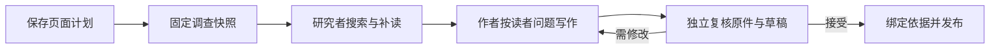

# 把材料整理成一篇真正能用的文章

用“活动约定”的教学示例串起页面计划、固定快照调查、读者导向写作、独立复核、发布阅读与原文变化后的章节级重核，并说明正式文章、参考资料、内部笔记和页面调查中间结果各自的用途。

来源：gpt-5.6-sol 分析，gpt-5.6-sol 独立复核；模型解释仍可被原始证据纠正。

## 先确定读者要完成什么

假设有一份教学用的《活动约定》：它只写了“预算是八十元”和“地点在图书馆”。目标不是生成一篇“活动约定.md 说明”，而是让参加者读完后知道**带多少钱、去哪里集合，以及信息变化后该看哪里**。原件提供事实，文章负责把事实变成可行动的解释；教学测试中的“春游安排”也正是把同一原件重组为“费用”和“集合”两节。这个例子是教学夹具，不代表真实活动。参考 [活动约定原件 ↗](../../../apps/server/tests/knowledge-lifecycle.test.ts#L29 "支持教学示例中原件只包含八十元预算和图书馆地点两个事实。") [费用与集合讲解 ↗](../../../apps/server/tests/knowledge-lifecycle.test.ts#L39 "支持文章把同一原件按参加者问题重组为费用和集合两节。")

这种转换由**页面计划**约束。计划保存稳定页面身份、页面类型、读者、阅读目标、场景、问题、调查入口和可选主题路径；入口路径只是起点，明确选材时另存材料范围。网页入口把这件事翻译成三个容易回答的问题：文章主题是什么、想弄懂什么、写给谁看。于是组织单位从“一个文件”变成“一个读者任务”。参考 [页面计划字段 ↗](../../../packages/contracts/src/knowledge.ts#L64 "支持页面计划保存读者、目标、场景、问题、入口、主题路径和明确材料范围。") [整理文章入口 ↗](../../../apps/web/src/knowledge/ArticleComposer.vue#L173 "支持网页让用户填写文章主题、阅读目标和目标读者。")

## 分清讲解、参考、内部笔记和调查交接

同一批材料可以产生三种用途不同的知识产物：

| 产物 | 解决的问题 | 新读者在哪里遇到 |
| --- | --- | --- |
| **正式文章** | 围绕场景建立理解并帮助行动 | 主题文章、搜索与助手背景 |
| **参考资料** | 稳定查询概念、状态或修改入口 | 独立的参考资料视图，也可参与搜索 |
| **内部笔记** | 由 `analyze` 对明确选中的材料保存内部分析结果 | 不进入阅读目录、知识召回或通知 |

用途来自保存的阅读意图，而不是文件路径、项目名或内部 key。发布文章列表会排除内部笔记和尚未发布的计划；另一份页面计划列表仍保留待整理、写作中和失败状态，供界面继续开始或重试。对活动例子而言，“参加者怎样准备”适合正式文章，字段或状态清单适合参考页。参考 [知识用途判定 ↗](../../../apps/server/src/knowledge/lifecycle.ts#L10 "支持正式文章、参考资料和内部笔记按保存意图区分，而非按路径或 key 推断。") [页面与发布列表 ↗](../../../apps/server/src/knowledge/repository.ts#L127 "支持页面列表保留非内部笔记的计划状态，发布列表排除内部笔记和未发布计划。") [三类知识产物 ↗](../../../docs/reader-first/publication-lifecycle.md#L9 "直接支持内部笔记由 analyze 生成，且不发布到目录、知识召回或通知。")

页面研究者输出的 findings 和 gaps **不是内部笔记**。它们只是一次 `writePage` 中交给作者的调查地图：告诉作者已经找到哪些背景、还缺什么；研究者、作者和复核者实际读取过的材料另记为调查轨迹，研究结果随本次生成 trace 保存。它们服务于这次页面写作，不构成另一套面向新人的 Wiki。参考 [页面调查与写入 ↗](../../../apps/server/src/knowledge/pipeline.ts#L251 "支持页面保存计划、运行研究者，并把 findings 和 gaps 作为本次写作的中间交接。") [写作复核与运行记录 ↗](../../../apps/server/src/knowledge/pipeline.ts#L161 "支持作者、独立复核、定向返修，以及研究结果随生成 trace、实际读取随 investigation 保存。") [依赖与调查轨迹分装 ↗](../../../apps/server/src/knowledge/pipeline.ts#L180 "支持正文引用和章节背景前提进入依赖，而实际读取另存为 investigation。")

## 从选材到发布的完整主链

一次整理按下面的顺序推进：

计划先保存，页面进入“写作中”；成功才变为“已发布”，失败则保留计划并标记失败。原生调查模式在固定原件范围中运行研究者，只有调查完成且不再请求补读，才把 findings 和 gaps 交给作者。参考 [页面调查与写入 ↗](../../../apps/server/src/knowledge/pipeline.ts#L251 "支持页面保存计划、运行研究者，并把 findings 和 gaps 作为本次写作的中间交接。")

调查环境把允许的原件导出到只读工作区，并用目录记录材料 key、版本、路径和行数；通过快照准入的既有文章才写入知识目录。准入会检查文章的调查读取是否都在允许材料中，并递归检查材料版本和文章依赖，因此既有文章不会绕过本次可见范围。研究者的任务是沿场景找到完整流程、必要背景和修改入口，而不是直接写最终 Wiki。参考 [固定调查工作区 ↗](../../../apps/server/src/knowledge/agent-research.ts#L181 "支持固定原件目录、材料目录和准入既有文章被导出到同一次调查工作区。") [既有文章快照准入 ↗](../../../apps/server/src/knowledge/research-snapshot.ts#L98 "支持既有文章只有在调查读取与递归依赖都位于允许材料和版本范围内时才进入研究快照。") [研究者职责 ↗](../../../packages/agent-runtime/roles/knowledge-researcher/1/skills/omem-knowledge-researcher/SKILL.md#L6 "支持研究者围绕读者问题补读完整流程并输出调查地图，而不是直接写最终文章。")

作者把调查地图变成正文；随后另一个复核角色独立对照固定原件，检查引用、范围、时态和关键条件。被拒绝的目标带着具体问题返修，只有接受的文档才交给仓储发布。参考 [写作复核与运行记录 ↗](../../../apps/server/src/knowledge/pipeline.ts#L161 "支持作者、独立复核、定向返修，以及研究结果随生成 trace、实际读取随 investigation 保存。") [独立复核职责 ↗](../../../packages/agent-runtime/roles/knowledge-verifier/1/skills/omem-knowledge-verifier/SKILL.md#L8 "支持复核者独立读取原件、核对引用与关键条件，并用具体问题要求修订。")

发布物把正文材料引用与章节 `reviewSources` 绑定为材料依赖，并把正文引用的文章加入依赖；研究、写作和复核实际读过的其他材料另存为 `investigation`。仓储写入前比较这些发布依赖的材料摘要或文章修订：若绑定输入在调查到发布之间变化，就拒绝发布；仅出现在调查轨迹中的读取不触发这项发布校验。参考 [依赖与调查轨迹分装 ↗](../../../apps/server/src/knowledge/pipeline.ts#L180 "支持正文引用和章节背景前提进入依赖，而实际读取另存为 investigation。") [发布依赖校验 ↗](../../../apps/server/src/knowledge/repository.ts#L192 "支持仓储发布前比较 artifact 依赖中的材料摘要和文章修订，输入不一致时拒绝发布。") [三种来源关系 ↗](../../../docs/reader-first/publication-lifecycle.md#L19 "支持正文引用、章节背景前提和调查轨迹承担不同职责。")

## 读者得到解释，也能回到原文

对活动示例，最终页面不只是重复“八十元、图书馆”，而是按“准备费用”“到场集合”组织行动：数字和地点各自贴近相应论断引用；需要追根时，读者点击引用查看写作时的固定原文。阅读页展示标题、摘要、“读完这一篇”的目标和分节正文，并在来源区说明生成与独立复核；章节超过两节时，页面还会显示页内目录。参考 [读者页面内容 ↗](../../../apps/web/src/knowledge/KnowledgeDocument.vue#L69 "支持阅读页展示目标、章节、待核提示、生成来源和页内目录。")

这里有三种容易混淆的来源关系：

- **正文引用**直接支持一句话或一段解释；
- **章节背景前提**记录正文没写出、但变化会改变该节含义的配置或约定；
- **调查轨迹**记录研究者、作者和复核者实际读过什么。

只有前两类构成文章的更新依据；偶然读到的背景不会自动让正文失效。发布物正是把引用与章节前提收进依赖，同时把实际读取另存为 investigation。参考 [三种来源关系 ↗](../../../docs/reader-first/publication-lifecycle.md#L19 "支持正文引用、章节背景前提和调查轨迹承担不同职责。")。引用解析还会按发布时保存的依赖版本找回原件；即使已有新版，读者看到的仍是当时的材料范围，固定版本缺失时则显示不可操作的原因。参考 [固定版本引用 ↗](../../../apps/server/src/knowledge/api.ts#L43 "支持引用按发布依赖解析到固定文章或材料版本，并说明不可用原因。")

## 原文变化后，只核对受影响的章节

引用始终钉在旧版本；变化判断只回答“这段解释还适不适用”，不会把引用偷偷替换成新版。对于 Markdown 章节或代码结构，系统寻找包含引用的最小完整结构：新版中只有一个同名同类结构、且完整文本相同，才允许行号移动或其他章节变化而继续使用；图片、没有行范围或无法确定结构的普通文档不能这样豁免。参考 [上下文变化判断 ↗](../../../apps/server/src/knowledge/lifecycle.ts#L40 "支持引用固定旧版本、按最小完整结构比较，并明确不自动语义重映射。")

活动示例体现了这一区别：只在两节前增加导读时，“费用”和“集合”仍可用，引用仍指向旧版本；预算从八十元改为一百二十元后，费用节进入“需要核对”，集合节仍保持当前并可参与搜索。若作者明确记录“集合方案以原预算为前提”，同一次预算变化也会让集合节待核对。参考 [章节局部失效示例 ↗](../../../apps/server/tests/knowledge-lifecycle.test.ts#L92 "支持导读变化不影响两节、预算变化只使费用节待核而集合节继续可用。") [背景前提变化示例 ↗](../../../apps/server/tests/knowledge-lifecycle.test.ts#L165 "支持显式记录的未引用前提变化也会让对应章节进入待核状态。")

页面不会因为一节待核就整体消失：阅读页在对应章节说明原因并保留原解释，其他章节继续阅读。这个机制根据已记录的正文引用和背景前提缩小复查范围，**不是语义不变的证明**。未记录的跨文件配置、调用者或运行环境仍可能影响结论；当前没有完整调用图或自动语义影响分析，更新也依赖显式“重新整理”，没有后台自动重写所有受影响页面。参考 [章节状态计算 ↗](../../../apps/server/src/knowledge/lifecycle.ts#L81 "支持各节由正文引用和背景前提共同计算状态，并保留未受影响章节。") [变化判断与显式更新 ↗](../../../docs/reader-first/publication-lifecycle.md#L27 "支持章节判断只是定位复查范围，以及重新整理沿用页面身份且当前没有后台自动重写。")

## 从哪里开始改进

如果你要改进这条流程，可以按问题定位：

- 改“页面要回答谁的什么问题”：从页面计划合同和文章整理表单入手，重点看读者、目标、场景、问题、调查入口与选材范围。参考 [页面计划字段 ↗](../../../packages/contracts/src/knowledge.ts#L64 "支持页面计划保存读者、目标、场景、问题、入口、主题路径和明确材料范围。") [整理文章入口 ↗](../../../apps/web/src/knowledge/ArticleComposer.vue#L173 "支持网页让用户填写文章主题、阅读目标和目标读者。")
- 改“调查、写作、复核怎样交接”：从页面写入主链及写作—复核循环入手。参考 [页面调查与写入 ↗](../../../apps/server/src/knowledge/pipeline.ts#L251 "支持页面保存计划、运行研究者，并把 findings 和 gaps 作为本次写作的中间交接。") [写作复核与运行记录 ↗](../../../apps/server/src/knowledge/pipeline.ts#L161 "支持作者、独立复核、定向返修，以及研究结果随生成 trace、实际读取随 investigation 保存。")
- 改“原文变化影响哪一节”：从章节上下文比较和状态计算入手。参考 [上下文变化判断 ↗](../../../apps/server/src/knowledge/lifecycle.ts#L40 "支持引用固定旧版本、按最小完整结构比较，并明确不自动语义重映射。") [章节状态计算 ↗](../../../apps/server/src/knowledge/lifecycle.ts#L81 "支持各节由正文引用和背景前提共同计算状态，并保留未受影响章节。")
- 改“新读者最终看到什么”：从阅读正文、章节状态和引用解析入手。参考 [读者页面内容 ↗](../../../apps/web/src/knowledge/KnowledgeDocument.vue#L69 "支持阅读页展示目标、章节、待核提示、生成来源和页内目录。") [固定版本引用 ↗](../../../apps/server/src/knowledge/api.ts#L43 "支持引用按发布依赖解析到固定文章或材料版本，并说明不可用原因。")

当前更新入口是显式的：界面为失败页面提供“重试整理”，为已有文章提供“重新整理这篇”。服务端收到请求后按页面 key 读取已保存的计划，并用该计划重新启动写作，因此沿用原页面身份，而不是新建同名页面。参考 [重试与重新整理入口 ↗](../../../apps/web/src/knowledge/KnowledgeHome.vue#L412 "支持界面为失败计划提供重试、为已有页面提供重新整理入口。") [按保存计划重新整理 ↗](../../../apps/server/src/knowledge/api.ts#L177 "支持服务端按页面 key 读取保存的 plan，并用该计划重新启动同一页面的整理。") [变化判断与显式更新 ↗](../../../docs/reader-first/publication-lifecycle.md#L27 "支持章节判断只是定位复查范围，以及重新整理沿用页面身份且当前没有后台自动重写。")

真正的完成标准也不只是模型接受或引用能打开，而是目标读者能沿示例说清流程、找到实现并开始行动。参考 [读者验收边界 ↗](../../../docs/reader-first/writing.md#L28 "支持事实复核与真实读者能否理解、定位和行动是两类不同验收。")
