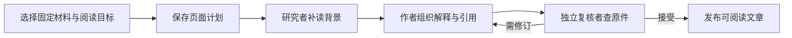

# 把材料整理成一篇真正能用的文章

以“预算八十元、图书馆集合”的教学示例，说明如何从读者问题制定页面计划，经过固定快照调查、面向读者写作、独立补查与发布，最终得到带固定原文引用且能随材料变化局部复核的文章。

来源：gpt-5.6-sol 分析，gpt-5.6-sol 独立复核；模型解释仍可被原始证据纠正。

## 从两句活动约定开始

设想一份很短的活动约定，只写了“预算是八十元”和“地点在图书馆”。**这是教学示例，不是一次真实用户活动记录或模型生成实录。**系统中的示例夹具把同一原件整理成“费用”和“集合”两节，并让两节分别指回原句。参考 [活动约定教学示例 ↗](../../../apps/server/tests/knowledge-lifecycle.test.ts#L38 "支持教学示例中的两条原始事实，以及将它们组织为费用和集合两节的说明。")

整理的价值不在于把文件换一种格式复述，而在于回答参加者真正关心的问题：要准备多少钱、到哪里集合。原件版本负责保存事实，章节或函数等结构块适合检索，而文章围绕一个读者问题跨材料讲解；派生解释可以帮助理解，却不会成为第二份独立事实。参考 [保存、检索与讲解单位 ↗](../../../docs/reader-first/architecture.md#L7 "解释原件、结构块和读者页面为何承担不同职责，以及派生解释不成为独立事实。")

## 先确定页面目的，再决定怎样组织材料

创建文章分成两步：先选择固定材料，再说明阅读目标。参考 [两步整理流程 ↗](../../../apps/web/src/knowledge/ArticleComposer.vue#L132 "支持创建文章先选择材料、再说明阅读目标的界面步骤。")

第二步填写文章主题、想弄懂什么和写给谁看；界面也提示，具体问题和使用场景会帮助文章讲得更清楚。参考 [阅读目标表单 ↗](../../../apps/web/src/knowledge/ArticleComposer.vue#L215 "支持第二步填写文章主题、阅读目标和目标读者，以及界面对具体问题与使用场景的提示。")

这些输入会形成**页面计划**。计划包含页面类型、读者、目标、场景、问题、主题路径和调查入口；`materialKeys` 限定可调查的材料范围，`entryPaths` 只是从哪里开始读。参考 [页面计划字段 ↗](../../../packages/contracts/src/knowledge.ts#L64 "支持页面计划包含读者、目标、场景、问题、入口和明确材料范围，并区分 materialKeys 与 entryPaths。")

在活动示例中，可以把计划理解为：读者是参加者，目标是“出发前知道带多少钱、去哪里”，问题是“费用和集合地点分别是什么”。于是两句原文被组织为一篇准备指南，而不是生成“活动约定.md 文件说明”。当前网页在新建文章或目标发生变化时，把目标同时作为初始场景和唯一问题，并把调查入口初始化为空；若要为仓库指南提供更细的多个问题或入口，可以在页面计划数据中明确填写。参考 [网页计划默认映射 ↗](../../../apps/web/src/knowledge/ArticleComposer.vue#L80 "支持新建或目标变化时以目标初始化场景和问题，并将调查入口初始化为空。")

## 一篇文章如何从计划走到发布

`writePage` 先保存计划并标记为写作中，再从计划限定的材料启动研究；原生研究只有在完成自己的调查、没有遗留读取请求后才进入写作。成功后页面转为已发布，失败则保留计划并记录失败状态。参考 [页面生成主流程 ↗](../../../apps/server/src/knowledge/pipeline.ts#L251 "支持保存计划、研究完成后写作、成功发布以及失败保留状态的流程。")

每个角色拿到的是同一批已捕获材料构成的任务快照：固定原件会导出到只读研究工作区，同时生成材料目录和既有文章目录。这样，研究、写作和复核看到的是同一时点的依据，而不是运行中不断变化的实时材料。参考 [固定研究快照 ↗](../../../apps/server/src/knowledge/agent-research.ts#L135 "支持把获准原件、材料目录和既有文章目录导出到同一研究工作区快照。")

## 研究、写作与独立复核解决不同问题

**研究者**回答“背景是否读够了”。它可以在快照中做混合搜索、读完整原件，也能搜索既有讲解；既有文章只是理解背景，新事实仍要回原件核对。参考 [原件与既有知识搜索 ↗](../../../apps/server/src/knowledge/agent-research.ts#L506 "支持研究者在快照内搜索原始材料，并将既有讲解仅作为带原始引用的背景。")

**作者**回答“怎样让目标读者读懂并行动”。它把研究得到的发现和缺口转成连贯章节，仍可继续补读；在活动示例里，可以写“准备八十元，到图书馆集合”，但不能自行补出集合时间、支付方式或参加资格。

**独立复核者**回答“文字虽然顺畅，事实、范围和页面目的是否成立”。作者草稿会交给另一个角色检查；被接受的文档才会组成产物并发布，未接受的目标带着具体问题进入修订，连续多轮仍有实质问题则不发布新稿。参考 [写作与独立复核 ↗](../../../apps/server/src/knowledge/pipeline.ts#L161 "支持作者产出草稿、独立复核、按具体问题修订，以及只发布 accepted 文档的机制。")

发布产物还区分三类关系：正文和背景前提构成更新依赖；实际读过但不支持具体论断的材料只进入调查轨迹。参考 [发布产物关系 ↗](../../../packages/contracts/src/knowledge.ts#L102 "支持区分正式依赖、生成与复核记录、发布用途和仅表示实际阅读的 investigation。")

## 新读者最终看到什么

最终页面不是研究日志，而是标题、摘要、“读完这一篇”的目标、按读者问题组织的正文，以及确有必要的待核对问题。页面会在具体章节提示需要更新的原因，同时保留旧解释，并在折叠区说明固定材料、生成者和独立复核者。参考 [文章阅读页面 ↗](../../../apps/web/src/knowledge/KnowledgeDocument.vue#L87 "支持读者看到摘要、阅读目标、章节状态、正文、待核对问题和生成来源记录。")

| 产物 | 适合做什么 | 是否进入读者目录与知识召回 |
| --- | --- | --- |
| 正式文章 | 围绕场景连续讲解，例如参加者如何准备 | 进入主题文章目录、搜索和助手背景 |
| 参考资料 | 快速查字段、接口或状态 | 进入单独参考目录，也可搜索 |
| 内部笔记 | 保存材料分析，供后续调查复用 | 不进入阅读目录、知识召回或通知 |

这三种用途由发布意图决定，不代表“新旧等级”。正文引用支持附近论断；`reviewSources` 记录未写进正文但会影响某节的关键前提；`investigation` 只是角色实际读过的审计轨迹，偶然读到的材料变化不会自动让正文失效。参考 [三种发布用途与来源关系 ↗](../../../docs/reader-first/publication-lifecycle.md#L9 "支持正式文章、参考资料、内部笔记的用途差异，以及正文引用、背景前提和调查轨迹的区别。")

读者点击引用时，系统按文章保存的依赖解析固定材料或固定文章版本；界面先展示引用关系和引用理由，再打开相应原文行段。若固定版本缺失，会给出可读的不可用原因，而不是悄悄跳到当前文字。参考 [固定引用解析 ↗](../../../apps/server/src/knowledge/api.ts#L45 "支持引用按保存的依赖解析固定材料或文章版本，并在缺失时返回明确原因。") [引用阅读界面 ↗](../../../apps/web/src/knowledge/KnowledgeFrame.vue#L84 "支持引用界面先展示关系和理由，再打开固定文章或原始材料范围，并显示不可用原因。")

## 原文变化后，按章节重新核对

引用始终钉在写作时的原件。系统比较旧版本与当前版本，只判断引用所在的完整 Markdown 章节或代码结构是否仍适用：只有在新版本中能唯一找到同标题、同类型的结构，且完整上下文不变时，即使行号移动也可继续使用原解释；若出现多个同名同类候选，则采取保守判断。它不会把旧引用自动重映射到新文字。参考 [引用上下文比较 ↗](../../../apps/server/src/knowledge/lifecycle.ts#L40 "支持引用保持指向旧原件，并且只有新版中唯一的同标题同类型结构与旧版完整上下文一致时才继续沿用解释。")

活动示例展示了三个分支：

- 只在预算前增加无关导读，两节上下文都未变，文章仍可用，引用仍回到最初版本。
- 把预算从八十元改为一百二十元，费用节进入待核对，集合节仍可阅读和检索。
- 如果集合方案明确登记了“以原预算为前提”，预算变化也会使集合节进入待核对。参考 [局部变化示例 ↗](../../../apps/server/tests/knowledge-lifecycle.test.ts#L93 "支持无关导读变化不影响文章、预算变化只使费用节待核对且集合节继续可检索的分支。") [未引用前提变化 ↗](../../../apps/server/tests/knowledge-lifecycle.test.ts#L166 "支持集合节声明依赖旧预算后，预算变化会让集合节进入待核对。")

这是一种**定位复查范围**的机制，不是自动证明语义完全不变。无法可靠识别结构的普通文本会采取更保守的判断；跨文件配置、调用方或运行环境若会改变解释，需要作者把它们登记为章节前提。当前也没有完整调用图或自动语义影响分析。参考 [变化判断的边界 ↗](../../../docs/reader-first/publication-lifecycle.md#L29 "解释结构比较只是定位复查范围，并不证明完整语义不变，也没有完整自动影响分析。")

## 补背景、重新整理与修改入口

如果材料缺少会改变读者行动的信息，作者应把它保留为明确问题，而不是用常识补造。读者回答后，答案会保存为新的原始材料，并加入同一页面计划；下一次重新整理时，研究者、作者和复核者都能看到它。参考 [补充背景进入计划 ↗](../../../apps/server/src/knowledge/repository.ts#L296 "支持读者回答保存为新原始材料、加入同一页面计划并触发重新核对。")

更新是显式动作：读者可以选择“重新整理这篇”，也可以在两步弹窗里“调整材料与目标”。文章身份和旧版固定引用会保留；如果生成期间计划或依赖又发生变化，发布会拒绝较早结果覆盖新计划和新材料。参考 [显式重新整理 ↗](../../../docs/reader-first/publication-lifecycle.md#L37 "支持重新整理、调整材料与目标时保留文章身份和旧版引用，并说明补充背景后仍需显式更新正文。") [发布前输入核对 ↗](../../../apps/server/src/knowledge/repository.ts#L202 "支持发布前比较当前计划和固定依赖，防止较早生成结果覆盖运行中已经变化的目标或材料。")

要改进这条流程，可从四处入手：页面计划合同决定要回答谁的问题；研究环境决定角色能搜索和补读什么；流水线决定研究、写作、复核与发布的顺序；生命周期判断决定哪些章节仍可用。验收时既要查事实与引用，也要让真正的新读者判断：是否理解、能否沿引用继续了解、是否知道下一步怎么做。
