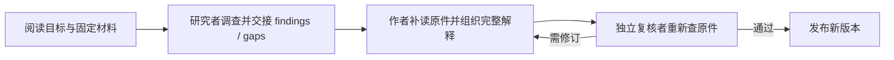

# Agent 怎样把材料讲明白：自主调查、写作与补查

沿一篇教学示例文章，解释阅读目标怎样驱动固定原件调查，研究者、作者与独立复核者如何借助 Traex harness 和 omem 工具协作，以及候选文章如何带着来源发布、失效并重写。

来源：gpt-5.6-sol 分析，gpt-5.6-sol 独立复核；模型解释仍可被原始证据纠正。

## 先决定新人要读懂什么

假设要把一份“功能设计”和对应实现写成新人指南。输入不只是标题和文件：页面计划还应说明文章类型、目标读者、要解决的问题、贯穿场景、待回答问题和调查起点。`entryPaths` 只是起点；真正限制调查边界的是明确选择的 `materialKeys`。参考 [页面计划字段 ↗](../../../packages/contracts/src/knowledge.ts#L60 "支持阅读目标、场景、问题、入口路径与明确材料范围的区别。")

这意味着调查不是“逐文件摘要”。概念解释应从问题和具体例子出发，再建立关系；每一节都要推进读者理解。**教学示例**中，我们的问题是：“为什么一次 ACP prompt 能连续搜索、补读并交付文章？”可观察结果是一篇能说明角色分工、运行过程、来源和修改入口的文章。参考 [读者导向的页面结构 ↗](../../../docs/reader-first/writing.md#L3 "说明概念解释应从问题和例子组织，并让每节推进理解。")

当前网页入口比完整页面计划简单：它收集标题、读者和一个目标，并暂时把目标同时当作场景和唯一问题，入口路径留空。因此改进调查体验时，要区分“底层 brief 已能表达什么”和“界面目前让用户填写了什么”。参考 [当前网页整理请求 ↗](../../../apps/web/src/knowledge/ArticleComposer.vue#L62 "支持当前 UI 将 goal 复用为 scenario 和单一 question、entryPaths 为空的现状。")

## 固定原件工作区让补读可追溯

每个角色拿到一个隔离工作区。所选材料按安全的相对路径导出到 `originals/`，`catalog.json` 记录材料 key、标题、修订、路径和行数；既有文章另列在 `knowledge.json`。检索使用只读数据库快照，所以同一次任务不会在调查途中悄悄切到刚更新的原文。参考 [固定原件与检索快照 ↗](../../../apps/server/src/knowledge/agent-research.ts#L135 "支持 catalog、knowledge 目录和只读 SQLite 快照的创建方式。")

Agent 可以先列目录或混合搜索，再读任意行段、完整章节或函数；也能查看既有文章、记忆、历史、图片、显式关联和代码定义/候选调用。已有讲解只帮助建立地图，新事实仍要回固定原件核对；候选调用也不等于完整调用图。参考 [自主调查工具范围 ↗](../../../docs/reader-first/agent-research.md#L15 "概括读取、搜索、知识背景、代码导航、历史、图片和候选提交的用途及边界。")

## 发现缺口后继续追，而不是交回宿主

在教学示例里，研究者先从 `pipeline.ts` 看见 `writePage`：它按 brief 取得材料，启动研究角色，只有研究者声明调查完成后才把 findings 与 gaps 交给作者。参考 [页面调查入口 ↗](../../../apps/server/src/knowledge/pipeline.ts#L214 "支持 writePage 选择材料、运行研究者并把完成的研究交给写作阶段。")

但只读这里还回答不了“工具为什么能反复调用”。研究者于是搜索 `connection.prompt`，补读 `gateway.ts` 和 `agents.ts`：前者准备角色工作区、原生 skill 与任务 MCP，后者建立 ACP session 并消费工具、计划和 usage 事件。缺背景时继续搜索和补读，正是原生模式取代固定研究轮数的价值；研究结论是路线图，不是可直接引用的第二份事实。参考 [角色工作区与调查注入 ↗](../../../apps/server/src/knowledge/pipeline.ts#L71 "支持每个角色由 gateway 获得固定材料工作区和原生调查环境。")

## 研究、成文和独立复核怎样交接

作者收到阅读目标与研究地图，但仍拥有同一材料范围和调查工具，可以重新选择证据、补齐输入输出，并把示例写成连贯说明。复核者在单独的角色运行中拿到草稿和同一阅读目标，独立检查关键因果；若不通过，只有被拒文章带着具体问题进入修订，最多经历有限次写作—复核循环。参考 [写作与独立复核循环 ↗](../../../apps/server/src/knowledge/pipeline.ts#L126 "支持作者、复核者、按问题修订以及通过后发布的主流程。")

这套交接刻意把研究 trace 与正文输入分开：读者看到的是经过整理的解释，运行记录则留作追溯。当前发布依赖收集正文引用以及作者、复核者被识别的实际读取；因此作者不能只相信研究者的概括，而应回读要写成事实的原件。参考 [发布依赖收集 ↗](../../../apps/server/src/knowledge/pipeline.ts#L142 "支持当前依赖由正文引用以及作者和复核者的实际读取组成，研究 findings 本身不充当事实来源。")

## 为什么一次 prompt 仍能多次用工具

这里的“一次 prompt”是**一次完整 Agent turn**，不是一次无工具的文本补全。omem 创建 session、挂载任务 MCP 与原生 skills，然后只调用一次 `connection.prompt`；在返回 `end_turn` 之前，Traex harness 可以反复让模型决定下一步、调用 Read/Grep/Glob 或 MCP、接收结果并继续推理。客户端持续接收 `tool_call`、计划和 usage 更新。参考 [ACP 会话与完整 turn ↗](../../../apps/server/src/agents.ts#L281 "支持创建 session、注入 MCP，并以一次 prompt 等待 end_turn 的协议调用。") [工具与计划事件 ↗](../../../apps/server/src/agents.ts#L226 "支持客户端在同一会话中持续接收工具调用、计划和 usage 更新。")

分工因此很清楚：Traex harness 负责 turn 内的推理—工具循环和上下文管理；omem 负责阅读目标、固定材料范围、工作区、可用工具、权限边界、输出合同与发布。原生知识任务不套用 omem 的输入/输出 token 预算，但模型上下文窗、超时、取消和进程生命周期仍然存在。参考 [原生运行边界 ↗](../../../apps/server/src/agent-runtime/gateway.ts#L407 "支持原生模式注入 MCP、跳过宿主输出预算，并继续保留运行时生命周期控制。")

## 从候选提交到可更新的文章

`submit_result` 只提交候选。它在当前 turn 内校验完整合同和来源；失败会把具体错误返回给 Agent 修正，成功才写下候选结果。聊天里打印一段 JSON 不能代替提交。参考 [候选提交校验 ↗](../../../apps/server/src/knowledge/agent-research.ts#L687 "支持 submit_result 在当前 turn 内校验、反馈错误并保存候选，而非直接发布。")

随后宿主把模型选择的行范围绑定为固定原文短引文，检查每节都有内联引用、目标确实在允许范围内，再由独立角色判断语义是否正确。结构合法与事实可信是两道不同的门。参考 [引用绑定与结构校验 ↗](../../../apps/server/src/knowledge/repository.ts#L44 "支持内联引用、允许目标、行范围和宿主绑定原文短引文的结构保障。")

复核通过后，发布物保存正文、材料或子文章的固定 digest、阅读计划，以及生成和复核记录；发布前若依赖已经变化，会拒绝把旧输入上的草稿设为当前版本。参考 [发布前依赖确认 ↗](../../../apps/server/src/knowledge/repository.ts#L122 "支持发布前检查固定依赖未变化，并记录新文章修订。") 材料或被引用文章后来变化时，刷新会把受影响页面及其上层页面标为非 current，但历史版本和固定引用仍可解析；“已失效”表示需要重写，不等于已经自动生成了新文章。参考 [材料变化后的失效 ↗](../../../apps/server/src/knowledge/repository.ts#L178 "支持材料或子文章 digest 变化导致页面及其上层页面转为非 current，同时保留历史解析。")

## 改进入口与当前边界

要改变体验，可以按问题落点定位：

| 想改变什么 | 主要入口 |
| --- | --- |
| 页面问什么、给谁看 | `WikiPageBrief`、网页整理表单、writer/verifier role skill |
| 能搜索和读取什么 | `knowledge/agent-research.ts` |
| 角色顺序、交接与发布条件 | `knowledge/pipeline.ts` |
| 原生 skill、MCP 与运行约束 | `agent-runtime/gateway.ts` |
| ACP session 与工具事件 | `agents.ts` |
| 版本、依赖与 current 状态 | `knowledge/repository.ts` |

最后要守住两个边界。第一，检索只是找候选：当前概念问题仍可能命中主题相近却不能回答问题的旧说明，相关性尚未整体通过。参考 [当前检索相关性边界 ↗](../../../docs/reader-first/progress.md#L5 "说明概念检索仍可能命中相近但不能回答问题的内容，整体读者质量尚未通过。") 第二，引用合法和独立复核都不能替代真实阅读验收；还要看术语是否首次即懂、示例是否贯穿、每节是否回答计划问题，以及读者能否找到下一步。参考 [事实检查与读者检查 ↗](../../../docs/reader-first/writing.md#L28 "支持独立事实复核不能替代页面目标、术语、案例与下一步的读者验收。")
