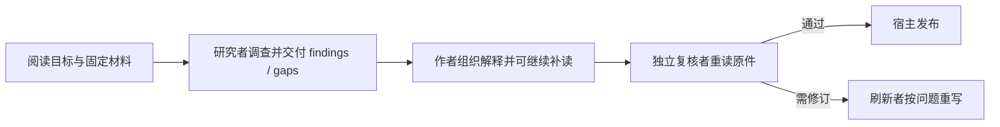

# Agent 怎样把材料讲明白：自主调查、写作与独立补查

沿一篇教学示例文章，解释阅读目标怎样约束调查，固定原件工作区与 Traex harness 如何配合，研究者、作者、复核者怎样独立补读，以及候选如何经引用校验、发布和失效更新。

来源：gpt-5.6-sol 分析，gpt-5.6-sol 独立复核；模型解释仍可被原始证据纠正。

## 先决定读者要解决什么问题

知识文章的起点不是“总结这些文件”，而是**谁要在什么场景下弄懂什么，并准备采取什么行动**。页面计划会写明读者、目标、场景、问题和起始路径；这些信息共同决定调查要追哪条因果、文章先讲什么。概念解释通常从问题和具体例子进入，长度服从讲清楚，而不是按文件逐篇复述。参考 [页面阅读目标 ↗](../../../config/wiki-pages.json#L136 "支持页面计划用读者、目标、场景、问题和入口控制调查方向。") [读者导向的写作路线 ↗](../../../docs/reader-first/writing.md#L3 "说明不同页面类型应围绕读者任务和完整例子组织。")

**教学示例**：我们选择一份 Agent 调查设计和对应实现，目标是让新人回答：“为什么只发送一次 ACP prompt，Agent 仍能搜索多次、发现缺口并继续补读？”预期可观察结果不是一张函数清单，而是一篇能说明角色分工、运行顺序和修改入口的文章。实际运行时，`writePage` 先按页面指定的材料范围取固定版本，把完整 brief 交给研究者；研究完成后，目标与研究结论再进入写作。参考 [读者页面生成入口 ↗](../../../apps/server/src/knowledge/pipeline.ts#L245 "支持材料范围、研究 brief、研究完成门槛和文章复用条件。")

## 在固定原件中调查，而不是一次塞满上下文

每个角色都会得到自己的任务工作区。允许的材料保持相对目录结构导出到 `originals/`；`catalog.json` 记录材料 key、固定修订、可读路径和行数，`knowledge.json` 只列依赖仍能在本次范围内追溯的既有文章。实现还会新建数据库，只复制本次授权的来源、修订与片段，并在建立检索投影后以只读方式重新打开。因此更准确的说法是“按范围构造并封存的一致快照”，不是把正在变化的整库直接交给模型。参考 [固定原件目录 ↗](../../../apps/server/src/knowledge/agent-research.ts#L106 "支持原件按安全路径导出以及 catalog 记录修订和行数。") [调查快照入口 ↗](../../../apps/server/src/knowledge/agent-research.ts#L167 "说明工作区创建本次调查数据库并筛选可追溯既有文章。") [封存只读快照 ↗](../../../apps/server/src/knowledge/research-snapshot.ts#L189 "支持检索投影完成后封存数据库并以只读模式重开。")

调查时，原生 Read/Grep/Glob 适合沿真实文件结构读代码和文档；omem MCP 则补上目录、精确行段或章节、混合检索、既有知识与记忆、历史版本、图片、代码导航和显式关系。既有知识与记忆可以提示方向，但新增事实仍要回到固定原件核对；代码 calls 也只是导航候选，不是完整调用图。参考 [材料调查工具 ↗](../../../apps/server/src/knowledge/agent-research.ts#L356 "说明目录、精确读取和混合检索等工具如何互补。") [工具范围与导航边界 ↗](../../../docs/reader-first/agent-research.md#L19 "支持知识、记忆、历史和代码导航均需回原件核对且 calls 并非完整图。")

回到示例：研究者先从 `writePage` 看到“研究者→作者→复核者”，却仍无法解释 prompt 内的循环，于是搜索并补读 gateway 与 ACP 客户端实现。这一步展示了 entry path 只是起点：缺背景时应继续查，而不是用最初几段材料硬凑结论。

## 三个角色交接，单次 prompt 内仍可多轮调查

这里有两层编排，职责不要混在一起：

| 层次 | 负责什么 |
| --- | --- |
| **omem** | 固定材料范围、准备工作区与 MCP、启动不同角色、校验候选、记录依赖并发布 |
| **Traex harness** | 在一个 Agent turn 内选择下一步、调用原生工具或 MCP、管理模型上下文，直到结束 turn |

gateway 为每次角色运行准备工作区、加载原生 skill 与 MCP，然后把完整任务交给 ACP。ACP 客户端只调用一次 `connection.prompt`，但在它返回前会持续接收工具调用、计划、用量和文本更新；只有 `stopReason=end_turn` 才算这次 turn 完成。因此“一个 prompt”不等于“一次模型推理或一次工具调用”。参考 [原生角色运行环境 ↗](../../../apps/server/src/agent-runtime/gateway.ts#L307 "支持 gateway 为角色准备工作区、原生 skill 和调查环境。") [一次 ACP turn ↗](../../../apps/server/src/agents.ts#L226 "支持客户端持续消费工具等更新并只调用一次 prompt 直到 end_turn。")

研究、写作和复核都通过独立的角色运行进入同一材料范围；研究者必须自行完成调查，作者只接收 findings/gaps 而非操作日志，复核者再拿草稿与原件独立核对。示例中，研究者把“需补读 gateway/agents 才能解释循环”交给作者；作者把它写成上面的分层关系；复核者在新运行中重新查关键实现，而不是只相信作者挑出的引文。参考 [Prompt 完成条件 ↗](../../../apps/server/src/agents.ts#L335 "直接支持一次 connection.prompt 返回 end_turn 才完成角色 turn。") [研究写作复核编排 ↗](../../../apps/server/src/knowledge/pipeline.ts#L157 "支持作者和复核者独立运行、拒绝后修订、接受后发布。")

## 提交的是候选，复核通过后才发布

角色可以在聊天中自然报告进度，但最终产物必须通过 `submit_result` 提交。工具会用同一份输出合同和引用规则验证候选：失败信息留在当前 turn，Agent 可继续补读并修正；成功只是写下候选结果，并不等于已经发布。参考 [候选提交工具 ↗](../../../apps/server/src/knowledge/agent-research.ts#L791 "说明 submit_result 在同一 turn 内返回校验反馈，成功仍只是候选。")

作者给出引用定位后，宿主从固定原文绑定精确引文，并检查每节是否内联引用、目标是否在授权范围、行号是否有效。随后独立复核者判断关键事实、时态、计划与实现是否混淆，以及文章是否回答读者问题；需要修订时，问题和原稿交给刷新角色，只有 accepted 的文档才组装成 artifact 并调用 repository 发布。参考 [引用确定性校验 ↗](../../../apps/server/src/knowledge/repository.ts#L44 "支持内联引用、授权目标和精确原文范围由宿主校验。") [接受后组装发布 ↗](../../../apps/server/src/knowledge/pipeline.ts#L167 "支持只有复核接受的文档才记录依赖、组装 artifact 并发布。")

这也解释了为什么研究地图不能直接当文章：findings 负责告诉作者“查到了什么、缺什么”，正文还要把材料重组为一个去掉引用也通顺的解释。复核关注事实与读者理解，但它依然只是发布门槛之一。

## 记录真正读过的来源，并随材料变化失效

发布产物保留阅读 brief、生成与复核模型、运行 trace 和依赖。原生模式下，材料依赖由正文引用以及作者、复核者实际读取的材料共同形成；发布前还会再次比较材料摘要和子文章 revision，输入在调查期间变化就拒绝发布，避免把旧调查悄悄挂到新原文上。参考 [实际读取依赖 ↗](../../../apps/server/src/knowledge/pipeline.ts#L173 "说明原生模式把正文引用和作者、复核者实际读取共同纳入材料依赖。") [发布前输入校验 ↗](../../../apps/server/src/knowledge/repository.ts#L122 "支持发布时重新比较材料摘要和文章 revision，防止竞态挂错版本。")

发布后，`refresh` 会检查直接依赖，并把子知识失效继续向上传播；受影响文章的 head 会被标为非 current，旧 revision 仍可按当时固定输入查看。磁盘恢复先把每份产物报告为 `restored`、`stale`、`missing` 或 `rejected`，完成导入后再由 repository 的 `refresh()` 维护 head 的 current 状态；旧正文不会静默指向新来源。参考 [依赖失效传播 ↗](../../../apps/server/src/knowledge/repository.ts#L178 "说明材料或子知识变化怎样把直接及传递依赖文章标为非 current。") [历史产物恢复状态 ↗](../../../apps/server/src/knowledge/artifacts.ts#L32 "支持磁盘恢复区分 restored、stale、missing 与 rejected，并在导入后刷新 repository 的 current 状态。")

因此，示例中的设计文档或实现一旦换版，这篇文章不会因为“以前复核通过”而永远有效。下次 `writePage` 只有在文章仍 current、reading brief 未变且角色版本一致时才复用，否则重新走研究、写作和复核。参考 [读者页面生成入口 ↗](../../../apps/server/src/knowledge/pipeline.ts#L245 "支持材料范围、研究 brief、研究完成门槛和文章复用条件。")

## 从哪里改体验，以及哪些质量仍要人判断

想改进这条体验，可以按问题定位：

- 改“为谁写、要回答什么、从哪里开始”，看页面计划和文章创建入口。
- 改角色顺序、交接内容、修订与依赖收集，看 `knowledge/pipeline.ts`。
- 改可见原件、快照范围、搜索或读取工具与读取记录，看 `agent-research.ts` 和 `research-snapshot.ts`。
- 改 ACP session、skill/MCP 注入、prompt 生命周期和权限，看 `agent-runtime/gateway.ts` 与 `agents.ts`。
- 改引用校验、发布及 current/stale 传播，看 `knowledge/repository.ts`；改文章结构或复核标准，则修改对应角色 skill。参考 [知识管线修改入口 ↗](../../../apps/server/src/knowledge/pipeline.ts#L102 "为角色运行、交接、依赖记录与发布流程的主要修改位置提供实现依据。")

最后要守住两条边界。第一，检索只提供候选：主题相关不等于回答问题，长问题可能在候选截断前丢掉真正的方法，AST 导航也不能自动解释业务因果。第二，schema、精确引用和独立复核能降低事实错误，却不能保证文章简短、术语好懂、案例贯穿或让新人真的会改；同一模型的独立会话也可能共享盲点。最终仍要由目标读者判断能否解释主流程、定位实现并开始行动。参考 [检索仍是候选 ↗](../../../docs/reader-first/current-system.md#L21 "支持相关命中、候选截断、计划混杂和重排不能保证答案完整的边界。") [阅读质量四个维度 ↗](../../../docs/reader-first/current-system.md#L5 "说明事实复核不能代替理解、完整回答、行动价值与真实读者验收。")

当前原生 CLI 也不是完整文件系统沙箱：运行时只自动批准任务工作区内的读或搜与本任务 omem 工具，但 CLI 仍可能看到祖先指令；此外跨文件调用链仍有限。它们是当前能力边界，不应包装成已经解决。参考 [Harness 当前边界 ↗](../../../docs/reader-first/current-system.md#L38 "支持文件系统隔离、跨文件链路和内容可读性仍有限的当前状态。")
