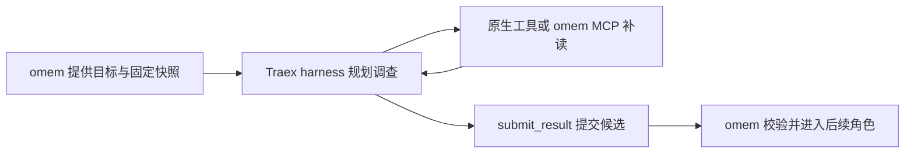

# Agent 怎样把材料讲明白：从自主调查到复核发布

用一篇功能文章的教学构造示例，说明阅读目标如何约束调查与结构，固定原件工作区和 omem 工具如何支持补读，Traex harness 怎样在一次 ACP turn 内组织多轮工具交互，以及研究者、作者、独立复核和知识仓储如何共同完成可追溯发布与后续更新。

来源：gpt-5.6-sol 分析，gpt-5.6-sol 独立复核；模型解释仍可被原始证据纠正。

## 先决定读者要带走什么

设想一个**教学构造**：开发者选中“Agent 自主研究”的设计说明和实现代码，希望写一篇让新人弄懂“为什么只发出一次 ACP prompt，Agent 仍能不断搜索、补读并交付文章”的解释。预期结果不是文件摘要，而是读者能复述从选材到发布的主链，并知道调查不足、文章难读或更新不及时分别该去哪里改。

阅读目标先于调查。页面计划保存读者、目标、场景、问题、起始路径和文章类型；其中起始路径只是线索，显式材料集合才限定调查范围。写作时再按“场景—完整例子—必要概念—整体地图—关键机制—修改入口”组织，而不是照着目录逐文件讲。参考 [读者优先的页面结构 ↗](../../../docs/reader-first/writing.md#L3 "支持页面应从场景和完整例子推进到机制与修改入口，而非按文件罗列。") [页面计划的范围语义 ↗](../../../packages/contracts/src/knowledge.ts#L60 "支持页面计划字段及 entryPaths 只是入口、materialKeys 才限定调查范围。")

当前网页入口把用户选择的材料版本与“文章主题、想弄懂什么、写给谁看”一起提交；简化入口会把目标同时用作场景和首个问题，并固定生成解释型页面。因此，若要让普通用户表达多个问题或更细的场景，入口本身就是一个可改进点。参考 [网页整理文章入口 ↗](../../../apps/web/src/knowledge/ArticleComposer.vue#L58 "支持网页提交固定 explanation 类型，并把目标映射为场景与首个问题。")

## 在固定原件上调查，缺背景就继续补读

生成开始时，`writePage` 先刷新文章状态、确定材料范围，再为研究者启动原生调查。研究者必须在自己的会话里完成搜索与补读，交付 `ready=true` 且不再把请求退回宿主，之后作者才接手。参考 [读者页面生成入口 ↗](../../../apps/server/src/knowledge/pipeline.ts#L243 "支持 writePage 确定材料范围、启动研究者并要求原生调查自行完成后再交给作者。")

每个角色拿到的是一次任务专属工作区：允许的材料导出到 `originals/`，安全的相对目录尽量保留；`catalog.json` 记录完整材料 key、固定修订、文件位置和行数，`knowledge.json` 只列本快照允许读取的既有文章，检索则读取一致的 SQLite 快照。这样，角色可以像读仓库一样使用 Read/Grep/Glob，又不会因正式库在调查中变化而悄悄换原文。参考 [固定原件工作区 ↗](../../../apps/server/src/knowledge/agent-research.ts#L107 "支持 originals、catalog、knowledge 目录和检索快照的构造方式。")

回到示例：研究者先从 `pipeline.ts` 与 `agent-research.ts` 跟主流程，却发现它们不足以解释 prompt 内的循环，于是搜索 `connection.prompt`、`tool_call` 和 `end_turn`，补读 `gateway.ts` 与 `agents.ts`。原生文件工具适合浏览真实目录和完整函数；omem 的材料搜索、章节读取、代码导航、历史与关联工具负责内部对象和定点补查。代码导航返回的调用只应当作候选，既有知识与记忆只作背景，新事实仍要回到原件。参考 [自主调查工具分工 ↗](../../../docs/reader-first/agent-research.md#L15 "支持原件、知识、记忆、代码导航、历史和图片工具的用途及候选关系边界。")

## 一次 prompt 为什么能包含多轮工具交互

这里的“一个 prompt”是一次完整的 **Agent turn**，不是一次模型文本补全。omem 创建 ACP session 后只调用一次 `connection.prompt`；在它返回 `end_turn` 之前，客户端会持续接收工具调用、工具更新、计划、用量和正文片段。换句话说，多轮“模型判断—调用工具—读取结果—继续判断”发生在 Traex 自带 harness 管理的 turn 内。参考 [ACP 更新流 ↗](../../../apps/server/src/agents.ts#L226 "支持客户端在一次会话中持续接收工具调用、计划、用量与正文更新。") [一次 prompt 的完成边界 ↗](../../../apps/server/src/agents.ts#L281 "支持只调用一次 connection.prompt，并以 end_turn 作为该 Agent turn 的完成条件。")

两边职责应分开理解：omem 管阅读目标、材料集合、快照、搜索与导航、权限边界、任务状态和发布；Traex harness 负责选择调查步骤、调用工具及上下文压缩。原生模式不设宿主输入/输出 token 预算，也没有旧式三轮调查门，但仍受模型窗口、自动压缩、超时、取消和进程退出约束。本仓库能够确认上述接口边界，不能据此推断 Traex 内部每轮模型调度或压缩算法。参考 [omem 与 Traex 的职责 ↗](../../../docs/reader-first/agent-research.md#L36 "支持 omem 管目标与快照、Traex harness 管调查步骤和压缩，以及无三轮门但仍有生命周期限制。")

## 研究地图、成文与独立复核怎样交接

研究者不写最终 Wiki，而是把场景输入输出、主链、概念因果、必要出处、修改入口和真正的缺口整理成给作者的地图。示例中的关键发现是：“固定快照由 omem 提供；一次 turn 内的反复工具使用由 harness 推进；候选提交之后仍未发布。”参考 [研究者交接内容 ↗](../../../packages/agent-runtime/roles/knowledge-researcher/1/skills/omem-knowledge-researcher/SKILL.md#L6 "支持研究结果是供作者使用的调查地图，而不是最终 Wiki。")

作者收到阅读计划以及研究的 findings/gaps，但仍拥有同一范围的固定原件和调查工具，可以自己补读。例如，为解释材料变化后的更新，作者会继续读发布仓储，而不是把研究结论当作第二份事实。作者完成草稿后，管线另开知识复核角色；角色会话不复用，因此复核者拿到草稿、阅读目标和原件范围，自行搜索并沿代表性输入核对因果，而不是沿用作者上下文。参考 [写作复核与发布主链 ↗](../../../apps/server/src/knowledge/pipeline.ts#L157 "支持作者接收研究结论、独立复核、修订、依赖记录以及仅接受文档进入发布。") [角色会话隔离 ↗](../../../apps/server/src/agent-runtime/gateway.ts#L315 "支持原生角色加载各自技能与工作区，并明确不复用角色 session。")

复核既看引用是否真的支持附近论断，也看时代、范围、关键条件和页面目的。若关键事实错误或把未知写成确定事实，它会要求修订；若只是措辞偏好或未枚举无关分支，则不应阻止发布。对这篇示例，复核重点是“一次 prompt 可包含反复工具调用”“只有通过复核的草稿才进入发布”“旧引用仍指向写作时版本”，同时检查新人能否找到修改入口。参考 [独立复核准则 ↗](../../../packages/agent-runtime/roles/knowledge-verifier/1/skills/omem-knowledge-verifier/SKILL.md#L8 "支持复核者自行阅读原件，检查事实、范围和关键行为，同时避免把审查变成无关边界清单。")

## 候选如何成为可追溯文章

`submit_result` 只是角色交付边界：它在同一 turn 内校验结构与来源引用，失败可继续补读并重提；成功只保存候选结果，并不直接发布。参考 [候选提交边界 ↗](../../../apps/server/src/knowledge/agent-research.ts#L791 "支持 submit_result 在 turn 内校验、允许失败后重提，并明确候选尚未发布。")

只有独立复核接受的文档才会组装成知识产物。产物记录正文引用及运行时识别到的实际读取依赖，同时保存生成与复核的模型、时间和 trace；正式发布前，仓储再次比较材料摘要与文章修订，若调查期间输入已经变化就拒绝发布。通过后才写入新知识修订、切换当前 head，并清除对应失效标记。参考 [写作复核与发布主链 ↗](../../../apps/server/src/knowledge/pipeline.ts#L157 "支持作者接收研究结论、独立复核、修订、依赖记录以及仅接受文档进入发布。") [发布前输入核对 ↗](../../../apps/server/src/knowledge/repository.ts#L122 "支持发布前验证依赖版本、写入修订、切换当前版本和记录独立复核。")

来源后来变化时，`refresh` 会把直接依赖和向上的文章依赖标成非 current，但不会改写旧产物。读者仍能回到写作时的固定原文，界面会明确提示“原始材料已有变化，等待更新”；再次运行页面生成，才会重新调查、写作、复核并产生新修订。参考 [依赖变化传播 ↗](../../../apps/server/src/knowledge/repository.ts#L178 "支持 refresh 根据固定材料或文章依赖传播失效，并保留历史材料的固定回读。") [读者看到的更新状态 ↗](../../../apps/web/src/knowledge/KnowledgeDocument.vue#L32 "支持非当前文章显示材料已变化且引用仍指向写作时版本，并展示生成与复核来源。")

## 质量边界与实际修改入口

这条管线提高了可追溯性，却不能替代阅读质量。检索命中只是候选：符号定义可能排在真正调用方之前，主题相关的计划或调研也可能不能回答问题，跨文件业务链仍不完整。合同与引用校验能阻止结构错误和部分无依据陈述，独立复核能减少只看作者所选短引文的风险；但它仍可能与作者共享模型盲点，不能冒充真实读者验收。判断文章是否成功，仍要看新人能否理解案例、回答计划问题并开始修改。参考 [当前检索与机制缺口 ↗](../../../docs/reader-first/progress.md#L39 "支持保存、检索、讲解单位已分离，同时说明定义、调用方、主题相关性与跨文件链仍有缺口。") [阅读质量检查 ↗](../../../docs/reader-first/writing.md#L28 "支持事实与引用完整不等于读者理解，独立模型复核也不能替代用户验收。")

改进体验时，可按症状定位：

| 症状 | 优先查看 |
| --- | --- |
| 用户难以表达读者、场景或多个问题 | `ArticleComposer.vue` 与页面 brief |
| 初始材料和工具不足、读取范围或审计不合适 | `agent-research.ts` |
| 角色启动、ACP 会话、权限、超时或候选提交异常 | `gateway.ts` 与 `agents.ts` |
| 研究、作者、复核的交接或修订节奏不合理 | `pipeline.ts` 与三个角色 skill |
| 文章未及时失效、发布或固定版本回读异常 | `knowledge/repository.ts` 与知识 API |
| 页面虽正确却难读 | 写作规范、角色 skill 与真实读者抽读 |

这张表对应的是职责边界，不是互斥模块：例如“文章太长”既可能来自写作 skill，也可能来自阅读目标过宽。当前进度文档已经明确记录回答偏长、重复和基础排序问题，因此下一步应以代表性问题和真实阅读效果验证改动，而不是用工具调用次数、引用数量或复核通过代替体验。参考 [当前阅读体验观察 ↗](../../../docs/reader-first/progress.md#L29 "支持回答偏长、重复、耗时和文件系统隔离等当前限制，以及按需调查而非机械调用所有工具的方向。")
