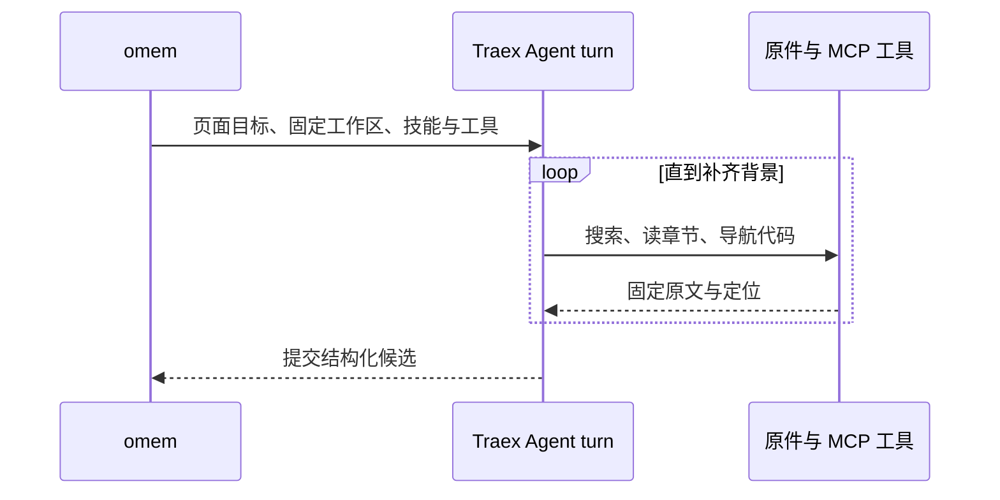

# Agent 怎样把材料讲明白：从自主调查到发布更新

以一篇面向新人的功能解释为例，说明阅读目标如何驱动调查，固定原件工作区与 Agent harness 如何分工，研究者、作者和独立复核者怎样交接，以及引用、发布、过期更新和阅读质量的边界。

来源：gpt-5.6-sol 分析，gpt-5.6-sol 独立复核；模型解释仍可被原始证据纠正。

## 先决定读者要解决什么问题

**教学示例：**我们选中一份“Agent 为什么能在一次请求中反复查资料”的功能设计和对应实现，目标不是逐文件摘要，而是让第一次接触 omem 的开发者回答三个问题：输入是什么、调查怎样推进、最后去哪里修改。输入包括页面的读者、目标、场景、问题和调查入口；可观察结果是一篇通过复核并发布的文章，读者能沿引用回到固定原文。当前页面计划正是这样描述这篇指南的。参考 [本页读者计划 ↗](../../../config/wiki-pages.json#L136 "支持教学场景、目标问题、调查入口与主题路径的说明。")

阅读目标会反过来决定文章结构和调查顺序：先用具体场景建立问题，再跟完整例子，引入必要概念，最后给机制、取舍与修改入口。`entryPaths` 只是起点，不是目录；如果从 `pipeline.ts` 看见“研究者先运行”，却仍解释不了“为什么一次 prompt 能多次用工具”，就应该继续读 ACP 网关和 Agent 会话实现。概念解释应围绕问题、概念、例子和关系组织，而不是把每个文件压成一段同形摘要。参考 [读者优先的写作结构 ↗](../../../docs/reader-first/writing.md#L3 "说明概念解释应从场景、例子和读者问题组织，而不是按文件摘要。")

## 在固定原件上搜索，而不是猜实时工作树

每个知识角色开始时，omem 会把本次允许的捕获修订导出到独占的 `originals/`，尽量保留代码与文档的相对结构；`catalog.json` 记录材料 key、路径、修订和行数，`knowledge.json` 列出可读的既有讲解，同时建立一致的 SQLite 调查快照。这里的“固定”意味着角色读到的是生成任务开始时选定的修订，而不是运行中悄悄变化的工作树。任务结束后，可重建的大副本和快照会被清理，正式原件与历史仍留在仓储。参考 [固定调查工作区 ↗](../../../apps/server/src/knowledge/agent-research.ts#L80 "支持原件导出、目录、知识清单、快照和任务结束清理的机制。")

调查方式按缺口选择：用原生 Read/Grep/Glob 顺着文件结构阅读；用 MCP 发现材料、搜索相关段落、展开章节或函数、查看既有知识和记忆、导航符号与候选调用、补历史或图片。搜索命中只是入口，既有讲解只是背景；新增代码事实仍要回原件核对，而候选调用也不能当作完整调用图。参考 [自主调查工具 ↗](../../../docs/reader-first/agent-research.md#L15 "说明各类读取、检索、代码导航和提交工具的用途及边界。")

在示例中，研究者先读 `KnowledgePipeline.writePage`，发现它能说明“谁先运行”，却不能解释 Agent 内部循环，于是搜索 `connection.prompt` 并补读 `agents.ts`。这类“发现缺背景后继续读”才是自主调查的核心。

## 一次 ACP prompt 是一个完整 Agent turn

omem 与模型自带 harness 的职责不同：omem 提供阅读目标、固定材料、工作区、只读工具、角色合同、引用校验和最终发布；Traex harness 在一个 turn 内选择步骤、反复调用工具并管理上下文。因而“一次 `connection.prompt`”不等于“一次模型推理”或“一次工具调用”。参考 [omem 与 harness 分工 ↗](../../../docs/reader-first/agent-research.md#L36 "支持宿主负责固定证据和发布、Traex 负责 turn 内调查循环的职责区分。")

ACP 客户端在会话期间接收 `tool_call`、计划和 usage 等更新，说明一个 turn 内可以发生多次工具活动；它在新建 session、发现并设置模型与 reasoning effort 后，只发起一次 `connection.prompt`，直到 `end_turn` 才结束。参考 [ACP 会话更新 ↗](../../../apps/server/src/agents.ts#L226 "支持一次会话期间能出现工具调用、计划和用量等多次更新。") [单次 prompt 的完整 turn ↗](../../../apps/server/src/agents.ts#L281 "支持新建 session、动态设置模型选项、发起一次 prompt 并等待 end_turn 的流程。")

## 研究地图交给作者，草稿交给独立复核

研究者的产物是**调查地图**：场景输入与输出、主链、关键因果、必要出处、修改入口和真正缺失的背景；它不是最终文章，也不是函数清单。参考 [研究者的交付 ↗](../../../packages/agent-runtime/roles/knowledge-researcher/1/skills/omem-knowledge-researcher/SKILL.md#L6 "说明研究结果是给作者使用的调查地图，而不是最终文章。")

作者收到页面 brief 以及研究的 findings/gaps，在自己的角色运行中重新读取关键原件，把地图重组为连贯解释。随后，独立复核者拿到草稿、目标和同一材料范围，但不靠研究者的隐藏上下文；网关为角色创建工作区，并明确不复用 session。复核者需要自己搜索和补读，既检查引用是否支持附近论断，也检查文章是否真正回答读者问题。参考 [写作与独立复核 ↗](../../../apps/server/src/knowledge/pipeline.ts#L126 "支持作者接收研究结论、复核者独立审稿、修订后重审以及仅发布 accepted 文档。") [角色工作区与新会话 ↗](../../../apps/server/src/agent-runtime/gateway.ts#L330 "支持网关创建角色工作区、加载原生技能并禁止 session 复用的说明。")

如果复核指出实质错误，下一次由 refresher 带着旧草稿和具体问题交付一份完整修订稿，再重新独立复核；只有 accepted 的文档进入发布。这个分工降低了“作者只验证自己选择的证据”的风险，但分开会话仍不是绝对真理保证。

## 通过复核后发布，来源变化后重新生成

作者只填写材料 key 和行范围，宿主从固定原文复制短引文，并检查每节都有行内引用、目标确实在本次材料范围内、行号有效；语义是否真的支持论断则留给独立复核。参考 [引用绑定与校验 ↗](../../../apps/server/src/knowledge/repository.ts#L44 "说明行内引用、材料范围和行号由宿主校验，短引文从固定原文复制。")

复核通过后，管线把文档、生成与复核 trace、阅读 brief 和依赖一起交给仓储。依赖包含正文引用，以及作者和复核者在原生调查中被识别到的实际读取；研究者的 trace 会保留用于追溯，但仅在研究阶段读过并不会自动让整篇文章依赖它。参考 [文章依赖的装配 ↗](../../../apps/server/src/knowledge/pipeline.ts#L145 "支持正文引用、作者与复核者实际读取进入依赖，而研究 trace 单独保留的说明。")

发布前，仓储再次比较依赖摘要；如果生成期间原件或子文章已经变化，就拒绝旧结果。发布成功会新增不可变文章 revision 并把它设为 current。之后 `refresh()` 发现材料摘要或被引用子文章 revision 变化时，会把受影响文章及其上层依赖标为 non-current，而不是改写旧引用；下一次 `writePage` 才重新走调查、写作和复核。参考 [发布前输入检查 ↗](../../../apps/server/src/knowledge/repository.ts#L122 "支持发布前比较依赖摘要、保存新 revision 并设为 current 的行为。") [过期传播 ↗](../../../apps/server/src/knowledge/repository.ts#L178 "支持材料或子文章变化后沿依赖把文章标为 non-current 的机制。")

## 知道改哪里，也知道哪些检查不能替代阅读

要改变体验，可以按责任定位：

| 想改变什么 | 主要入口 |
| --- | --- |
| 页面面向谁、回答什么、从哪里开始查 | `config/wiki-pages.json` |
| 研究、写作、复核、修订与依赖装配 | `knowledge/pipeline.ts` |
| 原件导出、快照、搜索/读取工具与提交 | `knowledge/agent-research.ts` |
| 原生技能、MCP 注入和角色工作区 | `agent-runtime/gateway.ts` |
| ACP session、模型选项、prompt 与更新事件 | `agents.ts` |
| 引用校验、发布、历史 revision 与 stale 传播 | `knowledge/repository.ts` |

当前真实小型流程已经出现研究者、作者和复核者的实际工具调用；但模型仍受自身上下文窗口、自动压缩、超时和取消约束，图像、历史工具和长时间全库调查也不能由小样例推断为都已完成同等验收。参考 [自主调查的当前边界 ↗](../../../docs/reader-first/native-research-results.md#L7 "支持真实小型流程的已完成能力以及模型资源和未逐项验收范围。")

最后要分清四件事：**事实成立、读者理解、问题回答完整、内容帮助行动**。引用和 schema 只覆盖其中一小部分，独立模型复核也可能与作者共享盲点。真正的阅读验收是让目标开发者能复述主流程、找到必要背景并开始修改；给齐材料仍讲不好是生成问题，材料本来能回答但检索后讲不好则是召回或上下文问题。参考 [四种质量 ↗](../../../docs/reader-first/current-system.md#L5 "支持事实、理解、完整回答和行动价值彼此不同，独立模型不能代替读者。") [真实阅读验收 ↗](../../../docs/reader-first/current-system.md#L60 "说明用真实问题区分生成失败与召回失败，并以理解和行动作为验收。")
