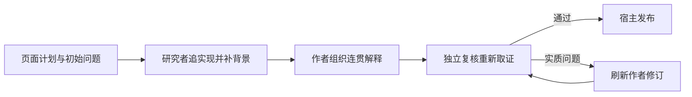

# Agent 如何把材料讲成一篇可读文章

用“解释一次 ACP prompt 为何仍能反复调查”这一教学示例，串起阅读目标、固定原件与可见历史、搜索补读、研究和写作交接、独立复核、来源依赖与更新机制，并指出 Traex harness 与 omem 的职责边界及改造入口。

来源：gpt-5.6-sol 分析，gpt-5.6-sol 独立复核；模型解释仍可被原始证据纠正。

## 从一个新人真正会问的问题开始

下面用一个**教学构造的例子**贯穿全程，不把它冒充真实运行记录。输入是两份已捕获材料：自主研究的功能说明 `docs/reader-first/agent-research.md`，以及实现入口 `apps/server/src/knowledge/pipeline.ts`。初始问题是：“为什么系统只调用一次 ACP prompt，Agent 却能多次搜索材料；文章通过什么步骤才会发布？”期望输出不是文件摘要，而是一篇让新人能从页面计划一路读到发布，并能找到修改入口的解释页。

页面计划先规定读者、目标、场景、待回答问题和入口路径。入口只告诉研究从哪里开始；真正的停止条件是这些读者问题是否已经有足够材料回答。参考 [页面阅读目标 ↗](../../../config/wiki-pages.json#L142 "支持页面计划以读者、目标、场景、问题和入口路径约束调查。") 对陌生开发者，推荐结构是“场景 → 完整例子 → 必要概念 → 整体地图 → 机制与取舍 → 修改入口”，所以研究与成文从一开始就受同一阅读目标约束。参考 [读者页面组织方式 ↗](../../../docs/reader-first/writing.md#L3 "说明陌生开发者的默认阅读路线与概念解释页的组织原则。")

## 固定本次原件，同时保留显式历史入口

生成入口先刷新文章状态。现有文章只有在仍为 current、页面计划未变、研究者/作者/刷新者/复核者的版本组合也未变时才复用；否则重新调查。原生模式先运行研究者，只有它自行完成调查后才进入写作。参考 [页面生成入口 ↗](../../../apps/server/src/knowledge/pipeline.ts#L245 "展示页面复用条件、原生研究者启动及研究结果进入写作流程。")

运行网关每次角色执行都会生成新的 `runId`，据此准备 workspace，再把该次研究环境接入其中；研究者、作者和复核者因而不会共用同一个临时目录。参考 [角色运行工作区 ↗](../../../apps/server/src/agent-runtime/gateway.ts#L352 "表明每次角色运行生成新的 runId 并据此准备 workspace。") 在这个目录里，本次准入的代码和文档按选定材料内容导出到 `originals/`，`catalog.json` 记录其正式 key、revision、路径与行数，`knowledge.json` 只列快照准入的既有文章。参考 [任务原件导出 ↗](../../../apps/server/src/knowledge/agent-research.ts#L107 "支持导出任务材料、记录 catalog revision 并筛选准入文章。") 常规 `read_material` 也从这组任务材料中解析 key，并返回该材料绑定的 revision，因此 `originals/`、目录和普通读取看到的是**本次任务选定的固定版本**。参考 [固定任务材料读取 ↗](../../../apps/server/src/knowledge/agent-research.ts#L267 "说明普通材料读取解析任务 entries，并返回其绑定的 revisionId。")

SQLite 快照的边界略有不同：它先按准入材料的 `sourceId` 限定来源，再复制该来源下满足可见条件的 revisions，而不是只留下当前选中的一个 revision。参考 [来源范围的只读快照 ↗](../../../apps/server/src/knowledge/research-snapshot.ts#L50 "表明快照先限定准入 sourceId，再复制该来源下满足可见条件的 revisions。") `material_history` 正是利用这部分数据列出同一来源的捕获版本，并可在明确指定 revision 时读取历史正文。参考 [显式历史版本读取 ↗](../../../apps/server/src/knowledge/agent-research.ts#L738 "说明历史工具按同一 sourceId 列出 revisions，并标识当前或读取指定历史。") 因此，默认原件读取稳定地指向任务版本；历史版本则通过显式历史入口访问，引用时必须保持其历史身份。原生 CLI 仍可能看到临时目录之外的祖先文件，所以这种角色工作区隔离也不等于完整文件系统沙箱。参考 [原生调查边界 ↗](../../../docs/reader-first/current-system.md#L40 "说明原生读取、AST 导航辅助、祖先文件可见性和阅读质量边界。")

## 首次代码命中不够时，沿缺口补读背景

示例研究者先搜索 `writePage`，读到它会独立启动 researcher；研究完成后，findings 与 gaps 被交给 writer 作为写作地图。writer 产出的草稿连同页面目标再交给拥有同一材料范围的新 verifier，verifier 并不继承研究地图，而是自行搜索和阅读。参考 [页面生成入口 ↗](../../../apps/server/src/knowledge/pipeline.ts#L245 "展示页面复用条件、原生研究者启动及研究结果进入写作流程。") [独立复核与修订 ↗](../../../apps/server/src/knowledge/pipeline.ts#L157 "展示作者、复核者、刷新者的交接以及仅发布接受文档。") 这厘清了角色交接，却仍解释不了“为什么一次 prompt 能反复查资料”。于是研究者把缺口写成更具体的问题，改搜 `session/prompt`，补读 ACP 集成说明，再查看客户端怎样创建 session、接收工具状态并等待 `end_turn`。这样，研究地图从一串函数名变成了“页面计划触发调查 → 一个 turn 内多次模型与工具交互 → 作者成文 → 独立复核 → 发布”的因果链。参考 [omem 与 harness 分工 ↗](../../../docs/reader-first/agent-research.md#L36 "说明 omem 管理目标、材料、工具与发布，Traex 管理 turn 内调查和压缩。")

调查既可用原生 Read/Grep/Glob 读取导出文件，也可用 omem 的目录、材料搜索、章节读取、知识、记忆、历史、图片和代码导航工具。既有知识只帮助找到方向，新增事实仍回原件核对。参考 [自主调查工具 ↗](../../../docs/reader-first/agent-research.md#L15 "列出材料发现、搜索、章节、知识、历史、图片与代码导航工具。") 跨文件时可用 `code_navigation` 找定义、import 和候选调用者，但其 calls 是名称级候选，不是完整调用图；应继续打开调用者确认，不能把候选直接写成确定因果。参考 [代码导航候选 ↗](../../../apps/server/src/knowledge/agent-research.ts#L647 "明确 calls 是名称级候选而非完整调用图。")

## 研究者画地图，作者把地图写成解释

研究者覆盖页面问题后提交 findings 与 gaps；作者收到页面计划和这张研究地图，并拥有同一材料范围与调查工具，可以继续补读。研究笔记不是新的事实来源，它的作用是告诉作者：主链在哪里、哪段背景补过、还有什么不能确定。参考 [页面生成入口 ↗](../../../apps/server/src/knowledge/pipeline.ts#L245 "展示页面复用条件、原生研究者启动及研究结果进入写作流程。") 作者完成草稿后，复核者接收的是草稿、页面目标和同一材料范围，而不是研究者的 findings/gaps；它需要重新取证。参考 [独立复核与修订 ↗](../../../apps/server/src/knowledge/pipeline.ts#L157 "展示作者、复核者、刷新者的交接以及仅发布接受文档。")

在示例里，作者不按文件顺序复述，而是从读者的输入问题写起：先解释页面计划，再说明固定原件和显式历史入口，随后用一次 ACP turn 串起搜索与补读，最后落到复核和发布。缺少的“单次 prompt 内部为何可循环”由补读材料嵌回同一主线，而不是另起一节堆协议字段。

omem 负责目标、准入材料、固定任务版本与历史入口、调查工具、合同校验和发布；Traex harness 负责一个 turn 内下一步查什么、何时调用工具以及上下文压缩。参考 [omem 与 harness 分工 ↗](../../../docs/reader-first/agent-research.md#L36 "说明 omem 管理目标、材料、工具与发布，Traex 管理 turn 内调查和压缩。")

## 一次 prompt 是完整 Agent turn，不是一次文本补全

运行时为角色创建新的 workspace 与 session，把原生 skill 和本机 MCP 接入，然后调用一次 `connection.prompt`。客户端持续接收 tool call、计划和 usage 更新，直到返回 `end_turn`；因此这一个 prompt 可以包含多次“模型判断—调用工具—读取结果—继续判断”。模型窗口、自动压缩、超时和取消仍然存在，只是不再由 omem 人为限定为三轮调查。参考 [omem 与 harness 分工 ↗](../../../docs/reader-first/agent-research.md#L36 "说明 omem 管理目标、材料、工具与发布，Traex 管理 turn 内调查和压缩。") [完整 ACP turn ↗](../../../apps/server/src/agents.ts#L232 "展示客户端接收工具和计划更新、创建 session 并等待 turn 结束。")

作者提交完整文档后，宿主绑定固定行引文，并校验目标 key、引用对象和可见范围；`submit_result` 只是保存通过合同检查的候选，不会直接发布。参考 [候选文档校验 ↗](../../../apps/server/src/knowledge/pipeline.ts#L140 "展示宿主检查文档 key、引用对象和允许范围。") [候选提交而非发布 ↗](../../../apps/server/src/knowledge/agent-research.ts#L806 "说明 submit_result 校验并保存候选结果，不直接发布文章。") 随后新的 verifier 会在同一材料范围中独立搜索和阅读。对本例，它应重新确认两条关键因果：反复工具调用来自 ACP turn/harness，而不是 omem 自己实现的循环；只有复核接受的文档才进入发布。若事实、范围或因果有实质问题，草稿与具体意见交给 refresher 修订后再复核。参考 [独立复核与修订 ↗](../../../apps/server/src/knowledge/pipeline.ts#L157 "展示作者、复核者、刷新者的交接以及仅发布接受文档。")

## 发布锁定作者和复核者实际依赖的来源

复核通过后，流水线把**正文引用的材料，以及作者和复核者 trace 中识别出的实际读取**汇成 material dependencies；下层文章则按正文引用保存固定 revision。研究者的 findings 与 trace 会随生成记录保存，但研究者单独读过的材料不会仅凭 research trace 自动进入失效依赖。参考 [发布依赖与研究记录 ↗](../../../apps/server/src/knowledge/pipeline.ts#L173 "支持依赖取自正文引用及作者和复核读取，研究 trace 另存。") 这意味着研究阶段发现的关键来源若要支撑正文，作者仍应亲自读取或引用；仅仅出现在导出目录里也不会自动成为依赖。

正式写入前，仓储再次比较材料 digest 与下层文章 revision。若生成期间输入已变化，发布会中止；通过后才保存不可变文章 revision、设置 current head 并记录章节变化。参考 [发布前输入核对 ↗](../../../apps/server/src/knowledge/repository.ts#L122 "展示发布前比较材料 digest 和文章 revision 并保存新 head。") 以后 `refresh` 会比较当前来源身份并沿文章依赖向上传播 stale。旧 revision 仍能按当时输入恢复阅读，但材料变化不会自动重写全库；下一次页面生成会重新调查、写作和复核。参考 [历史恢复与失效传播 ↗](../../../apps/server/src/knowledge/repository.ts#L156 "说明历史版本恢复、依赖变化判断和 stale 向上传播。")

## 知道工具能保证什么，也知道该去哪里改

搜索、章节定位和代码导航帮助 Agent 找到材料，合同校验与独立复核帮助拦住错误引用、范围和因果；它们都不能替代读者质量。页面是否有清晰路线、术语是否在首次出现时解释、教学例子是否真正贯穿、读者能否找到下一步，仍需人读。参考 [事实检查与读者检查 ↗](../../../docs/reader-first/writing.md#L28 "区分事实引用正确与页面真正回答读者问题。")

想改进这条体验，可以按问题定位：页面 brief 与 researcher 角色决定“查什么”；`agent-research.ts`、`research-snapshot.ts` 和检索/代码解析决定“怎样发现、读取固定版本与显式回看历史”；`gateway.ts`、`agents.ts` 决定“一次 turn 怎样接入工作区、模型、工具、超时和取消”；`writing.md` 与 writer 角色决定“怎样讲”；verifier 与 `writeAndVerify` 决定哪些事实问题阻止发布；pipeline 与 repository 决定来源依赖、stale 和历史。当前代码也明确提醒：AST 只是导航辅助，是否真正讲清跨文件因果，不能由工具调用次数或复核通过单独证明。参考 [原生调查边界 ↗](../../../docs/reader-first/current-system.md#L40 "说明原生读取、AST 导航辅助、祖先文件可见性和阅读质量边界。")
