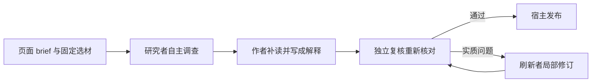

# Agent 怎样把材料讲明白：从自主调查到发布更新

以一篇面向新人的功能文章为例，解释阅读目标如何约束调查，固定原件工作区与 omem 工具如何支持补读，Traex harness 与 omem 如何分工，以及研究、写作、独立复核、发布和材料变化后的更新如何衔接。

来源：gpt-5.6-sol 分析，gpt-5.6-sol 独立复核；模型解释仍可被原始证据纠正。

## 先决定要帮助谁理解什么

设想一个**教学构造**的任务：开发者选中一份功能设计和对应实现，想让刚接触项目的人理解“后台怎样把材料整理成一篇可追溯文章”。期望的可见结果不是文件摘要，而是一篇能回答三个问题的解释：输入是什么，Agent 为什么要补读，开发者应去哪里改变行为。

页面 brief 会保存读者、目标、场景、待回答问题和入口路径；入口只是调查起点，不自动限定调查范围。网页创建任务时会要求显式选择材料，确认所选 revision 仍可用，再把对应材料 key 写回 brief。参考 [页面阅读目标与范围合同 ↗](../../../packages/contracts/src/knowledge.ts#L60 "支持 brief 表达读者、目标、场景、问题和入口，并明确 materialKeys 是可选的材料范围。") [网页显式选材入口 ↗](../../../apps/server/src/knowledge/api.ts#L165 "支持网页创建流程核对所选版本，并把材料 key 写入 brief。")

这些信息会直接改变工作：**reader/goal/questions** 决定研究者查什么、作者如何组织叙事、复核者检查哪些问题是否真正答完。机制页因此应从场景和完整例子进入，再讲概念、流程、取舍与修改入口，而不是先罗列合同字段。参考 [读者优先写作路线 ↗](../../../docs/reader-first/writing.md#L1 "支持机制页从场景和完整例子进入，并以理解和行动而非字段罗列为目标。")

## 在固定原件工作区里调查

任务开始时，管线先刷新文章状态；只有现有文章仍有效、brief 未变且角色版本未变时才复用，否则建立本轮材料集合。这里要区分两种入口：网页创建流程必须显式选材；直接调用底层 `writePage` 时，若 brief 提供 `materialKeys`，就只使用这些 key 且任一缺失都会失败，若省略 `materialKeys`，则把全部合格的已捕获材料纳入调查。两种情况都要求最终至少有一份可用材料。参考 [页面阅读目标与范围合同 ↗](../../../packages/contracts/src/knowledge.ts#L60 "支持 brief 表达读者、目标、场景、问题和入口，并明确 materialKeys 是可选的材料范围。") [网页显式选材入口 ↗](../../../apps/server/src/knowledge/api.ts#L165 "支持网页创建流程核对所选版本，并把材料 key 写入 brief。") [底层页面选材规则 ↗](../../../apps/server/src/knowledge/pipeline.ts#L243 "支持 writePage 的刷新、复用以及 materialKeys 存在或省略时的选材行为。")

每个角色都有独立工作区。实现把本轮获准原件导出到 `originals/`，尽量保留代码和文档的相对目录；`catalog.json` 记录材料 key、固定 revision、路径、行数和描述，`knowledge.json` 只列快照允许读取的既有文章。参考 [固定原件目录 ↗](../../../apps/server/src/knowledge/agent-research.ts#L136 "支持角色工作区导出 originals，并生成材料目录和获准文章目录。")

与这些文件配套的 SQLite 是**封存快照**。材料部分只复制获准来源及其版本；既有文章还必须递归满足这些获准材料版本或已接纳文章依赖。个人状态采用另一组规则：带证据的记忆与事项必须指向快照中的 revision 或 fragment；普通知识生成没有额外可见性过滤时，默认也会纳入空证据集的记忆和没有 `evidence_id` 的事项。因此“固定范围”不等于“只含有证据锚点的数据”，修改调查范围时也要考虑这些无锚定个人状态。数据库最终以只读方式打开，所以调查期间实时工作树或主库的变化不会悄悄改写本轮证据。参考 [快照材料范围 ↗](../../../apps/server/src/knowledge/research-snapshot.ts#L50 "支持快照只复制本轮获准来源、版本和片段。") [既有文章的依赖准入 ↗](../../../apps/server/src/knowledge/research-snapshot.ts#L98 "支持既有文章只有在材料版本和递归文章依赖都获准时才进入快照。") [个人状态的证据范围 ↗](../../../apps/server/src/knowledge/research-snapshot.ts#L153 "支持带证据的记忆和事项必须落在快照版本或片段内，而无锚定状态由 includeUnanchoredState 决定是否纳入。") [无锚定状态默认值 ↗](../../../apps/server/src/knowledge/agent-research.ts#L191 "支持未提供现成快照时，prepareAgentResearch 在没有 visible 过滤器的普通路径默认启用无锚定状态。")

## 从入口走通主链，缺背景再补读

研究者先沿代表性输入走一遍“请求入口 → 核心处理 → 发布结果”，再针对断掉的因果补背景。原生 Read/Grep/Glob 适合连续阅读真实目录；omem 工具补足对象身份和导航：可以列材料，搜索全文、符号与中文语义结果，打开完整章节或函数，查看历史版本、既有文章和有原始依据的记忆，也能取得定义、import、路由与候选调用位置。候选调用不是完整调用图，已有讲解也只是导航；新增事实仍应回原件核对。参考 [自主调查工具范围 ↗](../../../docs/reader-first/agent-research.md#L15 "说明原生文件读取与 omem 材料、知识、记忆、历史和代码导航工具的互补能力及调用候选限制。")

在贯穿示例里，研究者先读 API、`writePage` 和写作管线，发现它们只能说明角色顺序，不能回答“为什么一次 ACP prompt 仍能多次搜索”。于是搜索 `connection.prompt`、`tool_call`，补读 gateway 和 Agent 客户端，再回到研究工具端确认结果提交与读取审计。这个“发现缺口—缩小查询—读完整 enclosing symbol—补调用者”的过程，才是自主调查的价值；工具调用次数本身不是质量。

## 一次 prompt 内的循环，以及三种职责

这里最容易写反：omem 不负责逐步驱动模型推理。gateway 创建原生 skill 和 MCP 环境，把它们交给 ACP；客户端建立一个 session，并对整次 Agent turn 调用一次 `connection.prompt`。在这次 turn 内，Traex harness 可以在收到工具结果后继续推理、再次调用工具，客户端持续接收 tool call、计划和 usage 更新，直到 `end_turn`。参考 [ACP 工具事件 ↗](../../../apps/server/src/agents.ts#L232 "支持客户端在一次 Agent turn 中持续接收工具、计划和 usage 事件。") [单次 Agent prompt ↗](../../../apps/server/src/agents.ts#L292 "支持 ACP 创建 session、调用一次 connection.prompt 并以 end_turn 结束整次运行。")

职责边界是：**omem** 提供阅读目标、允许范围、固定快照、搜索/读取工具、合同校验和发布；**Traex harness** 选择下一步调查、组织工具往返并管理模型上下文；**模型角色**研究、写作或复核，但不直接写入知识库。原生模式不套宿主输入/输出 token 预算，却仍受模型窗口、自动压缩、超时、取消和进程生命周期约束。参考 [omem 与 Traex 分工 ↗](../../../docs/reader-first/agent-research.md#L36 "说明 omem、Traex harness 与模型角色的职责，以及无宿主预算不等于无生命周期限制。")

## 把研究地图写成文章，再让新会话挑错

研究者提交的是 findings 与 gaps；只有调查已完成且没有待宿主执行的请求时，管线才进入写作。作者拿到阅读目标和研究结论，但会在自己的工作区重新核对原文，也可以继续补读。因此研究地图只是交接线索，不是独立证据，更不是文章目录。参考 [研究到写作交接 ↗](../../../apps/server/src/knowledge/pipeline.ts#L245 "支持研究者完成调查后将 findings、gaps 与阅读目标交给作者。")

作者要把示例改写成“场景—必要概念—整体流程—关键因果—修改入口”。例如，不能写成“MCP server 循环调用模型”，而应分别说明 harness 驱动 Agent turn、omem 提供工具端点与固定范围。每条实现事实都贴近引用；宿主根据作者选择的固定行范围复制短 quote，并检查每节都有引用、目标和行号有效。参考 [引用绑定与校验 ↗](../../../apps/server/src/knowledge/repository.ts#L44 "支持宿主复制固定行范围的短引文，并校验正文内引用、目标和行号。")

随后，verifier 在独立新会话中拿到草稿和同一材料范围，自行搜索、阅读并沿代表性输入复查。事实错误、时代或范围错配、遗漏会改变行为的条件、把计划写成现状，都会要求修订；纯措辞偏好、未穷举无关分支或缺少专项测试不会阻止发布。参考 [独立复核标准 ↗](../../../packages/agent-runtime/roles/knowledge-verifier/1/skills/omem-knowledge-verifier/SKILL.md#L6 "支持 verifier 必须独立补读，并只因事实、范围、时代或关键行为等实质问题拒绝。") 管线最多进行初稿加三次修订；每轮只把被拒草稿及具体问题交给刷新角色，accepted 的文章才继续发布。参考 [修订与接受循环 ↗](../../../apps/server/src/knowledge/pipeline.ts#L157 "支持作者、独立复核、局部刷新和有限修订尝试的编排。")

## 发布时绑定来源，变化后保留历史

候选经 `submit_result` 校验并保存后仍未发布；gateway 还要求角色确实通过工具提交，不能只在聊天中打印 JSON。发布依赖至少包含正文引用的材料；原生模式还合并作者、复核 trace 中**运行时识别到的读取**，研究者浏览过的全部目录不会自动变成永久依赖。参考 [候选必须工具提交 ↗](../../../apps/server/src/agent-runtime/gateway.ts#L478 "支持原生角色必须通过 submit_result 形成已校验候选，不能用聊天 JSON 替代。") [发布依赖收敛 ↗](../../../apps/server/src/knowledge/pipeline.ts#L173 "支持发布依赖以正文材料引用为基础，并合并写作和复核 trace 中已登记的读取键。")

这里的读取审计不是完整的 shell 行为记录：运行时只有在工具事件中解析到 `file_path`、`path`，或 `parsed_cmd` 中的读取路径，并成功映射到工作区材料时，才会登记相应 key。无法被运行时识别的原生 shell 阅读可能不会进入依赖，因此正文引用仍是来源追踪的最低保障。参考 [原生读取键识别 ↗](../../../apps/server/src/knowledge/agent-research.ts#L1014 "支持运行时仅在工具事件能解析读取路径并映射到工作区材料时登记 reads。") [读取审计边界 ↗](../../../docs/reader-first/agent-research.md#L30 "说明未被运行时识别的原生 shell 阅读不保证进入记录，正文引用依赖仍是最低保障。")

真正发布前，仓储会再次比较材料 digest 和文章 revision；生成期间输入若已变化，就拒绝把旧快照产物标成当前。成功后保存不可变文章 revision、当前 head、阅读 brief、生成与复核来源。材料或下游文章变化时，`refresh` 把直接依赖已变的文章标为 stale，并沿文章依赖向上传播；它不会删除旧历史，也不会把旧引用静默指向新版。再次运行 `writePage` 时，stale 文章不再满足复用条件，会基于当前选材重走调查、写作和复核。参考 [发布前输入一致性 ↗](../../../apps/server/src/knowledge/repository.ts#L122 "支持发布前比较依赖身份，并保存不可变 revision 与当前 head。") [变化后的 stale 传播 ↗](../../../apps/server/src/knowledge/repository.ts#L178 "支持材料或文章依赖变化后标记 stale 并沿文章依赖传播，同时保留历史。")

## 从哪里改体验，以及现在的边界

定位改动时可以按用户体验倒推：

| 想改变什么 | 主要入口 |
| --- | --- |
| 页面为谁写、回答哪些问题及网页选材 | 页面计划、Article Composer 与知识 API |
| 调查范围、目录、快照和 omem 工具 | `knowledge/agent-research.ts`、`research-snapshot.ts` |
| ACP 会话、skill/MCP 接入、模型与超时 | `agent-runtime/gateway.ts`、`agents.ts` |
| 文章结构与复核门槛 | 写作规范及 writer/verifier/refresher skills |
| 角色交接、修订和依赖选择 | `knowledge/pipeline.ts` |
| 引用绑定、发布、历史与 stale | `knowledge/repository.ts` |

当前边界不在于“Agent 能不能多调几次工具”，而在于候选是否真正回答问题：名称级调用候选仍不是完整跨文件业务链，宽泛说明或旧调研仍可能排在实现之前。Agent 最终补查成功，不能证明第一轮检索已经好用。参考 [检索与调用链边界 ↗](../../../docs/reader-first/progress.md#L65 "支持名称级导航、宽泛材料排序和跨文件业务链仍有限，补查成功不能替代首轮检索质量。")

同样，固定原件、精确引用和独立复核能降低事实与范围错误，却不能自动产生好文章。还要由读者判断：案例是否贯穿、术语是否在场景中解释、关键因果是否连贯、是否能找到下一步。独立模型 accepted 是发布门槛，不等于用户已经读懂或验收。参考 [阅读质量验收 ↗](../../../docs/reader-first/writing.md#L28 "支持事实复核与读者验收是不同层次，独立模型不能替代真实读者理解。")
