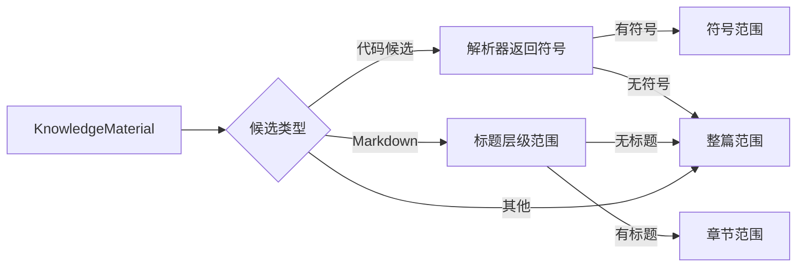

# 把原始材料投影为可阅读的章节与坐标

该模块不改写原始 fragment，而是按代码符号、Markdown 标题或整篇文档生成统一行范围，并将 fragment 对齐到字符与行坐标，供研究大纲、检索上下文和证据定位复用。

来源：gpt-5.6-sol 分析，gpt-5.6-sol 独立复核；模型解释仍可被原始证据纠正。

## 为什么需要结构投影

知识系统保存的是带固定身份的原始材料与 fragment，但阅读、研究和检索还需要回答“这一行属于哪个章节或符号”。此模块把不同材料统一投影为 `title/startLine/endLine/kind`，并明确保持原 fragment 及其 ID 不变；两个 `WeakMap` 分别缓存章节和 fragment 坐标。参考 [结构类型与投影缓存 ↗](../../../apps/server/src/knowledge/structure.ts#L5 "支持统一章节坐标、两类对象身份缓存，以及投影不改变原 fragment 身份的说明。")

这层投影会直接成为材料读取与搜索结果中的大纲，也会帮助检索命中补回同一章节内的标题和相邻原文。因此它是原始证据与阅读上下文之间的适配层，不是另一套事实存储。参考 [研究结果中的材料大纲 ↗](../../../apps/server/src/knowledge/research.ts#L26 "说明材料读取会把结构投影作为 outline 返回，体现它在研究阅读中的用途。") [检索命中的章节邻居 ↗](../../../apps/server/src/retrieval/context.ts#L6 "说明检索上下文使用 fragment 坐标和所属章节补充标题与相邻原文，并应用可见性过滤。")

## 从材料到可读范围

`materialSections` 先用 `path`，缺失时用标题，判断候选类型。代码分支会调用 `parseFile` 并把解析到的符号映射为行范围；Markdown 分支使用与阅读器一致的 lexer，围栏中的 `#` 不会成为标题，一个标题持续到下一个同级或更高层级标题之前。任何分支若最终没有得到结构，都会返回覆盖全文的 `document`。参考 [代码候选分支 ↗](../../../apps/server/src/knowledge/structure.ts#L11 "支持路径回退、代码候选扩展名匹配，以及符号结果为空后进入全文回退的流程。") [Markdown 章节与全文回退 ↗](../../../apps/server/src/knowledge/structure.ts#L17 "支持 Markdown lexer、标题层级截止规则以及没有结构时返回整篇范围。")

外层正则接受的代码扩展名比解析器当前的 AST 范围更宽。实际进入符号解析的是 `.ts/.tsx/.js/.mjs`，Vue 文件另走组件解析；像 `.jsx`、`.cjs`、`.mts` 这类虽进入代码候选分支，但解析器把它们视为普通文本并返回空符号，最终由本模块回退为全文范围。扩展名判断区分大小写。参考 [代码候选分支 ↗](../../../apps/server/src/knowledge/structure.ts#L11 "支持路径回退、代码候选扩展名匹配，以及符号结果为空后进入全文回退的流程。") [解析器的扩展名识别 ↗](../../../apps/server/src/code/parse.ts#L226 "支持当前只有 Vue、TS、TSX、JS、MJS 被识别为可进入相应解析路径，其他扩展名默认为普通文本。") [AST 与 Vue 解析路径 ↗](../../../apps/server/src/code/parse.ts#L236 "支持 Vue 的专门解析以及仅 TypeScript、JavaScript 语言进入 AST 遍历，其他语言返回空符号。")

## 把命中落回具体证据

`fragmentPositions` 按 fragment 原顺序，从上次结束处继续在完整文本中精确查找，输出字符偏移和 1-based 起止行；重复文本会依次绑定，找不到的 fragment 会被跳过。`containingSection` 再筛选覆盖命中行的范围，并以跨度最小者作为最具体结构。参考 [Fragment 对齐与具体范围选择 ↗](../../../apps/server/src/knowledge/structure.ts#L33 "支持 fragment 顺序匹配、字符和行坐标计算，以及按最小跨度选择所属结构。")

例如检索命中 Markdown 的某个段落后，上层先找到该 fragment 的行号，再定位所属章节，只补充章节标题及同节相邻 fragment，并继续遵守可见性过滤。缓存以材料对象身份为键，适合不可变快照；若调用方原地修改同一对象，已有投影不会自动失效。参考 [检索命中的章节邻居 ↗](../../../apps/server/src/retrieval/context.ts#L6 "说明检索上下文使用 fragment 坐标和所属章节补充标题与相邻原文，并应用可见性过滤。") [Fragment 对齐与具体范围选择 ↗](../../../apps/server/src/knowledge/structure.ts#L33 "支持 fragment 顺序匹配、字符和行坐标计算，以及按最小跨度选择所属结构。")
