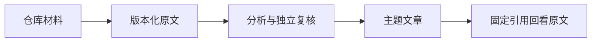

# 统一个人知识入口与证据更新流程

说明仓库材料如何接入个人记忆应用、形成可追溯文章，并在来源变化后重新分析和复核；同时厘清个人库与隔离验收环境的数据边界，以及当前验证、检索和外部集成的限制。

来源：gpt-5.6-sol 分析，gpt-5.6-sol 独立复核；模型解释仍可被原始证据纠正。

## 在同一应用中阅读知识与证据

omem 把日常助理、知识库、原始材料和事项放在同一个个人应用中。用户通过 `osdk run dev` 进入统一入口，仓库作为个人库中的真实材料使用，不再切换到独立 Review 产品。参考 [统一个人应用入口 ↗](../../../docs/implementation/unified-knowledge-reading.md#L3 "支持当前通过 osdk run dev 使用同一应用，并明确不再切换到独立 Review 产品。")

知识库以完整主题文章为起点，通过目录和页内导航定位内容；需要核实论断时，再沿句段末引用查看固定代码行或连续原始文档。来源变化的文章会显示待更新，Mermaid 无法渲染时仍保留文字说明，使解释层和证据层均可独立阅读。参考 [分层阅读与图表降级 ↗](../../../docs/implementation/unified-knowledge-reading.md#L9 "支持固定代码行、连续 Markdown 阅读、段末证据链接以及 Mermaid 失败时保留文字说明。")

## 仓库材料如何形成可追溯知识

仓库内容复用个人 Store 及 Source、Revision、Fragment、KnowledgeRepository 组成的统一证据链，不另建面向用户的独立产品或事实权威；生成与检索验收仍使用隔离的 Review 数据库和运行目录。捕获保持幂等，不替换已有个人材料、事项或配置，启动也不调用生成式模型。参考 [仓库接入个人记忆 ↗](../../../docs/implementation/repository-in-personal-memory.md#L3 "支持仓库材料幂等进入个人 Store、保留个人数据，并明确隔离 Review 数据库仍承担生成与检索验收。")、[统一证据链与隔离运行目录 ↗](../../../docs/implementation/unified-knowledge-reading.md#L18 "支持仓库复用统一数据模型、固定历史引用、隔离生成验收目录及父子章节恢复顺序。")

历史文章按固定依赖版本恢复：旧原文存在时仍可阅读，缺失时不能用当前版本冒充；恢复目录会先导入新版子章节，再更新引用它们的父章节。刷新后的正文可独立阅读，修稿过程保留在文章历史中。参考 [统一证据链与隔离运行目录 ↗](../../../docs/implementation/unified-knowledge-reading.md#L18 "支持仓库复用统一数据模型、固定历史引用、隔离生成验收目录及父子章节恢复顺序。")

## 现行入口与来源更新

当前面向用户的 `dev:review` 已移除。材料中的健康探测与重连规则针对旧双模式入口的启动竞态，用于区分服务尚未就绪和模式不存在；现有材料没有证明这套探测仍参与当前统一入口，因此不能把它当作现行启动架构。参考 [旧入口启动竞态 ↗](../../../docs/implementation/review-startup.md#L1 "说明健康探测和模式切换规则属于 dev:review 旧入口的历史修复，避免误写为当前统一入口。")、[统一个人应用入口 ↗](../../../docs/implementation/unified-knowledge-reading.md#L3 "支持当前通过 osdk run dev 使用同一应用，并明确不再切换到独立 Review 产品。")

来源变化后，Capture 会在事务中记录失效范围，调度重新提取并交由独立 verifier 复核，随后原子更新同一记忆。失败或缺少证据时保持 `needs_review`；只有全部受影响记忆真正应用，刷新才记为完成。参考 [来源更新闭环 ↗](../../../docs/implementation/status.md#L11 "支持失效记录、重新提取、独立复核、原子应用及失败保持待复核的流程。")

## 验证范围与不能外推的结论

现有记录覆盖依赖锁定、全量检查、浏览器工作流和多视口阅读，但最终状态仍须以当前 `verification.json` 与 `coverage.json` 为准；未通过文章保留旧版并标记待更新，未覆盖材料不能计为完成。参考 [阅读验收与覆盖口径 ↗](../../../docs/implementation/unified-knowledge-reading.md#L28 "支持依赖、全量检查和浏览器验收记录，并说明当前完成状态须由自动验证和覆盖记录判断。")

中文语义检索使用按模型身份隔离的固定向量，模型缺失时保留词法结果并报告降级；同义问法结果仅是小样本，reranker、ANN 与历史时点检索仍未实现。参考 [中文语义检索边界 ↗](../../../docs/implementation/status.md#L7 "支持固定中文向量模型、缺失模型时的降级行为、小样本结果及尚未实现的检索能力。") 当前 SQLite 实现面向个人单用户，不具备多租户 ACL、分布式事务或 pgvector。参考 [单用户部署边界 ↗](../../../docs/implementation/status.md#L140 "支持当前实现不具备多租户 ACL、分布式事务和 pgvector，团队能力仍属架构预留。")

飞书实机快照只记录 `lark-cli`、文档版本、`text` 和 `link` 类型及文本规模，不能据此认定 WebSocket、图片下载、幂等导入或固定引用已完成实机验证。参考 [飞书文档快照字段 ↗](../../../docs/implementation/live-lark-verification.json#L2 "支持现有快照仅记录连接器、版本、part 类型和文本规模，从而限定可得出的实机验证结论。")
