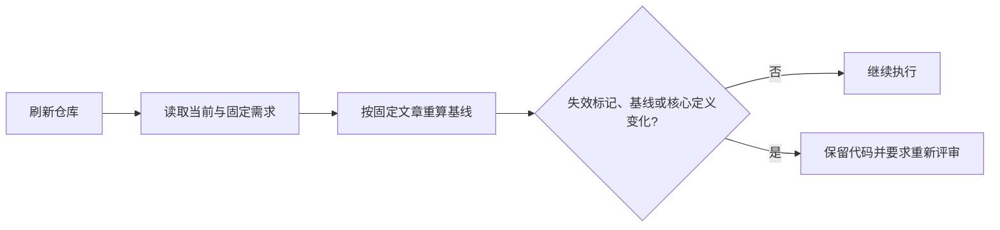

# 开发任务的需求基线与漂移拦截

该模块为一次开发运行冻结可重复比较的需求基线，并在执行、评审或应用前识别计划、原始材料、核心需求定义和显式失效标记的变化。它刻意排除开发结果与跟进状态等宿主回写，避免流程自己的进度更新误伤已经完成的评审。

来源：gpt-5.6-sol 分析，gpt-5.6-sol 独立复核；模型解释仍可被原始证据纠正。

## 为什么需要需求基线

开发任务可能从创建到应用持续较久；期间需求页、选材或原始材料都可能变化。`RequirementBasis` 用四部分描述评审依据：计划摘要、初始选材摘要、按键排序的材料摘要列表，以及核心需求定义摘要。这样后续无需比较整份易变文档，也能判断旧评审是否仍适用于当前输入。参考 [需求基线结构 ↗](../../../apps/server/src/development/requirement-basis.ts#L8 "支持基线由计划、选材、材料摘要和需求定义四部分组成的说明。")

核心定义只取目标、排除项及验收项的 `id` 与描述，并在摘要前排序；状态、证据和行动进度不参与。因此“验收项已实现”之类进度更新不会改变业务契约，而修改验收描述会改变基线。参考 [核心需求定义 ↗](../../../apps/server/src/development/requirement-basis.ts#L15 "支持核心定义仅摘要目标、排除项以及验收项标识与描述，并通过排序保持稳定。")

## 如何构造稳定指纹

构造时先确保开发结果表存在，再查找需求页对应的阅读计划；计划缺失会立即报错。随后收集开发结果与 `followup-state` 的来源 ID，并从计划材料中排除这些宿主生成的进度材料。剩余材料的键集合形成 `selection`，键与内容摘要形成 `inputs`。参考 [计划选材与进度排除 ↗](../../../apps/server/src/development/requirement-basis.ts#L34 "支持计划缺失边界、进度来源过滤、初始材料映射及 selection 计算逻辑。")

已冻结文章可能引用初始选材之外的背景，因此函数还递归遍历文章依赖：原件加入当前摘要，缺失原件记为 `missing`；文章依赖按指定修订继续展开，并用修订 ID 去重以终止环。最终计划、材料与需求定义分别稳定摘要，列表按键排序，避免遍历顺序造成伪变化。参考 [递归依赖与基线输出 ↗](../../../apps/server/src/development/requirement-basis.ts#L63 "支持递归追踪文章依赖、处理缺失原件、修订去重，以及排序输出四类基线字段。")

## 代表性校验流程与边界

代表性调用把知识仓库和运行记录（需求键、固定修订、创建时基线）交给 `assertRequirementBasis`。函数先刷新仓库并同时读取当前文章与固定文章；任一不可用或当前页已不再是需求都会失败。旧运行若没有基线，则采用兼容规则：只有固定修订仍是当前有效修订才放行。参考 [固定版本与兼容校验 ↗](../../../apps/server/src/development/requirement-basis.ts#L90 "支持刷新仓库、读取当前和固定版本、固定版本不可用报错，以及无基线旧运行的兼容分支。")

有基线时，显式失效标记、重算基线不一致，或当前核心定义与原基线不一致，任一条件都会抛错。重算使用固定文章以稳定依赖图，同时另查当前文章的核心定义；这既允许进度型新修订，也能拦截范围、原始材料或验收条件漂移。参考 [漂移判定与拦截 ↗](../../../apps/server/src/development/requirement-basis.ts#L108 "支持显式失效、完整基线变化或当前核心定义变化均触发重新评审的结论。")
