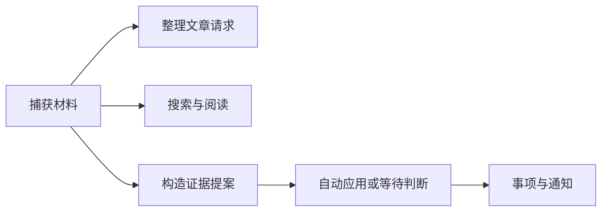

# 真实浏览器中的核心用户流程验收

该脚本运行真实 Vue 页面、Fastify API 与临时 SQLite 数据库，贯通材料捕获、文章整理、搜索、证据阅读、事项、判断、飞书接入和故障展示。模型响应、文章生成、提案评审输入、部分任务推进、搜索故障及飞书外部依赖则采用确定性夹具或注入，因此它主要验证产品编排、持久化和界面边界，而非所有外部系统的真实效果。

来源：gpt-5.6-sol 分析，gpt-5.6-sol 独立复核；模型解释仍可被原始证据纠正。

## 验证可实际操作的产品主链

脚本解决的是“各模块单独可用后，用户能否通过真实页面完成连续操作”的问题。它创建临时数据目录，启动 Fastify 服务、SQLite 仓储和无头 Chromium，并收集页面异常与关键控制台错误。参考 [真实服务与浏览器启动 ↗](../../../scripts/browser-smoke.ts#L75 "支持脚本创建临时仓储、启动真实 Fastify 与 SQLite，并使用 Chromium 收集页面错误。")

这里的“真实”有明确边界：Vue、HTTP API 与 SQLite 确实运行，但 ACP 模型响应、文章生成、提案评审输入、部分后台任务推进、搜索故障，以及飞书注册、能力探测和已有应用凭据，都由确定性夹具或测试注入控制。参考 [ACP 协议夹具 ↗](../../../scripts/browser-smoke.ts#L83 "支持模型配置指向固定 ACP 测试进程，而非真实生成模型。") [飞书外部依赖夹具 ↗](../../../scripts/browser-smoke.ts#L19 "支持已有应用、固定凭据、能力结果和本地注册适配器均由脚本内实现提供。") [固定提案评审输入 ↗](../../../scripts/browser-smoke.ts#L116 "支持提案评估使用固定 supported assessment，而不是运行独立评审模型。") [任务状态手工推进 ↗](../../../scripts/browser-smoke.ts#L341 "支持脚本领取任务并直接标记运行和成功，说明部分后台推进由测试代码控制。")

首个场景从空工作区打开输入表单，保存一份回滚材料，再检查页面出现对应内容且仓储中确有记录。这证明捕获流程贯通了前端、API 与持久化，而不只是对静态 DOM 做断言。参考 [空工作区材料捕获 ↗](../../../scripts/browser-smoke.ts#L193 "支持从页面输入材料并核对真实仓储记录的端到端捕获流程。")

## 从材料进入知识、检索与行动

文章整理覆盖两步式选择：先筛选并勾选材料，再填写主题和想弄懂的问题；返回上一步后选择仍保留，窄屏下对话框不横向溢出，提交后焦点回到触发按钮。提交接口被拦截并直接返回成功状态，所以该场景验证的是所选 revision、brief 和交互合同，不验证生成模型能否写出正确正文。参考 [文章整理提交合同 ↗](../../../scripts/browser-smoke.ts#L213 "支持两步选择、状态保留、移动布局、请求范围与焦点恢复，也显示生成接口被直接拦截。")

搜索场景通过路由注入延迟、空结果与 503 响应，确认加载提示、失败提示和请求竞态处理正确：较早的延迟请求返回时，不得覆盖后来查询的真实结果。参考 [搜索故障与竞态注入 ↗](../../../scripts/browser-smoke.ts#L299 "支持延迟、空结果、503 失败以及过期请求不得覆盖新结果的搜索行为。")

提案路径向真实评估 API 提交固定为“有依据”的 assessment，随后由脚本领取、运行并完成任务，再检查材料处理、已生效事项、证据回看与通知详情。冲突变更则进入待判断，可补充背景、拒绝或确认；来源更新后，旧判断必须被阻止。参考 [提案应用与通知流程 ↗](../../../scripts/browser-smoke.ts#L329 "支持固定评审后的自动应用、任务完成、证据回看和通知详情展示。") [待判断与过期保护 ↗](../../../scripts/browser-smoke.ts#L503 "支持冲突提案的补充背景、拒绝、确认应用，以及来源变化后阻止旧判断。")

## 证据阅读、日常跟进与飞书接入

证据阅读构造双向引用来验证循环提示、逐层返回、基于片段追问和关闭后的状态；材料产生新版本后，读者仍可切回不可变的旧版本。事项场景则覆盖创建、完成、重新打开、等待对象、暂缓提醒、取消和跨页面保留会话，并检查页面不暴露内部标识。参考 [递归证据与版本历史 ↗](../../../scripts/browser-smoke.ts#L396 "支持循环证据导航、逐层返回、片段追问以及新旧版本分别可读。") [事项与日常跟进 ↗](../../../scripts/browser-smoke.ts#L446 "支持待办生命周期、持久会话、等待和暂缓操作、窄屏布局及内部标识隐藏。")

飞书流程使用本地注册适配器、固定能力结果及内存中的已有应用提供者和凭据。它验证二维码与外部授权链接、取消重配、复用应用、owner 配对、启用连接，以及密钥不会出现在页面或状态响应中；这能说明产品编排与保密边界，但不能证明真实租户授权、权限探测或消息收发成功。参考 [飞书外部依赖夹具 ↗](../../../scripts/browser-smoke.ts#L19 "支持已有应用、固定凭据、能力结果和本地注册适配器均由脚本内实现提供。") [飞书授权与配对界面 ↗](../../../scripts/browser-smoke.ts#L602 "支持二维码授权、已有应用复用、owner 配对、启用连接和凭据不泄露等界面断言。")

真实实现中的注册适配器会返回凭据，已有应用提供者也负责列举应用和按 App ID 取得凭据；浏览器脚本用内存实现替代了这些外部来源。延伸阅读：[注册适配器合同 ↗](../../../apps/server/src/integrations/lark/registration.ts#L5 "说明生产注册适配器接收授权请求并异步返回飞书应用凭据，帮助界定脚本夹具替代的接口。") [已有应用提供者合同 ↗](../../../apps/server/src/integrations/lark/existing-apps.ts#L6 "说明已有应用来源负责列举可复用应用并按 App ID 读取凭据，帮助解释内存提供者的替代范围。")

## 响应式、阅读安全与故障边界

界面验收覆盖桌面、768 像素和 390 像素视口，包括无横向溢出、对话框焦点约束、Esc 关闭和移动端全屏。脚本还构造 100 个持久证据节点并逐层进入，只渲染当前引用块，以检查深链阅读不会一次铺开全部内容。参考 [响应式与深层证据 ↗](../../../scripts/browser-smoke.ts#L663 "支持桌面、平板、手机布局和焦点检查，以及 100 层证据链的有界渲染。")

故障场景直接把模型任务和通知投递写成失败状态，另行中断 jobs API，并重启真实服务确认事项仍能从 SQLite 恢复。因此它验证的是失败信息如实呈现、页面在局部离线时仍可导航，以及持久数据可恢复；它没有运行执行器或通知渠道从失败、退避到重试成功的生命周期。参考 [故障展示与重启恢复 ↗](../../../scripts/browser-smoke.ts#L765 "支持注入模型与通知失败、模拟 API 离线，并在服务重启后检查持久事项恢复。")

阅读器还检查 Markdown 表格、Mermaid SVG、脚本内容过滤、折叠后内容保留、键盘展开和减少动画偏好。最后要求页面错误集合为空，写出验证结果，并关闭浏览器、应用和仓储后删除临时目录。参考 [富文本安全与折叠交互 ↗](../../../scripts/browser-smoke.ts#L840 "支持表格、Mermaid、安全过滤、折叠内容保留、键盘操作和减少动画偏好的验收。") [结果记录与资源清理 ↗](../../../scripts/browser-smoke.ts#L879 "支持最终页面错误为空、验证报告写出及临时浏览器、应用、仓储和目录清理。")
