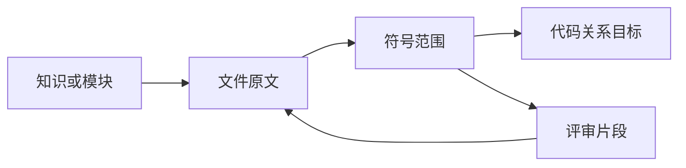

# Web 前端的可追溯阅读与事项跟进

Web 前端提供两项并列能力：Code Wiki 将知识文章、模块结构、源码、符号和评审片段组织为可回退、可深链的证据阅读轨迹；任务界面为已有事项提供等待、稍后提醒和取消命令。现有材料未证明两者之间已有直接的创建或关联入口。

来源：gpt-5.6-sol 分析，gpt-5.6-sol 独立复核；模型解释仍可被原始证据纠正。

## 从知识概览逐层进入证据

Code Wiki 以知识首页为起点，并提供仓库快照、模块列表和依赖图入口；读者可以从模块说明继续进入文件和符号。参考 [知识与代码结构入口 ↗](../../../apps/web/src/codewiki/CodeWiki.vue#L275 "支持知识首页、仓库快照、模块列表和依赖图构成主要阅读入口。")

知识、引用、模块、文件、符号和评审片段共用同一个轨迹抽屉，返回、跳转、循环提示与焦点归还由页面容器统一处理。知识正文会用请求代次避免旧响应覆盖新文章，并且只有可操作引用才发出导航事件。参考 [共享证据轨迹抽屉 ↗](../../../apps/web/src/codewiki/CodeWiki.vue#L371 "支持多类阅读帧共用轨迹抽屉及返回、跳转、关闭等交互。") [知识正文导航 ↗](../../../apps/web/src/knowledge/KnowledgeDocument.vue#L10 "支持文章加载的请求代次保护，以及仅允许可操作引用触发导航。")

## 在源码、符号与规则之间追踪

文件帧并列展示不可变源码、符号提纲和关系入口，并对无法解析或由 DTO 明确标为不可操作的边禁用下钻。参考 [文件原文与关系入口 ↗](../../../apps/web/src/codewiki/FileFrame.vue#L199 "支持文件帧展示源码、符号提纲，并结合解析结果和 edgeDisabled 控制关系下钻。") 符号帧读取符号附近的源码和文件关系边；关系请求失败时降级为空数组，符号带有片段标识时还可打开对应规则或决策。参考 [符号源码与关系加载 ↗](../../../apps/web/src/codewiki/SymbolFrame.vue#L55 "支持符号帧读取源码窗口，并在关系请求失败时降级为空数组。") [符号关系与片段入口 ↗](../../../apps/web/src/codewiki/SymbolFrame.vue#L97 "支持符号关系筛选、下钻和关联评审片段入口。")

片段把关系分为反向代码影响和正向依据，点击时优先按仓库路径回到代码文件，否则进入另一片段。参考 [片段关系分类与下钻 ↗](../../../apps/web/src/codewiki/FragmentFrame.vue#L31 "支持片段关系的正反向分类，以及优先进入代码文件、再进入其他片段的流程。") 同文件符号边进入符号范围帧，跨文件符号边进入目标文件；纯同文件文件边以及外部或缺失目标不下钻。参考 [代码边下钻规则 ↗](../../../apps/web/src/codewiki/modules.ts#L184 "支持同文件符号、跨文件目标和不可解析目标采用不同下钻结果。")

## 可读标签与深链恢复边界

标签与禁用合同目前是**按调用路径落实**的。`modules.ts` 的辅助函数会优先采用 `displayTitle`、`displayPath` 等展示字段，并让 `actionable` 优先决定边的原因和禁用状态；文件帧及 Code Wiki 新建文件、符号轨迹时调用了这些函数。参考 [标签与边状态辅助函数 ↗](../../../apps/web/src/codewiki/modules.ts#L222 "支持 modules.ts 内展示字段优先、可读名称回退及 actionable 优先的辅助函数合同。") [轨迹标题与下钻标签 ↗](../../../apps/web/src/codewiki/CodeWiki.vue#L165 "支持恢复标题仍使用原始 path 和 name，而新建文件、符号轨迹调用人类标签辅助函数的实际边界。")

这还不是所有阅读帧的统一行为：模块文件列表直接显示原始 `path`；符号帧标题直接显示 `file.path` 和 `symbol.name`，符号边也只按目标能否解析决定禁用，没有检查 `actionable`。参考 [模块文件列表文本 ↗](../../../apps/web/src/codewiki/ModuleFrame.vue#L155 "支持模块帧直接显示文件原始路径，说明展示字段合同尚未覆盖所有阅读路径。") [符号帧显示与禁用条件 ↗](../../../apps/web/src/codewiki/SymbolFrame.vue#L147 "支持符号帧直接显示 path 和 name，且符号边仅按解析结果决定是否禁用。") 因此不能把 DTO 展示字段优先和不可操作约束概括为整个前端均已落实。

页面会把主视图和轨迹写入 URL Hash，并在恢复时保留解析出的轨迹。参考 [页面深链写入与恢复 ↗](../../../apps/web/src/codewiki/CodeWiki.vue#L219 "支持页面手工序列化完整轨迹，并在恢复时直接保留解析出的轨迹帧。") 若旧模块、文件或符号已不在当前代码图中，轨迹帧仍可能存在，但对应阅读组件因存在性条件不满足而不渲染正文。参考 [页面深链写入与恢复 ↗](../../../apps/web/src/codewiki/CodeWiki.vue#L219 "支持页面手工序列化完整轨迹，并在恢复时直接保留解析出的轨迹帧。") [轨迹帧存在性条件 ↗](../../../apps/web/src/codewiki/CodeWiki.vue#L383 "支持模块、文件和符号帧只有在当前代码图能解析目标时才渲染正文组件。") 共享 Hash 辅助函数在读写时按 `MAX_TRAIL` 截取，而页面实际写入路径手工序列化完整轨迹，两条路径对超长轨迹的处理尚不一致。参考 [共享 Hash 路由合同 ↗](../../../packages/ui/src/OmHashRoute.ts#L27 "支持共享解析和写入函数都按 MAX_TRAIL 截取轨迹，从而说明其与页面手工写入的差异。")

## 已有事项的跟进控制

任务界面只对开放或等待状态的事项显示跟进设置，可记录等待对象、设置稍后提醒或取消事项。提交前会校验必要输入，并携带任务版本、随机请求标识、ISO 时间和浏览器时区；成功后通知父层刷新，失败则上报错误。界面明确说明跟进时间不改变截止时间，也不会自动联系对方。参考 [事项跟进操作 ↗](../../../apps/web/src/TaskFollowUpControls.vue#L8 "支持入口状态、三类动作、校验、命令负载、刷新与错误处理，以及界面的自动化边界说明。")

共享合同约束事项状态、跟进字段、带偏移时间、IANA 时区及命令负载，使这些操作属于正式任务流。参考 [任务跟进共享合同 ↗](../../../packages/contracts/src/task-flow.ts#L3 "支持事项状态、跟进时间、时区和命令字段由共享合同约束。") 当前材料没有展示从知识文章、文件、符号或片段创建、关联或打开事项的入口，因此证据阅读和事项跟进应视为并列能力，而不是已打通的闭环。
