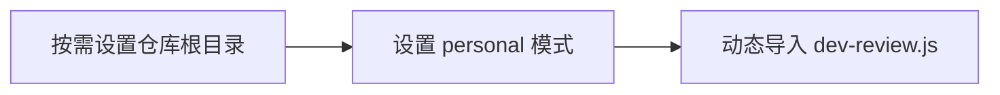

# 个人开发模式启动入口

该脚本在加载开发启动模块前补充仓库根目录，并将运行模式设为 personal。它只负责准备环境和触发模块导入；具体启动哪些服务、如何初始化数据以及怎样清理资源，需要结合 dev-review.js 及相关测试进一步确认。

来源：gpt-5.6-sol 分析，gpt-5.6-sol 独立复核；模型解释仍可被原始证据纠正。

## 入口的作用

该入口为后续开发启动逻辑准备两个运行参数：当 `OMEM_REPO_ROOT` 未设置，即值为 `undefined` 时，以当前工作目录作为仓库根目录；同时将 `OMEM_DEV_MODE` 设为 `personal`。前者保留调用方已经提供的值，包括空字符串；后者则直接覆盖已有模式值。参考 [运行环境设置 ↗](../../../scripts/dev.ts#L1 "支持仓库根目录仅在值为 undefined 时采用当前工作目录、开发模式固定为 personal，以及两者覆盖规则不同的说明。")

脚本随后加载相邻的 `dev-review.js`，因此当前文件承担环境准备与启动转交，具体启动行为由被导入模块承载。参考 [开发模块加载 ↗](../../../scripts/dev.ts#L3 "支持当前入口在准备环境后将具体启动行为交给 dev-review.js 承载。")

## 执行流程

脚本按固定顺序同步设置环境变量，再等待动态导入完成：

由于赋值发生在导入之前，被加载模块初始化时可以读取这两个环境变量；入口自身没有捕获导入错误的代码。参考 [启动执行顺序 ↗](../../../scripts/dev.ts#L1 "支持先设置环境变量、再等待动态导入的执行流程，并表明当前入口没有额外的错误捕获语句。")

文件末尾使用空导出，使该文件保持 ES 模块形式，但没有声明可供其他模块调用的业务接口。参考 [ES 模块声明 ↗](../../../scripts/dev.ts#L4 "支持该文件保持模块形式且没有导出业务接口的说明。")

## 可确认的行为边界

两个配置项的覆盖规则不同：仓库根目录使用空值合并赋值，仅在变量值为 `undefined` 时写入；开发模式则无条件固定为 `personal`。当前材料能够确认这一行为差异，但不能说明它是否属于长期产品约定。参考 [配置覆盖差异 ↗](../../../scripts/dev.ts#L1 "支持 OMEM_REPO_ROOT 仅在值为 undefined 时赋值，而 OMEM_DEV_MODE 会被无条件覆盖的行为边界。")

现有内容也只能证明入口导入了 `dev-review.js`，无法确定该模块会启动哪些服务，是否同步仓库知识、创建数据库或处理退出信号；这些跨模块结论需要结合被导入文件及相关测试判断。延伸阅读：[下游模块引用 ↗](../../../scripts/dev.ts#L3 "仅支持入口依赖 dev-review.js，不能据此推断该模块内部的服务启动、数据初始化或退出清理行为。")
