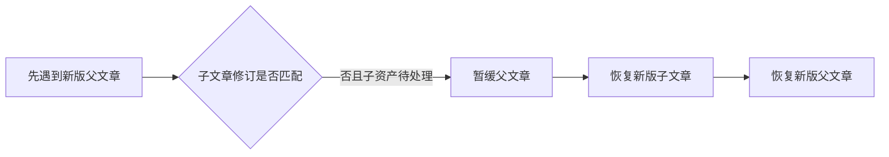

# 仓库知识导入与历史证据保留测试

该测试以临时仓库和真实 SQLite Store 验证两项关键行为：仓库中的已复核知识可以幂等接入个人记忆且不覆盖个人捕获；材料或父子文章更新后，旧证据仍可追溯，并能按依赖顺序恢复新版知识。测试使用 fixture 模型信息，不代表真实模型链路已经验收。

来源：gpt-5.6-sol 分析，gpt-5.6-sol 独立复核；模型解释仍可被原始证据纠正。

## 解决什么问题

开发知识需要进入个人记忆，但不能覆盖用户原有内容，也不能因源文件更新而丢失文章曾引用的固定证据。首个场景创建仓库 README、仓库侧知识文章和个人日记，再把仓库知识导入个人 Store，用于验证这两类数据可以共存。参考 [仓库与个人数据场景 ↗](../../../apps/server/tests/development-knowledge.test.ts#L11 "支持测试创建仓库材料、发布知识文章并保留个人日记的使用场景。")

测试使用实际创建 SQLite 文件并初始化各仓储服务的 `Store`，因此覆盖的是持久化集成行为，而非纯内存替身。参考 [真实存储初始化 ↗](../../../apps/server/src/store.ts#L45 "说明测试使用会创建 SQLite 文件并初始化仓储组件的实际 Store。")

## 幂等导入与固定证据

首次导入后，文章应处于当前状态，并可按材料键和原始摘要解析出“统一保存”的旧内容；再次导入时，修订总数不增加，个人日记仍然存在。随后 README 被改写，文章应转为非当前状态，但原摘要对应的历史材料仍可读取，手动恢复历史文章也不能把它误标为当前版本。参考 [幂等与历史证据断言 ↗](../../../apps/server/tests/development-knowledge.test.ts#L21 "直接支持重复导入不增加修订、个人捕获保留、源更新后文章过期且旧证据仍可解析。")

这组断言体现了**当前性与可追溯性分离**：源变化会使派生知识过期，却不会破坏文章生成时绑定的证据。材料对象本身由非派生修订组装，并以正文、图片及来源属性计算摘要，为固定引用提供身份依据。参考 [材料身份构造 ↗](../../../apps/server/src/knowledge/repository.ts#L11 "解释知识材料如何排除派生修订、汇总内容并计算稳定摘要。")

## 父子文章同批更新

第二个场景先导入旧版父子文章，再把子文章和引用它的父文章同时更新。即使恢复过程先遇到父资产，最终父文章摘要仍为新版，父子两篇文章也都处于当前状态。参考 [父子文章更新断言 ↗](../../../apps/server/tests/development-knowledge.test.ts#L38 "支持同次导入后新版父文章摘要生效且父子文章均为当前版本。")

恢复器会在子依赖尚未达到目标修订时跳过父项，并通过多轮处理等待依赖就绪；无法推进的剩余项最终标记为缺少子知识。参考 [依赖顺序恢复流程 ↗](../../../apps/server/src/knowledge/artifacts.ts#L40 "解释恢复器为何暂缓依赖修订未匹配的父文章，并通过多轮恢复子项后继续处理。")

## 断言范围与未覆盖行为

测试只使用一个 README、一个个人文本捕获以及标记为 accepted 的 fixture 生成与复核信息；它没有调用真实模型，也没有证明语义复核质量。参考 [Fixture 复核来源 ↗](../../../apps/server/tests/development-knowledge.test.ts#L43 "表明测试文章使用 fixture 生成器和 fixture verifier，而不是真实模型调用。")

当前还未断言损坏 JSON、缺少生成来源、文档结构非法、永久缺失子文章等拒绝路径，也未覆盖并发导入、进程中断或多来源冲突。知识合同虽然约束章节、内联引用和问题结构，但本文件主要验证导入后的状态与证据保留，并非对合同全部边界的穷举测试。参考 [知识文档合同 ↗](../../../packages/contracts/src/knowledge.ts#L25 "提供章节、引用和问题结构的合同背景，用于区分本测试覆盖的导入行为与未穷举的结构边界。")
